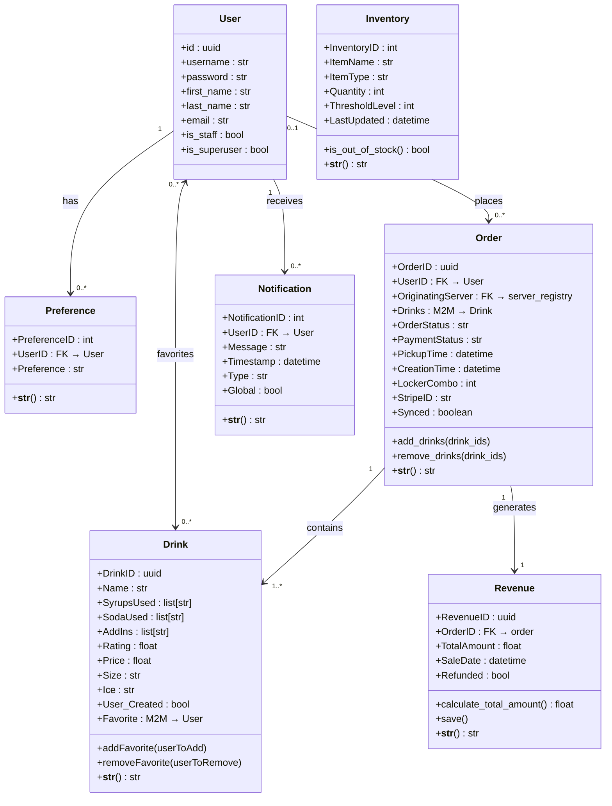
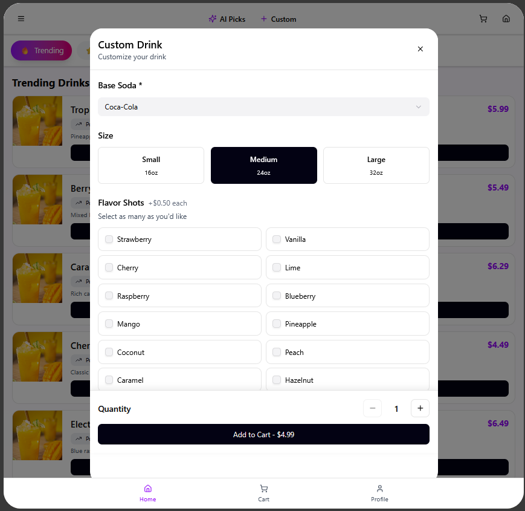
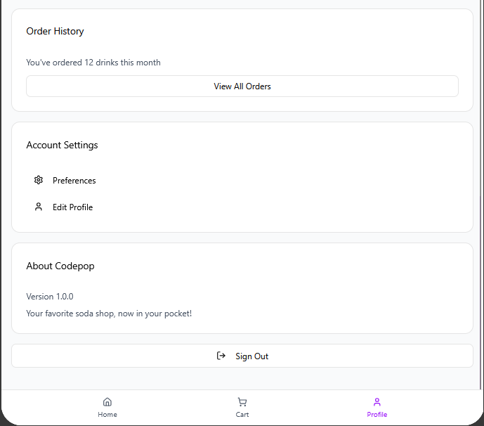
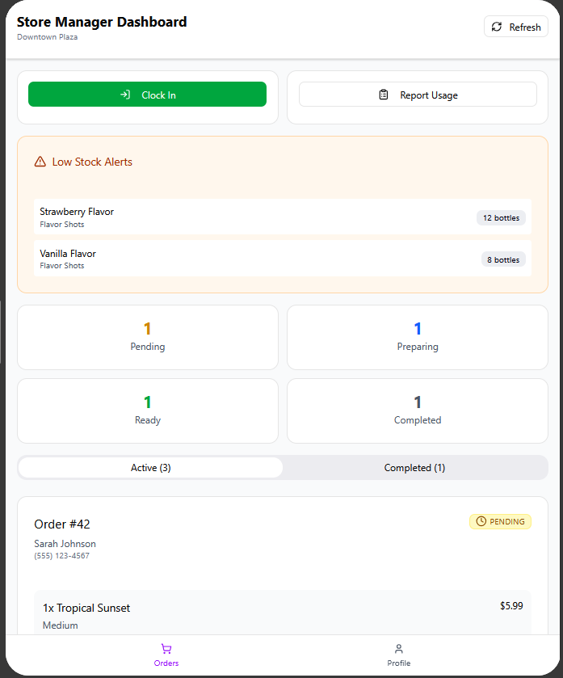
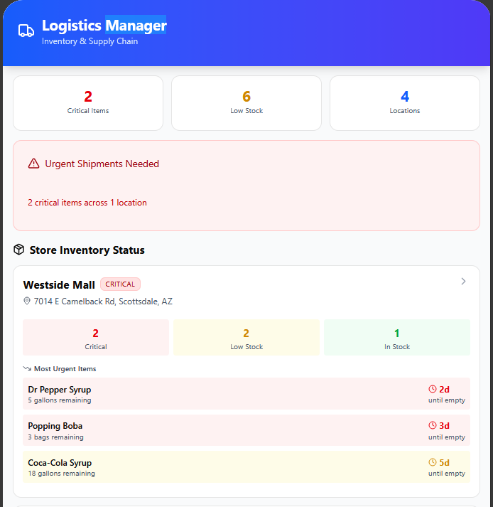
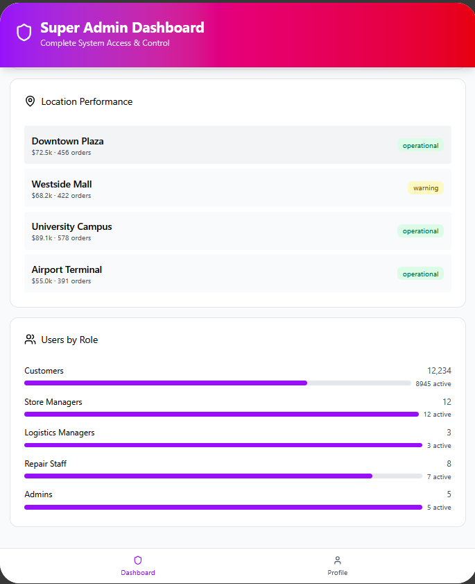
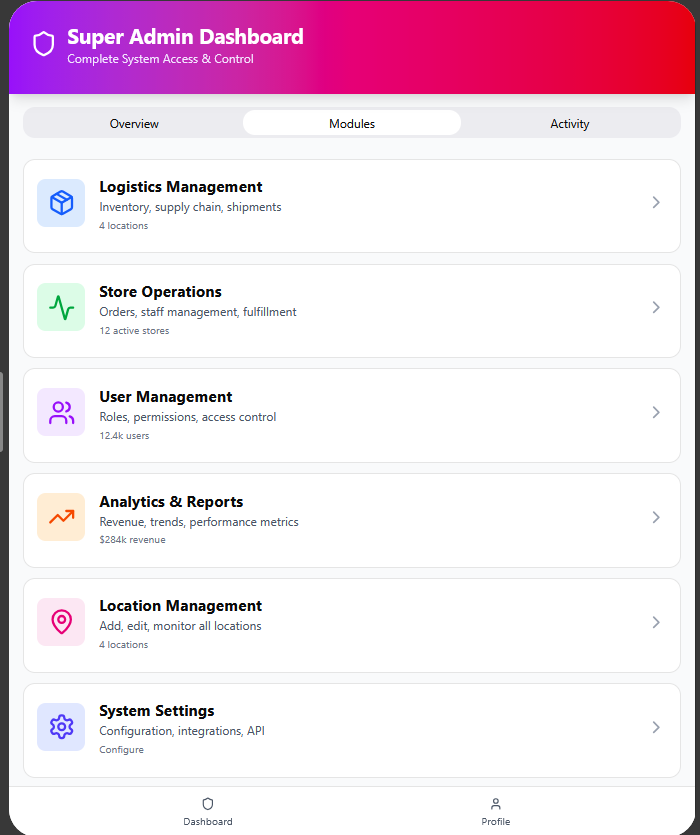

# Low-Level Design Document

**Version:** 1

**Team:** SocialDrinkers (3)

---

Table of contents:

- [Low-Level Design Document](#low-level-design-document)
  - [1. Introduction and Architectural Overview](#1-introduction-and-architectural-overview)
    - [1.1 Purpose](#11-purpose)
    - [1.2 Consistency with High-Level Design](#12-consistency-with-high-level-design)
    - [1.3 System Architecture](#13-system-architecture)
  - [2. Technology Stack \& Frameworks](#2-technology-stack--frameworks)
    - [2.1 Languages, Libraries, and Frameworks](#21-languages-libraries-and-frameworks)
    - [2.2 Justification](#22-justification)
  - [3. Subsystem and Class Design](#3-subsystem-and-class-design)
    - [3.1 Subsystem Breakdown](#31-subsystem-breakdown)
    - [3.2 Detailed Class Definitions](#32-detailed-class-definitions)
    - [3.3 UML Class Diagrams](#33-uml-class-diagrams)
  - [4. Database Design](#4-database-design)
    - [4.1 Database Tables and Schema](#41-database-tables-and-schema)
      - [**Table: `user` (`auth_user`)**](#table-user-auth_user)
      - [**Table: `master_list`**](#table-master_list)
      - [**Table: `server_registry`**](#table-server_registry)
      - [**Table: `user_movement`**](#table-user_movement)
      - [**Table: `preference`**](#table-preference)
      - [**Table: `drink`**](#table-drink)
      - [**Table: `Flavors`**](#table-flavors)
      - [**Table: `inventory`**](#table-inventory)
      - [**Table: `notification`**](#table-notification)
      - [**Table: `order`**](#table-order)
      - [**Table: `revenue`**](#table-revenue)
      - [**Table: `order_drinks`** (Many-to-Many Join Table)](#table-order_drinks-many-to-many-join-table)
      - [**Table: `drink_favorite`** (Many-to-Many Join Table)](#table-drink_favorite-many-to-many-join-table)
      - [Implementation Notes](#implementation-notes)
    - [4.2 Normalization Justification](#42-normalization-justification)
      - [**First Normal Form (1NF):** Eliminating Repeating Groups](#first-normal-form-1nf-eliminating-repeating-groups)
      - [**Second Normal Form (2NF):** Eliminating Partial Dependencies](#second-normal-form-2nf-eliminating-partial-dependencies)
      - [**Third Normal Form (3NF):** Eliminating Transitive Dependencies](#third-normal-form-3nf-eliminating-transitive-dependencies)
  - [5. User Interface (UI) and Experience (UX)](#5-user-interface-ui-and-experience-ux)
    - [5.1 UI Prototypes](#51-ui-prototypes)
      - [User](#user)
        - [Manager](#manager)
        - [Admin](#admin)
        - [Super Admin](#super-admin)
    - [5.2 User Flow](#52-user-flow)
      - [Account Creation and Profile Setup](#account-creation-and-profile-setup)
      - [Login Process](#login-process)
      - [Logout Process](#logout-process)
      - [AI-Generated Drink Selection](#ai-generated-drink-selection)
      - [Super Admin Capabilities](#super-admin-capabilities)
      - [Regular Admin Capabilities](#regular-admin-capabilities)
      - [Store Manager Responsibilities](#store-manager-responsibilities)
    - [5.3 Usability and Accessibility](#53-usability-and-accessibility)
  - [6. Peer to Peer Networking](#6-peer-to-peer-networking)
    - [6.0 Terms](#60-terms)
      - [Home Server](#home-server)
      - [Visiting Server](#visiting-server)
      - [Sensitive Information](#sensitive-information)
      - [Permanent Data](#permanent-data)
      - [Ephemeral Data](#ephemeral-data)
      - [Authoritative Source](#authoritative-source)
      - [Inter-Server API](#inter-server-api)
    - [6.1 Home and Visiting Server Assignment](#61-home-and-visiting-server-assignment)
      - [Store-Local Users](#store-local-users)
      - [Cross-Store Users](#cross-store-users)
    - [6.2 Cross-Server User Session Handling](#62-cross-server-user-session-handling)
      - [Account Creation](#account-creation)
      - [Login Process](#login-process-1)
      - [Data Transfer Rules](#data-transfer-rules)
      - [Payment and Order Processing](#payment-and-order-processing)
    - [6.3 Data Synchronization and API Optimization](#63-data-synchronization-and-api-optimization)
      - [Login Discovery Process](#login-discovery-process)
      - [User Table Updates](#user-table-updates)
      - [Caching Strategy](#caching-strategy)
    - [6.4 Security Requirements for Peer-to-Peer Servers](#64-security-requirements-for-peer-to-peer-servers)
    - [6.5 Server Failure and Fault Tolerance](#65-server-failure-and-fault-tolerance)
      - [Visiting Server Failure](#visiting-server-failure)
      - [Home Server Failure](#home-server-failure)
      - [Home Server Recovery](#home-server-recovery)
    - [6.6 Scalability and Load Balancing](#66-scalability-and-load-balancing)
    - [6.7 Data Privacy Model](#67-data-privacy-model)
    - [6.8 Server Registration and Discovery](#68-server-registration-and-discovery)
      - [Server Registry](#server-registry)
      - [New Server Onboarding](#new-server-onboarding)
      - [Health Checks](#health-checks)
  - [7. Security and Data Protection](#7-security-and-data-protection)
    - [7.1 Security Risks \& Mitigations](#71-security-risks--mitigations)
    - [7.2 Data Protection (In Transit and At Rest)](#72-data-protection-in-transit-and-at-rest)
  - [8. Third-Party Integrations](#8-third-party-integrations)
    - [8.1 Integration Details](#81-integration-details)
      - [**Payments: Stripe**](#payments-stripe)
      - [**AI Drink Recommendations: OpenAI API**](#ai-drink-recommendations-openai-api)
      - [**Location Services: Google Maps API**](#location-services-google-maps-api)
  - [9. Deployment Plan and DevOps](#9-deployment-plan-and-devops)
    - [9.1 Deployment Strategy](#91-deployment-strategy)
  - [Deployment Architecture](#deployment-architecture)
    - [9.2 Automated Testing and Monitoring](#92-automated-testing-and-monitoring)
      - [Testing Strategy](#testing-strategy)
      - [Monitoring and Observability](#monitoring-and-observability)
  - [10. Task Breakdown and Team Assignments](#10-task-breakdown-and-team-assignments)
    - [10.1 Key Tasks and Feature Teams](#101-key-tasks-and-feature-teams)

---

## 1. Introduction and Architectural Overview

### 1.1 Purpose

The purpose of this document is to provide a detailed, technical blueprint for the CodePop system. It outlines the specific classes, database schemas, security protocols, and deployment strategies necessary for the development sprints. It serves as the authoritative reference for developers implementing the system. It covers the full deployment stack — from the ReactJS frontend to the Django backend, from the PostgreSQL database schema to the Google Cloud infrastructure on which all server instances run. Each server instance is packaged as a Docker container, ensuring environment consistency across all deployments. The same application codebase is deployed to every instance; instances are differentiated only by their associated database, which is scoped to the individual store it serves.

### 1.2 Consistency with High-Level Design

The Low-Level Design remains fully consistent with the High-Level Design by preserving the defined three-tier architecture, maintaining clear separation between the client, server, and database layers.

This document adheres strictly to the technology stack selected in the HLD, utilizing ReactJS for the frontend, Django for the backend, PostgreSQL for the database, and Stripe for payment processing. The LLD does not introduce new architectural technologies or structural deviations; rather, it implements and refines the design decisions established in the HLD.

Security considerations outlined in the HLD are expanded upon in this document through detailed implementation strategies. This includes enforced data encryption in transit, hashed password storage using Django’s secure defaults, centralized storage of sensitive data on authoritative servers, and adherence to OWASP Top 10 security principles.

The decentralized peer-to-peer architecture described in the HLD is further operationalized in the LLD through the formal definition of Home and Visiting servers. This includes clearly defined server roles, authentication workflows, data ownership rules, synchronization policies, and fault tolerance mechanisms. These refinements ensure secure and efficient inter-server communication while preserving the original decentralized vision.

Additionally, the LLD supports the HLD’s goals regarding inventory tracking, predictive maintenance, and IoT telemetry by defining the Inventory table, Notification system, order and telemetry logging structures, and scalable REST-based device communication endpoints.

The infrastructure choices made in this document are consistent with the HLD's operational goals. All server instances are hosted on Google Cloud, which provides the geographic distribution and reliability required by the P2P architecture. Each server instance runs inside a Docker container, ensuring reproducible, environment-agnostic deployments that match the HLD's goal of horizontal scalability. Because every instance runs identical application code and differs only in its connected database, new store locations can be onboarded by provisioning a new Google Cloud instance and database without any code changes — directly realizing the HLD's vision of an extensible, decentralized network.

### 1.3 System Architecture

Each client is implemented as a ReactJS Progressive Web App. It is responsible for rendering the user interface, handling user input, and securely communicating with backend services over HTTPS. The client manages session tokens for authenticated users and supports offline capabilities through service workers. It is designed to function on both mobile and desktop platforms.

Every server is responsible for authentication, authorization, and processing orders, including payment handling through Stripe. Business logic and request validation are handled at this level.

Each server operates within a decentralized peer-to-peer network, where any store server can act as either a Home Server or a Visiting Server. Every individual store runs its own dedicated server instance. Sensitive user data remains stored on the user’s Home Server. Communication between servers is secured using TLS to ensure encrypted data exchange.

Users interact with the client, which sends HTTPS requests to the appropriate server. The server validates and processes the request, interacts with the database and/or external services as needed, and then returns a response to the client.

Because the system uses a decentralized architecture, each store operates its own independent server while participating in the broader network. This design supports horizontal scaling, as new store locations can be deployed with the same software stack and integrate into the network without requiring architectural changes.

The database uses PostgreSQL to store system data, including user accounts, order history, preferences, and related records. It enforces foreign key constraints and follows normalization principles to prevent redundancy and maintain consistent data integrity.

**Infrastructure and Deployment**

All server instances are hosted on Google Cloud. Each instance runs inside a Docker container, which packages the full application runtime — the Django backend, its dependencies, and its configuration — into a portable, self-contained unit. This guarantees that every instance runs in an identical environment regardless of the underlying Google Cloud machine, eliminating environment-specific bugs and simplifying deployment.

Every Google Cloud instance runs the same application code. Instances are differentiated solely by the PostgreSQL database they connect to. Each database is scoped to a specific individual store and holds only the data belonging to that store's user base. This design means:

- Adding a new store location requires only provisioning a new Google Cloud instance with a new database — no code changes are needed.
- A rolling update to the application (e.g., a new feature or security patch) can be applied uniformly across all instances by updating the shared Docker image.
- Database isolation ensures that a failure or data issue on one store's instance does not directly affect other stores.

This architecture maps directly onto the P2P model: each Docker container is an independent peer dedicated to a single store, capable of acting as a Home or Visiting Server, while Google Cloud's infrastructure provides the reliability and geographic distribution the system requires.

---

## 2. Technology Stack & Frameworks

### 2.1 Languages, Libraries, and Frameworks

- **Frontend:** ReactJS (Progressive Web App architecture utilizing functional components and hooks)
- **Backend:** Django (Python-based framework handling business logic, authentication and API endpoints)
- **Database:** PostgreSQL (relational database system for persistent data storage)
- **Other Tools:** Stripe (secure third-party payment processor)

### 2.2 Justification

- **Design Choice:** The system uses ReactJS for frontend and Django for the backend with PostgreSQL as the database and Stripe for payment.

- **Alternatives Considered:** Native iOS (Swift) / Android (Kotlin) for frontend were considered but would require separate codebases overall slowing deployment and updates., Node.js with express was considered as a backend alternative, but we stuck with Django for it's security defaults and PostgreSQL integration.

- **Rationale:** ReactJS enables cross-platform deployment through a single progressive app which supports both desktop and mobile. Django provides the framework with built-in authentication handling, ORM support, and administrative tools which help with the system's decentralized architecture. PostgreSQL helps with foreign key enforcement and scalability, along with Django having built-in support for it. Stripe was chosen to allow sensitive payment information to be stored elsewhere, this allows the decentralized network to not have to send saved payment info between servers.

---

## 3. Subsystem and Class Design

### 3.1 Subsystem Breakdown

The CodePop system is divided into nine major subsystems, each responsible for a distinct functional domain:

1. **User Authentication & Authorization** — Handles user registration, login, logout, and role-based access control (user, manager, admin, super admin).
2. **User Preferences** — Stores and manages per-user flavor and drink preferences, which are also consumed by the AI recommendation engine.
3. **Drink Management** — Manages the catalog of drinks (both standard menu items and user-created recipes), including ingredient definitions, ratings, sizing, and favorite tracking.
4. **Order Management** — Orchestrates the full order lifecycle from cart creation through fulfillment, including drink assignment, locker combo issuance, and status transitions.
5. **Inventory Management** — Tracks physical stock levels for sodas, syrups, add-ins, and supplies, and generates threshold alerts for restocking.
6. **Notification System** — Delivers user-targeted and global alerts (e.g., order ready, low stock, promotional messages).
7. **Payment & Revenue** — Integrates with Stripe to process payments and refunds, and records per-order financial data in the revenue ledger.
8. **AI Drink Recommendation Engine** — Generates personalized drink recipes by applying similarity matching against a user's saved preferences and a CSV-backed ingredient dataset.
9. **Customer Service Chatbot** — Provides a conversational AI interface for handling wrong-drink and refund support flows.

---

### 3.2 Detailed Class Definitions

Each subsystem is structured so that model classes own only data and domain-level behavior (SRP), serializer classes own only validation and transformation, and view classes own only HTTP request/response handling. Inheritance is used exclusively to extend Django REST Framework base classes, avoiding custom deep hierarchies. Composition is preferred when objects must collaborate — for example, views compose serializers for validation rather than embedding validation logic inline, and models expose ManyToMany relationships to compose related entities.

---

**Subsystem 1: User Authentication & Authorization**

- `CustomAuthToken` _(extends `ObtainAuthToken`)_: Handles user login and token issuance.
  - _Methods:_ `post(request)` — validates credentials, returns `token`, `user_id`, `first_name`, `is_staff`, `is_superuser`
- `CreateUserAPIView` _(extends `CreateAPIView`)_: Handles user registration.
  - _Methods:_ `post(request)` — creates a `User` record and its associated auth token
- `LogoutUserAPIView` _(extends `APIView`)_: Handles user logout.
  - _Methods:_ `post(request)` — deletes the requesting user's auth token; requires `IsAuthenticated`
- `UserOperations` _(extends `ModelViewSet`)_: Provides super-admin user management (list, edit, delete).
  - _Methods:_ `list()`, `post(request)` — edit user fields (username, name, password, role), `destroy(request)`; requires `IsSuperUser`
- `IsSuperUser` _(extends `BasePermission`)_: Custom DRF permission gate.
  - _Methods:_ `has_permission(request, view)` — returns `True` only if the user is authenticated and `is_superuser`
- `CreateUserSerializer` _(extends `ModelSerializer`)_: Validates and securely creates user accounts.
  - _Fields:_ `username`, `password` (write-only), `first_name`, `last_name`
  - _Methods:_ `create(validated_data)` — calls `set_password()` to hash before saving
- `GetUserSerializer` _(extends `ModelSerializer`)_: Read serializer for user data.
  - _Fields:_ `id`, `username`, `password` (write-only), `first_name`, `last_name`, `is_staff`, `is_superuser`

---

**Subsystem 2: User Preferences**

- `Preference` _(extends `Model`)_: Stores a single preference tag for a user.
  - _Fields:_ `PreferenceID (AutoField PK)`, `UserID (ForeignKey → auth_user)`, `Preference (CharField, max 100)`
  - _Methods:_ `__str__()` — returns preference description
- `PreferencesOperations` _(extends `ModelViewSet`)_: Full CRUD for preferences; requires `IsAuthenticated`.
  - _Methods:_ `list()`, `create()`, `retrieve()`, `update()`, `destroy()`
- `UserPreferenceLookup` _(extends `ListAPIView`)_: Lists all preferences for a specific user.
  - _Methods:_ `get_queryset()` — filters by `user_id` URL parameter
- `PreferenceSerializer` _(extends `ModelSerializer`)_: Validates preferences against a fixed allow-list (~60 accepted flavor/style tags).
  - _Fields:_ `PreferenceID`, `UserID`, `Preference`
  - _Methods:_ `validate_Preference(value)` — raises `ValidationError` if value is not in the allowed set

---

**Subsystem 3: Drink Management**

- `Drink` _(extends `Model`)_: Represents a drink recipe; the central entity of the catalog.
  - _Fields:_ `DrinkID (UUID7)`, `Name (CharField, max 255)`, `SyrupsUsed (ArrayField)`, `SodaUsed (ArrayField)`, `AddIns (ArrayField)`, `Rating (FloatField, nullable)`, `Price (FloatField)`, `Size (CharField, default "m")`, `Ice (CharField, default "normal")`, `User_Created (BooleanField)`, `Favorite (ManyToManyField → auth_user)`
  - _Methods:_ `addFavorite(userToAdd)`, `removeFavorite(userToRemove)`, `__str__()`
- `DrinkOperations` _(extends `ModelViewSet`)_: Full CRUD for drinks; filters non-user-created drinks on list.
  - _Methods:_ `list()`, `create()`, `retrieve()`, `update()`, `destroy()`; PATCH actions for adding/removing favorites
- `UserDrinksLookup` _(extends `ListAPIView`)_: Lists all drinks favorited by a specific user.
  - _Methods:_ `get_queryset()` — filters `Favorite` by `user_id` URL parameter
- `DrinkSerializer` _(extends `ModelSerializer`)_: Validates drink creation and updates.
  - _Fields:_ All `Drink` model fields
  - _Methods:_ `validate_Size(value)` — accepts `['16oz', '24oz', '32oz']`; `validate_Ice(value)` — accepts `['none', 'light', 'regular', 'extra']`

---

**Subsystem 4: Order Management**

- `Order` _(extends `Model`)_: Represents a customer order and its full lifecycle state.
  - _Fields:_ `OrderID (UUID7)`, `UserID (ForeignKey → auth_user, nullable)`, `Drinks (ManyToManyField → Drink)`, `OrderStatus (CharField: pending/processing/completed/cancelled)`, `PaymentStatus (CharField: pending/paid/failed/remade)`, `PickupTime (DateTimeField, nullable)`, `CreationTime (DateTimeField, auto)`, `LockerCombo (BigIntegerField, nullable)`, `StripeID (CharField)`, `Synced (Boolean)`
  - _Methods:_ `add_drinks(drink_ids)`, `remove_drinks(drink_ids)`, `__str__()`
- `OrderOperations` _(extends `ModelViewSet`)_: Full CRUD for orders, including PATCH support for drink modifications.
  - _Methods:_ `list()`, `create()`, `retrieve()`, `update()`, `partial_update()`, `destroy()`
- `UserOrdersLookup` _(extends `ListCreateAPIView`)_: Lists and creates orders scoped to a specific user.
  - _Methods:_ `get_queryset()` — filters by `user_id`; `perform_create()` — assigns `UserID` automatically
- `OrderSerializer` _(extends `ModelSerializer`)_: Validates and creates orders, handling the ManyToMany drink assignment.
  - _Fields:_ All `Order` model fields
  - _Methods:_ `validate_Drinks(value)` — ensures drink list is non-empty; `create(validated_data)` — pops drinks, saves order, then calls `set()` on the M2M relation

---

**Subsystem 5: Inventory Management**

- `Inventory` _(extends `Model`)_: Tracks a physical stock item at the store.
  - _Fields:_ `InventoryID (AutoField PK)`, `ItemName (CharField, max 100)`, `ItemType (CharField: Soda/Syrup/Add In/Physical)`, `Quantity (PositiveIntegerField)`, `ThresholdLevel (PositiveIntegerField)`, `LastUpdated (DateTimeField, auto_now)`
  - _Methods:_ `is_out_of_stock()` — returns `True` if `Quantity <= 0`; `__str__()`
- `InventoryListAPIView` _(extends `ListAPIView`)_: Lists all inventory items that are not out of stock.
  - _Methods:_ `get_queryset()` — filters by `Quantity > 0`
- `InventoryReportAPIView` _(extends `APIView`)_: Generates an aggregate inventory report.
  - _Methods:_ `get(request)` — returns total item count, out-of-stock count, and below-threshold count
- `InventoryUpdateAPIView` _(extends `RetrieveUpdateAPIView`)_: Retrieves or updates a single inventory item; handles `reset_quantity` and `used_quantity` update modes; returns a warning when stock drops below `ThresholdLevel`.
  - _Methods:_ `partial_update(request, pk)` — validates quantity change and returns threshold warning if applicable
- `InventorySerializer` _(extends `ModelSerializer`)_: Serializes all inventory fields.
  - _Fields:_ `InventoryID`, `ItemName`, `ItemType`, `Quantity`, `ThresholdLevel`, `LastUpdated`

---

**Subsystem 6: Notification System**

- `Notification` _(extends `Model`)_: Stores a single alert or message for a user or for all users.
  - _Fields:_ `NotificationID (AutoField PK)`, `UserID (ForeignKey → auth_user)`, `Message (CharField, max 500)`, `Timestamp (DateTimeField, default now)`, `Type (CharField, max 50)`, `Global (BooleanField, default False)`
  - _Methods:_ `__str__()`
- `NotificationOperations` _(extends `ModelViewSet`)_: Full CRUD for notifications; filters to return both global notifications and those targeted at the requesting user. Includes a `filter_by_time` custom action accepting ISO 8601 `start`/`end` query parameters.
  - _Methods:_ `list()`, `create()`, `retrieve()`, `update()`, `destroy()`, `filter_by_time(request)`
- `UserNotificationLookup` _(extends `ListAPIView`)_: Lists all notifications belonging to a specific user.
  - _Methods:_ `get_queryset()` — filters by `user_id` URL parameter
- `NotificationSerializer` _(extends `ModelSerializer`)_: Serializes all notification fields.
  - _Fields:_ `NotificationID`, `UserID`, `Message`, `Timestamp`, `Type`, `Global`

---

**Subsystem 7: Payment & Revenue**

- `Revenue` _(extends `Model`)_: Records the financial outcome of a completed order.
  - _Fields:_ `RevenueID (UUID7)`, `OrderID (UUID7)`, `TotalAmount (FloatField, default 0.0)`, `SaleDate (DateTimeField, default now)`, `Refunded (BooleanField, default False)`
  - _Methods:_ `calculate_total_amount()` — sums `Price` for all drinks in the linked order; `save()` — overridden to auto-populate `TotalAmount` before insert; `__str__()`
- `StripePaymentIntentView` _(extends `View`, CSRF exempt)_: Creates a Stripe PaymentIntent for the client-side payment flow.
  - _Methods:_ `post(request)` — creates Stripe customer, ephemeral key, and payment intent; returns `paymentIntent`, `ephemeralKey`, `customer`, `publishableKey`
- `refund_order(client_secret_or_id)`: Module-level helper function that calls the Stripe Refunds API to reverse a charge.
- `RevenueViewSet` _(extends `ModelViewSet`)_: Full CRUD for revenue records.
  - _Methods:_ `list()`, `create()`, `retrieve()`, `update()`, `destroy()`
- `RevenueSerializer` _(extends `ModelSerializer`)_: Serializes revenue data and triggers auto-calculation on create.
  - _Fields:_ `RevenueID`, `OrderID`, `TotalAmount`, `SaleDate`, `Refunded`
  - _Methods:_ `create(validated_data)` — calls `calculate_total_amount()` after saving

---

**Subsystem 8: AI Drink Recommendation Engine**

- `GenerateAIDrink` _(extends `APIView`)_: HTTP interface to the recommendation engine; works for both anonymous and authenticated users.
  - _Methods:_ `get(request, user_id=None)` — loads user preferences (or defaults), delegates to `drinkAI.generate_soda()`, and returns a structured drink recipe
- `generate_soda(user_preferences)` _(module function in `drinkAI.py`)_: Orchestrates the full recommendation pipeline.
  - _Returns:_ dict with `SyrupsUsed`, `SodaUsed`, `AddIns`, `Size`, `Ice`, `UserCreated`
- `generate_similar_syrup_preferences(user_preference)` _(module function)_: Uses `CountVectorizer` + cosine similarity to find the top 5 syrups that best match a user's flavor preference string.
- `generate_best_soda(syrups, prefs)` _(module function)_: Selects a soda whose `best-match-flavors` column overlaps most with the chosen syrups' flavor profiles.
- `generate_best_addins(syrups, soda, prefs, num)` _(module function)_: Selects add-ins whose `best-match-syrup` and `best-match-soda` columns align with the chosen syrups and soda.
- `create_list(csv_file_name)` _(module function)_: Reads a CSV ingredient file and returns an array of ingredient names for lookup operations.

---

**Subsystem 9: Customer Service Chatbot**

- `Chatbot` _(extends `APIView`)_: Manages a multi-turn conversational support session powered by Microsoft DialoGPT-medium.
  - _Fields (session state):_ `phase` — current conversation stage (`init`, `1`, `collect`); `order_number` — captured order reference; `selected_drinks` — drinks flagged for refund/remake
  - _Methods:_ `post(request)` — receives user message and conversation history, runs NLP-based intent matching (regex), advances the state machine (wrong-drink flow or refund flow), calls `refund_order()` when appropriate, and returns a structured JSON response with the next bot message and updated state

---

### 3.3 UML Class Diagrams

The diagram below shows the six Django model classes, their fields, key methods, and relationships (foreign keys and many-to-many associations). The built-in Django `auth_user` table is represented as `User`.



---

## 4. Database Design

### 4.1 Database Tables and Schema

#### **Table: `user` (`auth_user`)**

Stores the user credentials and basic information. This table is **local** to each server and contains sensitive data (password hashes) only for users whose Home Server is this specific instance.

| id                    | username        | password        | email           | first_name | last_name | is_staff | is_superuser |
| :-------------------- | :-------------- | :-------------- | :-------------- | :--------- | :-------- | :------- | :----------- |
| `primary_key` (UUID7) | String (unique) | String (hashed) | String (unique) | String     | String    | Boolean  | Boolean      |

- **Security Note:** Password hashes are never synchronized. A server only contains `auth_user` records for users who registered at that specific store.
- **UUID7 Usage:** This is used to make it easier to sort users and query the database for synchronization, as the first part is a timestamp.

---

#### **Table: `master_list`**

A global mapping table synchronized across all servers in the network. It allows a visiting server to identify which Home Server possesses a user's authoritative credentials.

| UserID                | Username | HomeServerID            |
| :-------------------- | :------- | ----------------------- |
| `primary_key` (UUID7) | String   | FK to `server_registry` |

---

#### **Table: `server_registry`**

A global registry of all active store servers in the P2P network. It contains the network addresses and public keys required for secure inter-server communication and JWT verification.

| ServerID      | ServerURL      | PublicKey                     | Status          | LastSeen |
| :------------ | :------------- | :---------------------------- | :-------------- | :------- |
| `primary_key` | String (HTTPS) | Text (RSA/ED25519 Public Key) | Active/Inactive | DateTime |

---

#### **Table: `user_movement`**

Acts as an immutable audit log for when a user's authoritative Home Server is reassigned. This ensures that if a server is offline during a migration, it can process this log upon reconnection to accurately update its `master_list` and maintain synchronization across the P2P network.

| MovementID            | UserID                        | PreviousServerID        | NewServerID             | Timestamp              | Status                                |
| :-------------------- | :---------------------------- | :---------------------- | :---------------------- | :--------------------- | :------------------------------------ |
| `primary_key` (UUID7) | `id` (UUID7) from `auth_user` | FK to `server_registry` | FK to `server_registry` | DateTime (default now) | String (Initiated, Completed, Failed) |

---

#### **Table: `preference`**

Stores user-specific app or drink preferences.

| PreferenceID  | UserID                | Preference                               |
| :------------ | :-------------------- | :--------------------------------------- |
| `primary_key` | `id` from `auth_user` | String with user preferences (max `100`) |

---

#### **Table: `drink`**

Stores the recipes and metadata for custom sodas, whether they are standard menu items or created by a user.

| DrinkID               | Name               | SyrupsUsed       | SodaUsed         | AddIns           | Rating           | Price | Size                 | Ice                       | User_Created |
| :-------------------- | :----------------- | :--------------- | :--------------- | :--------------- | :--------------- | :---- | :------------------- | :------------------------ | :----------- |
| `primary_key` (UUID7) | String (max `255`) | Array of Strings | Array of Strings | Array of Strings | Float (nullable) | Float | String (default `m`) | String (default `normal`) | Boolean      |

---

#### **Table: `Flavors`**

Stores the types of flavors inside of the syrup or soda so the AI can better match flavors together.
| Syrup ID | Name | Primary Flavor | Secondary Flavor | Tertiary Flavor |
| :------------ | :----------------- | :--------------- | :--------------- | :--------------- |
| `primary_key` | String (max `255`) | String | String | String |

---

#### **Table: `inventory`**

Tracks the physical stock of the soda shop, including bases, syrups, add-ins, and cups/lids.

| InventoryID   | ItemName           | ItemType                               | Quantity         | ThresholdLevel   | LastUpdated             |
| :------------ | :----------------- | :------------------------------------- | :--------------- | :--------------- | :---------------------- |
| `primary_key` | String (max `100`) | String (Soda, Syrup, Add In, Physical) | Positive Integer | Positive Integer | DateTime (Auto-updated) |

---

#### **Table: `notification`**

Stores alerts and messages to be sent to users (e.g., when their soda is ready in the locker).

| NotificationID | UserID                | Message            | Timestamp              | Type              | Global                  |
| :------------- | :-------------------- | :----------------- | :--------------------- | :---------------- | :---------------------- |
| `primary_key`  | `id` from `auth_user` | String (max `500`) | DateTime (default now) | String (max `50`) | Boolean (default False) |

---

#### **Table: `order`**

Manages customer orders, their payment statuses, fulfillment details (like locker combinations), and acts as the authoritative historical ledger for a user's transactions across the entire peer-to-peer network.

| OrderID               | UserID                           | OrderStatus                                        | PaymentStatus                          | PickupTime          | CreationTime        | LockerCombo           | StripeID                  | Synced                    |
| :-------------------- | :------------------------------- | :------------------------------------------------- | :------------------------------------- | :------------------ | :------------------ | :-------------------- | :------------------------ | :------------------------ |
| `primary_key` (UUID7) | `id` from `auth_user` (nullable) | String (Pending, Processing, Completed, Cancelled) | String (Pending, Paid, Failed, Remade) | DateTime (nullable) | DateTime (Auto-add) | BigInteger (nullable) | String (Unique, nullable) | Boolean (default `False`) |

---

#### **Table: `revenue`**

Tracks accounting and financial metrics associated with orders.

| RevenueID             | OrderID                        | TotalAmount           | SaleDate                 | Refunded                  |
| :-------------------- | :----------------------------- | :-------------------- | :----------------------- | :------------------------ |
| `primary_key` (UUID7) | `OrderID` (UUID7) from `order` | Float (default `0.0`) | DateTime (default `now`) | Boolean (default `False`) |

---

#### **Table: `order_drinks`** (Many-to-Many Join Table)

Automatically generated by Django to handle the `ManyToManyField` linking multiple drinks to a single order.

| id            | order_id                       | drink_id                       |
| :------------ | :----------------------------- | :----------------------------- |
| `primary_key` | `OrderID` (UUID7) from `order` | `DrinkID` (UUID7) from `drink` |

---

#### **Table: `drink_favorite`** (Many-to-Many Join Table)

Automatically generated by Django to handle the `ManyToManyField` for users favoriting specific drinks.

| id            | drink_id               | user_id               |
| :------------ | :--------------------- | :-------------------- |
| `primary_key` | `DrinkID` from `drink` | `id` from `auth_user` |

---

#### Implementation Notes

- **Foreign Keys**: In the actual PostgreSQL database, Django will append `_id` to the Foreign Key fields. For example, the `UserID` field in the `Preference` model will be created as `UserID_id` in the database to link to the `auth_user` table.
- **Arrays**: Because we're using `ArrayField` for `SyrupsUsed`, `SodaUsed`, and `AddIns`, these will be native PostgreSQL array types (ideal for scalable recipe ingredients).

### 4.2 Normalization Justification

To ensure data integrity, minimize redundancy, and prevent anomalies (from `insert`, `update`, `delete`, etc.), the CodePop database is designed to adhere to at least the Third Normal Form (3NF).

Below is a breakdown of how these tables satisfy these rules:

#### **First Normal Form (1NF):** Eliminating Repeating Groups

1NF requires that the tables contain no repeating groups or multi-valued attributes, ensuring each column contains solely atomic values.

- **How we achieve it:** In our models, we use Django's `ManyToMany` field for relationships where multiple items can belong to multiple entities. Specifically, `Favorite` (users favoring drinks) and `Drinks` (drinks in an order). Instead of storing a comma-separated string of DrinkIDs in the `order` table, the ORM manages the mapping tables. This separates the data into distinct, atomic rows.
- **Notes on ArrayFields:** We utilize PostgreSQL `ArrayField` for `SyrupsUsed`, `SodaUsed`, and `AddIns` in the `Drink` model. While traditional theory considers this a violation of 1NF, this is a deliberate, modern optimization choice. Because these ingredients are strictly descriptive to the recipe, and don't require foreign-key tracking to an ingredients table, this prevents excessive and expensive SQL joins while maintaining application logic.

#### **Second Normal Form (2NF):** Eliminating Partial Dependencies

2NF further requires that all non-key attributes are fully functionally dependent on the entire primary key.

- **How we achieve it:** Partial dependencies can only occur in tables with composite primary keys (a primary key made of two or more columns). Because every standard model in our schema (`Preference`, `Drink`, `Inventory`, `Notification`, `Order`, `Revenue`) relies on a _single-column_ identifier (whether an auto-incrementing integer or a UUID) as its Primary Key (e.g., `PreferenceID`, `DrinkID`), partial dependency is structurally impossible. Every attribute in these tables depends entirely on that single ID.

#### **Third Normal Form (3NF):** Eliminating Transitive Dependencies

3NF further requires that no non-key attribute depends on another non-key attribute. All attributes must depend solely on the primary key.

- **How we achieve it:** We heavily utilize Foreign Keys to reference related data rather than duplicating it. For example, in the `Order` table, we store a `UserID` (Foreign Key) rather than storing the user's username, email, or phone number directly on the order record.
- **Preventing Anomalies:** If a user's account details were stored directly in the `Order` table, changing a user's email address would require updating every single order that user has ever made (Update Anomaly). If we deleted a user's only order, we might accidentally delete the user's account information (Deletion Anomaly). By strictly storing only the `UserID` in the `Order` table, the user's data depends strictly on the `id` in the `auth_user` table, completely satisfying 3NF. Similarly, the `Revenue` table calculates and stores financial data linked to an `OrderID`, isolating financial tracking from the logistical status of the Order itself.

---

## 5. User Interface (UI) and Experience (UX)

### 5.1 UI Prototypes

A working prototype for the application can be found [here](https://www.figma.com/make/BtypY8RxTDdqVOn2As0ygv/CodePop).

#### User

- 
- 
- 

##### Manager

- 
- 

##### Admin

- 

##### Super Admin

- 
- 

### 5.2 User Flow

#### Account Creation and Profile Setup

1. User navigates to the registration page
2. User enters email, password, and personal information
3. System validates input and assigns home server based on geographic region
4. User account is created in `auth_user` table
5. User profile is replicated across all servers via hourly sync
6. User receives confirmation email
7. User is redirected to login page

#### Login Process

1. User enters email and password
2. System queries user registry to locate home server
3. Home server validates credentials against password hash
4. Home server generates signed access token
5. User session is established with expiration time
6. User is redirected to home screen
7. Non-sensitive user data (preferences, order history) is cached locally

#### Logout Process

1. User clicks logout button
2. System invalidates current session token
3. Cached data is cleared from client
4. User is redirected to login page
5. Session record is removed from visiting server (if applicable)

#### AI-Generated Drink Selection

1. User navigates to "Get Recommendation" feature
2. System sends request to AI recommendation engine with user preferences
3. AI analyzes user flavor profile and past orders
4. AI generates drink recipe with syrup combinations from `drink` table
5. Recommended drink is displayed with name, ingredients, and price
6. User can save recommendation to favorites or add directly to cart
7. Drink is added to `drink_favorite` table if saved, or to `order_drinks` if ordered

#### Super Admin Capabilities

Super admins can:

- Promote or demote regular admins to/from admin status
- Access all stores and user data across regions
- Manage system-wide security policies
- Override any store-level decision
- Generate system-wide reports
- Manage inter-server communication and P2P network configuration
- Access audit logs across all servers

**Process to Change Admin Access:**

1. Super admin navigates to "User Management" section
2. Super admin searches for target admin user
3. Super admin selects user and clicks "Modify Permissions"
4. Super admin toggles admin status on/off
5. System updates user permissions in `auth_user` table
6. Change is logged to audit trail with timestamp and super admin ID
7. Target user receives notification of permission change
8. If demoting, all admin sessions are invalidated immediately

#### Regular Admin Capabilities

Regular admins can:

- View all orders and user data within their assigned region
- Manage store managers and staff
- Monitor inventory levels
- Review financial reports and revenue data
- Handle customer support and refund requests
- Manage notifications and marketing messages
- Access server health and performance metrics for their region
- Cannot promote other users or modify system-wide settings

#### Store Manager Responsibilities

Store managers must:

1. **Daily Operations**

- Monitor real-time order queue and fulfillment status
- Manage locker assignments and pickup coordination
- Track inventory levels via `inventory` table
- Respond to customer notifications and issues

2. **Inventory Management**

- Check `ThresholdLevel` alerts in `inventory` table
- Reorder syrups, sodas, add-ins, and physical supplies when stock drops below threshold
- Log all inventory updates with timestamps
- Monitor expiration dates for perishable items

3. **Order Management**

- Review pending orders from `order` table
- Coordinate drink preparation
- Assign locker combinations from `LockerCombo` field
- Update `OrderStatus` (Pending → Processing → Completed)
- Send pickup notifications when drinks are ready

4. **Financial Oversight**

- Review daily revenue reports from `revenue` table
- Monitor payment statuses in `order` table (Pending, Paid, Failed)
- Process refunds for failed payments or customer complaints
- Generate end-of-day financial summaries

5. **Quality Control**

- Ensure drinks match saved recipes from `drink` table
- Monitor customer ratings and feedback
- Address low-rated drinks or recurring complaints
- Update drink recipes if quality issues arise

6. **Customer Service**

- Handle customer inquiries and complaints
- Process special orders or custom modifications
- Manage loyalty and preference programs
- Send promotional notifications via `notification` table

7. **System Maintenance**

- Perform equipment checks and preventive maintenance
- Report technical issues to IT/Support team
- Ensure P2P server connectivity and data synchronization
- Monitor cache synchronization status with home server

### 5.3 Usability and Accessibility

The CodePop interface is designed to prioritize usability and accessibility across all user types and devices:

**Visual Accessibility**

- All text meets WCAG AA contrast ratios (minimum 4.5:1 for body text, 3:1 for large text)
- Font sizes scale responsively with a minimum of 16px on mobile devices
- Interactive elements have minimum touch targets of 44x44 pixels
- Color is never the sole indicator of information; icons and text labels accompany all UI states

**Navigation and Wayfinding**

- Consistent header and navigation placement across all screens
- Breadcrumb trails on multi-step workflows (account creation, checkout, order tracking)
- Clear focus indicators for keyboard navigation
- Descriptive page titles and section headings
- Logical tab order following reading direction

**Error Handling and Feedback**

- Clear, plain-language error messages that explain what went wrong and how to fix it
- Real-time validation feedback as users complete forms
- Success confirmations after critical actions
- Toast notifications for non-critical updates

**Responsive Design**

- Single-column, mobile-first layout that scales to desktop
- Touch-friendly spacing for mobile interactions
- Optimized layouts for screen readers
- Support for system-level font scaling preferences

**Assistive Technology Support**

- Semantic HTML and ARIA labels for all interactive components
- Form labels properly associated with inputs
- Alternative text descriptions for all images
- Keyboard navigation fully functional (no mouse required)
- Compatible with screen readers (NVDA, JAWS, VoiceOver)

**Progressive Enhancement**

- Base functionality works without JavaScript
- Service workers enable offline capabilities
- Graceful degradation for older browsers

---

## 6. Peer to Peer Networking

This system uses a distributed peer-to-peer (P2P) server model where each server can operate independently while also communicating securely with other servers. Every server is capable of acting as both a home server (authoritative data owner) and a visiting server (temporary access node). This architecture supports geographic distribution, scalability, redundancy, and reduced latency for global users.

The design ensures:

- Data locality for performance

- Authoritative ownership of sensitive information

- Controlled replication of non-sensitive data

- Secure inter-server communication

- Reduced cross-server API overhead

### 6.0 Terms

#### Home Server

The home server is the authoritative server where a user's primary account record is stored.

Characteristics:

- Stores all permanent user data.

- Acts as the source of truth for authentication and sensitive data.

- Processes all security-sensitive operations.

- Maintains full user profile, and permissions

- Only one home server exists per user.

---

#### Visiting Server

A visiting server is any server that temporarily services a user whose account resides on another server.

Characteristics:

- Does not permanently store user data.

- Requests and caches non-sensitive data from the home server.

- Routes sensitive operations back to the home server.

- Improves user experience by reducing geographic latency.

---

#### Sensitive Information

Data classified as requiring heightened security controls.

Examples:

- Password hashes

- Multi-factor authentication secrets

- Government identifiers

- Encryption keys

Sensitive information:

- Is never replicated.

- Is never cached on visiting servers.

- Must only be accessed through secure inter-server requests.

---

#### Permanent Data

Data that must persist long-term and remain authoritative on the home server.

Examples:

- Orders

- Saved drinks

- Drink preferences

- Account settings

- Store access permissions

---

#### Ephemeral Data

Temporary data used only during a session.

Examples:

- Session tokens

- Temporary access tokens

- Cache entries

- Geo-location routing data

---

#### Authoritative Source

The server that owns and validates a specific dataset. In this system, the home server is the authoritative source for all user account data.

---

#### Inter-Server API

A secure internal API used exclusively for server-to-server communication.

Requirements:

- Encrypted (TLS)

- Authenticated via mutual authentication or signed service tokens

- Rate-limited

- Logged for auditing

---

### 6.1 Home and Visiting Server Assignment

When a user creates an account:

- The system assigns a home server based on the store where the account is created.

- All permanent and sensitive data is stored on that home server.

- The home server becomes the authoritative data owner.

---

#### Store-Local Users

Users such as:

- Logistics managers

- Store managers

- Regional administrators

These users:

- Are always routed directly to their home server.

- Do not require cross-server communication.

---

#### Cross-Store Users

Users such as:

- Customers

- Super administrators

These users:

- May visit any store location, each of which runs its own dedicated server.

- When visiting a store other than the one where they registered, they are serviced by a visiting server.

- Experience reduced latency when ordering at their home store.

- If a user connects to a non-home server, that server operates as a visiting server.

---

### 6.2 Cross-Server User Session Handling

Since user data resides on a single home server, the visiting server must coordinate access.

#### Account Creation

1. User enters information to create an account.

2. Server checks the local user registry for a matching username or email.

3. If a match is found, the server returns an error and prompts the user to use a different username or email.

4. If there is no match, account creation proceeds.

5. User table is updated and propagated to all other servers on the next hourly sync.

#### Login Process

1. User submits credentials.

2. Server checks the local user registry to identify the user's home server.

3. If the username is not found in the local registry, the login attempt is rejected. The client is informed that the account does not exist or that a sync delay may be in effect (see User Table Updates).
   1. A one-time discovery ping may be applied to see if nearby stores contain the user info before synchronization has occurred.

4. Home server validates the submitted credentials against the stored password hash.

5. If credentials are invalid:
   - The home server returns an authentication failure response.
   - The failed attempt is counted. After a configurable number of consecutive failures, the account is temporarily locked and the user is notified.

6. If credentials are valid:
   - Home server generates a temporary signed access token.
   - Visiting server establishes a session using the token.

7. Visiting server stores:
   - Home server location
   - Non-sensitive cached data
   - Session expiration time

Passwords are never transmitted in plain text and are never stored outside the home server.

---

#### Data Transfer Rules

Data Sent to Visiting Server (Temporary Cache)

- Order history

- Saved drinks

- Drink preferences

- Non-sensitive profile data

Data Never Sent

- Password hashes

- MFA secrets

- Encryption keys

---

#### Payment and Order Processing

When a user initiates payment on any server:

1. All payment will be handled by stripe.

2. Order is created
   - Order ID generated

   - Order added to account history

   - Order added to orders list

3. Stripe processes payment

4. Home server updates permanent order data.

5. If order is on visiting server, order is saved to visiting server and home server.

---

### 6.3 Data Synchronization and API Optimization

#### Login Discovery Process

To reduce system-wide API load:

1. All users and their home server is stored on every server.

2. Once a username match is found:
   - Home server is contacted for logging in.
   - If a match is not found, a one-time ping to other servers can be done to see if the user hasn't been synced yet.

3. This reduces:
   - Broadcast authentication overhead

   - Latency

   - Cross-server traffic

---

#### User Table Updates

The user table must be up to date across all servers.

This table will be automatically updated every hour to ensure data parity.

**Sync Window Consideration:** A newly created account may not be propagated to all servers until the next scheduled sync. If a user creates an account and then immediately attempts to log in at a different server within the same sync window, that server may not yet have a record for the user. In this case, the receiving server must return a clear error indicating that the account may not yet be available at this location, and direct the user to log in at the server where they registered or to retry after the sync interval.

---

#### Caching Strategy

Visiting servers maintain:

- Temporary cache of non-sensitive user data

- Session tokens

- Cache expiration timestamps

Cache invalidation policies:

- Time-based expiration

- Manual invalidation after account updates

- Forced refresh on critical actions

No sensitive data is cached.

---

### 6.4 Security Requirements for Peer-to-Peer Servers

For secure P2P operation, servers must:

1. Use Mutual Authentication
   - Each server must verify the identity of other servers before accepting requests.

2. Encrypt All Inter-Server Traffic
   - All communication must use TLS.

3. Enforce Principle of Least Privilege

   Visiting servers:
   - May request only required data.

   - Cannot directly modify sensitive data.

4. Maintain Audit Logs

   All inter-server requests must log:
   - Requesting server

   - Timestamp

   - User ID

   - Operation performed

5. Rate Limiting

   To prevent abuse:
   - Limit login discovery calls

   - Limit cross-server payment attempts

---

### 6.5 Server Failure and Fault Tolerance

#### Visiting Server Failure

If a visiting server fails:

- Users with active sessions on the visiting server lose their local cache.

- Users must log in again at the nearest available server.

- Because no permanent data is stored on a visiting server, no data is lost.

- The home server remains authoritative and unaffected.

#### Home Server Failure

If a home server fails:

- New login attempts for users assigned to that home server are rejected.

- Users who are already authenticated via a visiting server may continue their current session until the cached session token expires, after which re-authentication will fail until the home server is restored.

- No other server may assume authority over the home server's data.

- Writes to permanent or sensitive data (orders, account changes, preferences) are rejected for affected users while the home server is unavailable.

#### Home Server Recovery

When a home server comes back online:

- It re-registers itself with the network (see Section 6.8).

- All other servers resume routing authentication requests to it automatically, based on restored health check status.

- No manual intervention is required for users to resume normal login once the server is marked active again.

### 6.6 Scalability and Load Balancing

To ensure system scalability:

- Each store's server manages users who registered at that store; new store locations are onboarded by provisioning a new server instance.

- Visiting servers should monitor CPU and memory usage.

- Routing should direct users to their home store's server when possible, and to the nearest available store server otherwise.

- Health checks must determine server availability.

### 6.7 Data Privacy Model

This system follows a strict data separation model:

- Sensitive data remains centralized per user.

- Non-sensitive data may be cached temporarily.

- Permanent writes always return to home server.

- Visiting servers act only as operational proxies.

This ensures:

- Reduced attack surface

- Compliance readiness

- Controlled data ownership

- Predictable data consistency

### 6.8 Server Registration and Discovery

For servers to communicate with each other, each server must be known to the rest of the network. This is managed through a server registry that is replicated alongside the user table.

#### Server Registry

Each server maintains a local copy of the server registry, which contains metadata and security keys for all known store instances:

| Field       | Description                                                         |
| :---------- | :------------------------------------------------------------------ |
| `ServerID`  | Unique identifier for the server instance                           |
| `ServerURL` | HTTPS endpoint used for inter-server API calls                      |
| `PublicKey` | The asymmetric public key used to verify JWTs signed by this server |
| `RegionID`  | Unique identifier for the region this server is dedicated to        |
| `Status`    | Current availability status (`Active`, `Inactive`)                  |
| `LastSeen`  | Timestamp of the last successful health check response              |

The registry is replicated across all servers using the same hourly sync mechanism as the user table.

#### New Server Onboarding

When a new Google Cloud instance is provisioned:

1. An administrator manually adds the new server's entry to the registry on one existing server.

2. The next hourly sync propagates the new server record to all other peers.

3. On first startup, the new server pulls the full user table and server registry from any known peer.

4. The new server begins accepting traffic once initial synchronization is complete.

#### Health Checks

Each server periodically contacts all known peers to confirm availability:

- If a server does not respond within a timeout window, its `Status` is set to `Inactive` in the local registry.

- When a previously inactive server responds again, its `Status` is restored to `Active` and normal routing resumes.

- Health check state is maintained locally by each server and is not propagated via the hourly sync — each server independently determines peer availability.

## 7. Security and Data Protection

### 7.1 Security Risks & Mitigations

There are various common security risks potentially involved in the development of this application if proper standards are not followed:

- **Risk: Mitigation**
  - **Notes**
- **SQL Injection:** Prevented by Django's Object-based (ORM) implementation of SQL commands, treating all user inputs purely as text.
  - `eval()` is a very dangerous function (**DO NOT USE**)
- **Cross-site Scripting (XSS):** React by default treats all rendered variables as pure text, instead of just putting it into the webpage. This prevents instances where if a malicious username is rendered, even if there is code by way of `<script>` tags, these are not executed on the user's machine.
  - Note the dangers of using `dangerouslySetInnerHTML` in React. (**DO NOT USE**)
- **CSRF:** Prevented by using Django's `CSRF Token` checks during state-changing requests (e.g. `POST`, `PUT`, `DELETE`). Only valid, active sessions have a usable `CSRF token`, preventing random websites from sending requests to the database.

### 7.2 Data Protection (In Transit and At Rest)

- **In Transit:** All communications between the ReactJS app and Django backend will be encrypted using HTTPS/TLS.
- **At Rest:** Sensitive user data (like passwords) will not be stored in plaintext. Django’s default PBKDF2 password hasher will be used, with the possibility of easily updating later to a newer algorithm (e.g. Argon2id) based on OWASP and NIST recommendations. Payment information is solely handled by Stripe. `django-encrypted-model-fields` will be used where possible (fields that aren't queried or filtered within the database).

---

## 8. Third-Party Integrations

### 8.1 Integration Details

The CodePop system integrates three key third-party services to enhance functionality and security.

**Stripe** handles all payment processing through tokenization, ensuring raw card data never touches CodePop servers; payment intents are created server-side and processed client-side via Stripe Elements with webhook listeners for status updates, while all payment data is securely stored in Stripe's vault with only transaction IDs retained in the `order` table, maintaining PCI DSS compliance through server-side API authentication and HTTPS/TLS encryption.

**OpenAI API** powers the AI drink recommendation engine by analyzing user preferences, order history, and flavor profiles to generate custom drink recipe recommendations using dynamically constructed prompts; responses are validated, parsed, and mapped to existing drink recipes in the `drink` table or used to create new entries, with request caching preventing duplicate API calls and fallback to predefined popular drinks if the API fails.

**Google Maps API** provides geographic routing and location services for home server assignment during account creation, store locating functionality on the frontend, and visiting server detection during cross-region logins; Geocoding and Distance Matrix APIs determine user locations and calculate distances to nearby stores with results cached to optimize quota usage, while user location data is not permanently stored unless explicitly requested to prioritize privacy.

#### **Payments: Stripe**

Stripe is integrated as the primary payment processor for all transactions within the CodePop system. The implementation follows PCI DSS compliance standards to ensure secure card handling.

**Integration Details:**

- Stripe's tokenization system ensures that raw card data never touches CodePop servers
- Payment intent is created on the backend and processed client-side using Stripe Elements
- Webhook endpoints listen for payment status updates (e.g., `payment_intent.succeeded`, `payment_intent.payment_failed`)
- Failed payments are logged and users are notified via the `notification` table
- All payment data is stored in Stripe's secure vault; CodePop only stores the Stripe transaction ID in the `order` table

**Security Measures:**

- No card data is cached or stored locally
- All Stripe API calls use server-side authentication with secret keys
- HTTPS/TLS encryption protects all client-server payment communication
- PCI compliance is maintained through Stripe's hosted infrastructure

---

#### **AI Drink Recommendations: OpenAI API**

The OpenAI API powers the AI-generated drink recommendation engine. This system analyzes user preferences and flavor profiles to suggest custom drink recipes.

**Prompt Construction:**
The system constructs prompts dynamically based on user data:

```
"Given a user with the following preferences: {user_preferences},
past order history: {order_history},
and flavor profile: {flavor_analysis},
suggest a custom soda recipe using available syrups: {available_syrups}.
Include drink name, syrup combinations, add-ins, and estimated price."
```

**Response Parsing:**

- OpenAI returns a structured JSON response containing:
  - Drink name
  - List of syrup IDs with flavor profiles from the `Flavors` table
  - Add-in recommendations
  - Estimated price
- The response is validated and mapped to existing drink recipes in the `drink` table
- If the recommended combination doesn't exist, a new drink record is created and added to `drink_favorite`

**Implementation:**

- Requests are made server-side (Django backend) to avoid exposing API keys
- Response caching prevents duplicate API calls for similar user profiles
- Fallback to predefined "popular drinks" if API fails
- Requests will be rate limited to avoid an overly expensive bill from a malicious party accessing the system

---

#### **Location Services: Google Maps API**

Google Maps integration provides geographic routing, store locating, and regional user assignment.

**Use Cases:**

1. **User Home Server Assignment**
   - During account creation, user's location is determined via their IP address or explicit location input
   - Nearest regional server is assigned as their home server
   - Geographic data is stored but not treated as sensitive information

2. **Store Locator**
   - Users can search for nearby CodePop locations on the "Find a Store" screen
   - Map displays all available stores with real-time distance and travel time estimates
   - Clicking a store shows hours, contact info, and current inventory levels

3. **Visiting Server Detection**
   - When a user logs in from a different region, the system calculates geographic distance
   - If distance exceeds threshold, a nearby visiting server is assigned for reduced latency
   - User location is updated in cache but not permanently stored on visiting server

**Implementation:**

- Geocoding API converts user addresses to coordinates
- Distance Matrix API calculates travel distances between user and stores
- Maps Embed API displays interactive map on storefront pages
- All API calls are server-side authenticated using API keys
- Results are cached to reduce API quota usage

**Privacy Considerations:**

- User precise location data is not permanently stored unless explicitly requested
- Location queries are necessary only for account setup and visiting server assignment
- Users can manually assign a preferred home server regardless of geography

---

## 9. Deployment Plan and DevOps

### 9.1 Deployment Strategy

## Deployment Architecture

**Frontend Deployment (React PWA)**

- Built as a Progressive Web App using React
- Static assets (HTML, CSS, JS) hosted on Google Cloud Storage or Cloud CDN
- Service workers enable offline functionality and caching
- Deployed via CI/CD pipeline; changes trigger automatic builds and distribution to CDN
- Users access via HTTPS; PWA installs to home screen on mobile/desktop

**Backend Deployment (Django)**

- Django application packaged in Docker containers
- Each container runs on a separate Google Cloud Compute Engine instance
- Environment configuration (database connection, API keys, secrets) injected at runtime
- Database: PostgreSQL instance on Google Cloud SQL (separate from each server instance for data isolation)
- API endpoints exposed over HTTPS; all requests validated and authenticated

**Inter-Service Communication**

- Frontend communicates with backend via REST API over HTTPS
- Backend instances communicate securely via TLS for P2P operations
- API Gateway (optional) routes requests to appropriate backend instance based on region/home server assignment

**Continuous Deployment (CI/CD)**

- Git commits trigger automated testing and linting
- On merge to main branch, Docker image is built and pushed to Container Registry
- All running instances pull and deploy the new image with zero-downtime rolling updates
- Database migrations applied automatically during deployment

**Monitoring & Scaling**

- Google Cloud Monitoring tracks CPU, memory, disk, and network metrics across instances
- Auto-scaling policies adjust instance count based on traffic and resource utilization
- Logs aggregated to Google Cloud Logging with alerts for errors and anomalies
- Health checks ensure failed instances are replaced automatically

### 9.2 Automated Testing and Monitoring

#### Testing Strategy

The CodePop system employs a multi-layered testing approach to ensure code quality, prevent regressions, and maintain system reliability across all deployment instances.

**Unit Testing**

Django unit tests validate individual model methods, serializer validation logic, and API endpoint behavior:

- **Model Tests** (`tests/test_models.py`): Test model methods such as `Drink.addFavorite()`, `Inventory.is_out_of_stock()`, and `Revenue.calculate_total_amount()`. These tests verify that business logic executes correctly in isolation.
- **Serializer Tests** (`tests/test_serializers.py`): Test validation logic for all serializers (e.g., `PreferenceSerializer.validate_Preference()`, `DrinkSerializer.validate_Size()`, `OrderSerializer.validate_Drinks()`). These ensure invalid data is rejected and valid data is transformed correctly.
- **View/API Tests** (`tests/test_views.py`): Test each API endpoint with valid and invalid payloads, verifying correct HTTP status codes, response structure, and permission checks. For example:
  - `CreateUserAPIView` is tested with valid and duplicate usernames
  - `OrderOperations` is tested for partial updates and drink addition/removal
  - `InventoryUpdateAPIView` is tested for quantity changes and threshold warnings
  - Inter-server API endpoints are tested with malformed authentication headers

**Integration Testing**

Integration tests validate workflows spanning multiple subsystems:

- Cross-subsystem flows such as user registration → preference setting → order creation → payment processing are tested end-to-end.
- P2P server interactions are tested, including home/visiting server handshakes, session token validation, and data synchronization.
- Payment workflow integration with Stripe is tested using Stripe's test mode, verifying webhook handling and transaction logging.

**Security Testing**

Security-focused tests validate mitigation of OWASP Top 10 risks:

- **SQL Injection Prevention**: Attempts to inject SQL via user input fields are tested to confirm Django ORM rejects malformed queries.
- **XSS Prevention**: Attempts to input `<script>` tags in username, preference, and message fields are verified to render as plain text in responses.
- **CSRF Protection**: State-changing requests (POST, PUT, DELETE) without valid CSRF tokens are rejected.
- **Authentication/Authorization**: Attempts to access protected endpoints without valid tokens or with insufficient permissions are rejected.

**Continuous Integration (CI)**

All unit and integration tests run automatically on every commit to the main repository branch:

- Tests must pass before code is merged.
- Test coverage reports are generated to identify untested code paths (target minimum 80% coverage).
- Linting checks (using `pylint` and `flake8`) enforce code style and detect common errors.
- Type checking (using `mypy` for Python) catches type-related bugs early.

---

#### Monitoring and Observability

The system implements comprehensive monitoring across application, infrastructure, and P2P communication layers.

**Application Logging**

Django's built-in logging framework captures all relevant system events:

- **INFO Level**: User actions (login, order creation, preference updates), API requests, and authentication events.
- **WARNING Level**: Inventory threshold breaches, payment failures, failed authentication attempts, and Stripe API errors.
- **ERROR Level**: Unhandled exceptions, database constraint violations, third-party service failures, and inter-server communication errors.
- **DEBUG Level**: Detailed request payloads, serializer validation steps, and ORM query logs (disabled in production).

Logs are structured in JSON format to enable machine parsing and correlation:

```json
{
  "timestamp": "2024-01-15T14:23:45Z",
  "level": "ERROR",
  "user_id": 123,
  "request_id": "abc-xyz-789",
  "subsystem": "Payment",
  "message": "Stripe refund failed",
  "stripe_error_code": "rate_limit",
  "order_id": 456
}
```

**Error Tracking and Alerting**

Critical errors are captured and alerted on immediately:

- Unhandled exceptions are logged with full stack traces and context (user ID, request data, server ID).
- Payment processing failures trigger alerts to operations staff and are logged to the `notification` table for user notification.
- Inter-server communication failures (home server unreachable, authentication token rejection) are logged and trigger failover logic.
- Database connection pool exhaustion or slow queries exceeding configurable thresholds trigger alerts.

**Infrastructure Monitoring**

Google Cloud monitoring tracks infrastructure health across all deployed instances:

- **CPU and Memory Usage**: Each Docker container's resource utilization is monitored. Alerts fire if CPU exceeds 80% or memory exceeds 85%.
- **Disk Space**: Storage usage on each instance is monitored; alerts fire if free disk space drops below 10%.
- **Network I/O**: Incoming and outgoing network traffic is tracked to detect unusual spikes or DDoS-like patterns.
- **Container Health**: Docker containers are monitored for restart frequency; unexpected restarts trigger alerts.

**P2P Network Health**

Inter-server communication is monitored to ensure network resilience:

- **Health Check Status**: The result of each peer-to-peer health check (success, timeout, connection refused) is logged with timestamp.
- **Home Server Availability**: If a home server fails health checks, it is marked as `Inactive` and users are routed to alternative servers; this transition is logged and alerted.
- **Sync Lag**: The time difference between the last successful hourly sync and current time is monitored. If lag exceeds 2 hours, an alert is triggered.
- **Inter-Server Latency**: Round-trip time for inter-server API calls is measured and logged. Latency spikes may indicate network congestion or server performance issues.

**Performance Monitoring**

API response times are tracked to detect performance regressions:

- Endpoint response times are aggregated and p95, p99 latencies are calculated.
- Queries taking longer than configurable thresholds (e.g., >1 second) are logged as slow queries.
- AI recommendation engine API calls to OpenAI are timed; timeouts or rate-limit responses trigger alerts.
- Payment processing latency (time from order creation to Stripe success) is tracked.

**User-Facing Metrics**

High-level system health metrics are available via a `/health` endpoint:

```json
{
  "status": "healthy",
  "database_connection": "ok",
  "home_servers_active": 5,
  "visiting_servers_active": 12,
  "orders_pending": 23,
  "payment_success_rate": 0.989,
  "average_api_latency_ms": 145
}
```

**Log Aggregation and Retention**

All logs from all server instances are aggregated centrally using Google Cloud Logging:

- Logs are retained for 90 days for compliance and auditing.
- Logs are queryable by timestamp, severity, subsystem, user ID, server ID, and custom fields.
- Dashboards display real-time overview of system health, recent errors, and key metrics.
- Alerts are configured for critical conditions (payment errors, server unavailability, data corruption indicators).

**Testing of Monitoring Systems**

Monitoring systems themselves are tested:

- Synthetic transactions are periodically executed to ensure the full request/response flow works end-to-end.
- Alert routing is tested to confirm that critical alerts reach on-call staff.
- Log parsing and aggregation is validated to ensure logs are correctly indexed and searchable.

---

## 10. Task Breakdown and Team Assignments

### 10.1 Key Tasks and Feature Teams

| Priority | Task Description                           | Subsystem | Assigned Team   |
| :------- | :----------------------------------------- | :-------- | :-------------- |
| High     | Set up Django Models and migrate database  | Database  | Back-end Team   |
| High     | Implement JWT / Session Authentication API | Auth      | Back-end Team   |
| High     | Build Home and Order UI components         | UI        | Front-end Team  |
| Medium   | Integrate AI Recommendation script         | AI        | Back-end Team   |
| Medium   | Connect Cart UI to backend API             | Order Mgt | Front-end Team  |
| Low      | Configure deployment server                | DevOps    | Network/Backend |
