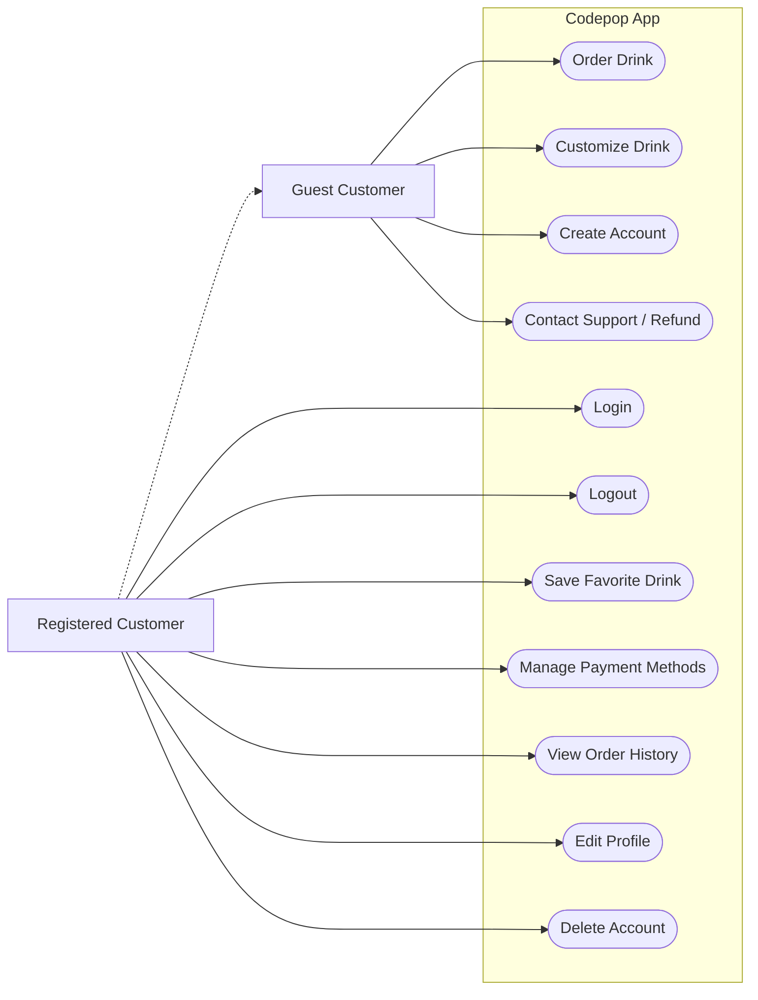
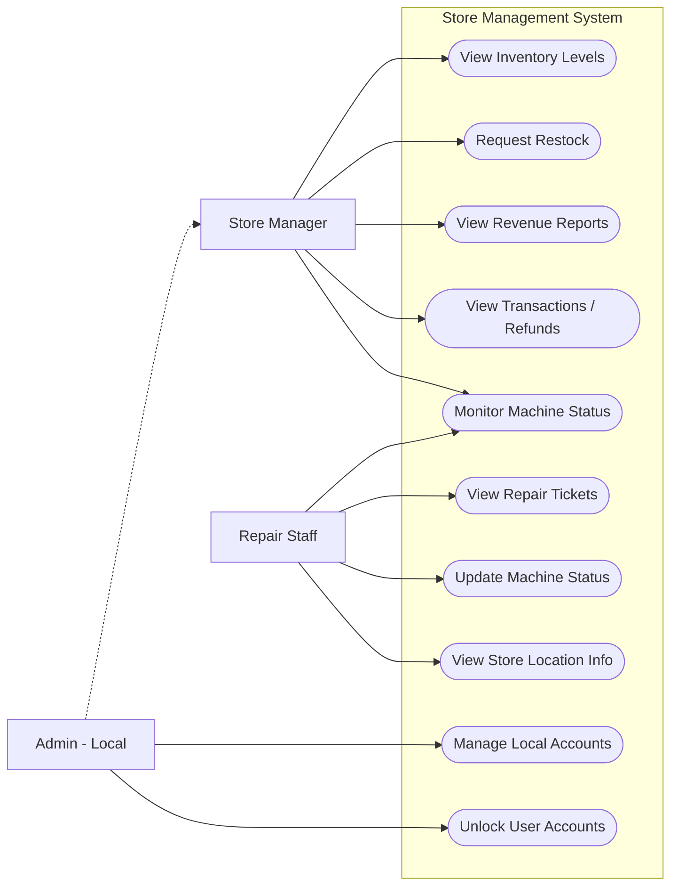
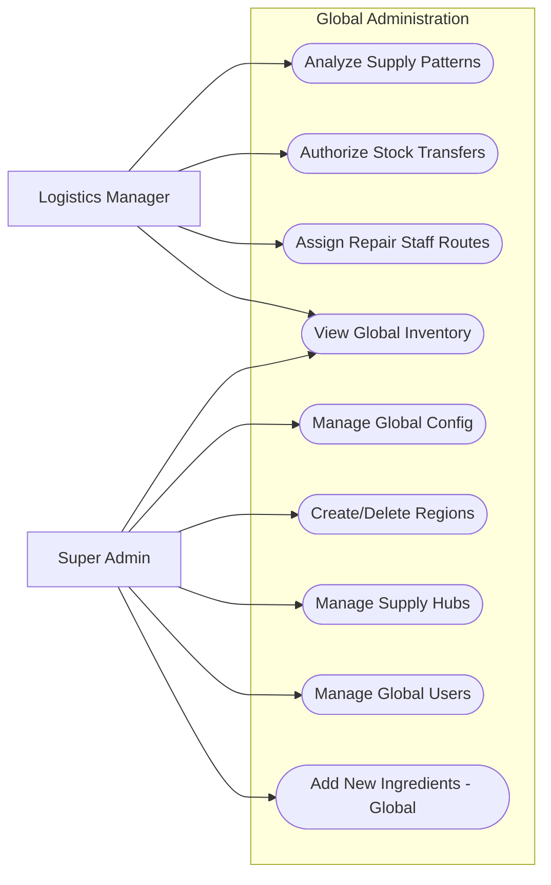

# Purpose

The purpose of this document is to define the functional, non-functional, business, and user requirements for the Codepop application. Codepop is an automated beverage fulfillment ecosystem designed to minimize human labor while still upholding maximum customer satisfaction. This document serves to provide the scope for the system's capabilities.

# Scope

The Codepop ecosystem is comprised of a customer-facing mobile and web application for ordering, a comprehensive system for inventory and logistics management, and a machine interface for tracking the status of automated robotic drink dispensers. The system manages the flow between customers, store managers, logistic coordinators, and repair staff to ensure "Just-In-Time" drink fulfillment and efficient supply chain operations.

# Definitions & Acronyms

Supply Hub:

- A central warehouse facility responsible for distributing inventory to stores within its region and neighboring regions within 1000 miles.

Region:

- A collection of stores in a large geographical area.

Micro-Region:

- A subdivision of a geographic region used to optimize repair staff travel and stock transfers.

# User Classes and Characteristics

To ensure the system meets the needs of all users, we have identified the following user classes and characteristics:

### Guest Customer

A transient user who interacts with the system for immediate needs without long-term commitment.

- **Characteristics:**
  - Wishes to use the system without retaining personal data.
  - Values a frictionless and speedy ordering process.
- **Limitations:**
  - Data and preferences are not saved after the session ends.
  - Will not have access to advanced personalized AI features (e.g., preference-based drink generation).

### Registered Customer

A recurring user who creates an account to enhance their ordering experience through data persistence.

- **Characteristics:**
  - Values convenience features such as saving favorite drink recipes and payment methods.
  - Utilizes the Codepop Drink Generator AI for personalized recommendations.
- **System Interaction:**
  - The system automatically suggests the optimal store location based on the user's current GPS location.
  - Order history and preferences are synchronized across all regions.

### Store Manager

The operational lead responsible for a specific physical location. They ensure the day-to-day efficiency of the store.

- **Responsibilities:**
  - Monitors local inventory levels (syrups, cups, ice, CO2).
  - Tracks store revenue and financial reporting.
  - Monitors immediate machine status and alerts.
- **Access Control:**
  - Strictly limited to the information of their own assigned store; cannot view data from other locations.

### Logistics Manager

A high-level administrator responsible for the supply chain and inventory flow across multiple regions and Supply Hubs.

- **Responsibilities:**
  - Manages "Supply Hubs" and authorizes stock transfers between stores and hubs.
  - Assigns tasks and routes to **Repair Staff**.
  - Analyzes supply usage patterns using an AI or algorithm to optimize restocking.
- **Access:**
  - **Region Stock:** View specific store stock within their region.
  - **Hub Stock:** View inventory levels in regional Supply Hubs.
  - **Proximity Stock:** View stock availability in regions within 1000 miles for emergency sourcing.
  - **Sales Data:** Access aggregated store sales data to inform logistics decisions.

### Repair Staff

Technical staff tasked with maintaining robotic drink dispensers to minimize store downtime. They operate primarily in the field based on automated or assigned tickets.

- **Responsibilities:**
  - Ensures maintenance is completed in a timely manner.
  - Responds to machine status alerts (e.g., "error", "service upcoming").
- **Information Access:**
  - Receives detailed store information (Address, Contact).
  - View machine specifics: Machine Type, Operational Start Date.
  - View real-time logs: Machine Status (e.g., "Repair-Start", "Normal"), Status Date.

### Admin (Local)

A store-level administrator with elevated permissions compared to the standard Store Manager.

- **Access:**
  - Includes all access rights of a **Store Manager** (Stock, Revenue, Machine Status).
- **User Management:**
  - Ability to manage local user accounts (e.g., adding or removing Store Managers).
  - Can update/unlock user accounts for their specific location.

### Super Admin

The highest level of system access, responsible for the global configuration of the decentralized network.

- **Responsibilities:**
  - Manages global security settings and system configurations.
  - Oversees all user accounts system-wide.
- **Network Control:**
  - Can create or delete Supply Hubs and Regions.
  - Has unrestricted read/write access to data at any store location or Supply Hub.

# Business Requirements

These requirements define high-level business goals

1. Scalability via Decentralization
   - The architecture must be optimized to allow for easy expansion from a single store to multiple locations, being organized into regions and sub-regions.
   - The software must operate without a single centralized master server. Instead local stores must communicate with each other and synchronize peer-to-peer or with their regional hub only when necessary.
2. Automation and Minimal Human Interaction:
   - The system must enable stores to run without the interference of human operators, with minimal visits by store staff, relying instead on robotic fulfillment.
3. Supply Chain Optimization
   - The system must reduce waste and stockouts by utilizing the 7 designated supply hubs
   - Inventory logic must prioritize shipping from the closest valid source _(Local Store > Regional Hub > Neighboring Hub < 1000 miles)_.
   - The 7 hubs are as listed:
     1. **Region A:** Chicago, IL
     2. **Region B:** New Jersey, NY
     3. **Region C:** Logan, UT
     4. **Region D:** Dallas, TX
     5. **Region E:** Atlanta, GA
     6. **Region F:** Phoenix, AZ
     7. **Region G:** Boise, ID
4. Maintenance Efficiency
   - To maximize system uptime and profits, the system must transition from a reactive to a proactive maintenance schedule. Repair staff travel should be minimized using specialized algorithms.
5. Regulatory and Reporting Compliance
   - Each location must maintain independent revenue tracking. Global reporting must be aggregable by Super Admins without compromising the decentralized nature of the network.
6. Payment System

- App/Site should be able to process payment when an order is placed
- Refunds must be process before order is retrieved
- ability to track revenue

## Must Have

### Region Management

- Stores will belong and act within an assigned region
- Each Region will have a supply hub
- Supplies can come from supply hub, local suppliers, stores within region, and regions within 1000 miles

### Store Info

- Communicate directly with other stores inside of their region
- Own stock quantity

- Sales data

- The user will pay for their soda(s) as soon as they submit their order either on the app or the website. If the cart is empty no transactions will take place. If the user decides to cancel the order, they will get immediately reimbursed. The user should not be able to cancel their order once the drinks have been picked up.

- All transactions will be handled by third party software to reduce need for encryption

### Machine Management

- Keep track of maintenance schedule

- Keep track of machine type

- Keep track of machine status
  - running

  - repair-start

  - repair-end

  - error

  - critical error

  - out of order

  - service upcoming

- Keep track of when the status is applied/changed

- Keep track of how long until machine is inoperable

- Keep track of repair staff location/status

### Dashboards

- each role requires a specific dashboard to update/change/view everything that their responsibilities require of them

- User has the option to create their own drink without the use of AI

### Universal Drink ordering system

- Drinks are universal in their makeup
  - a small is x oz, medium is y oz, and a large is z oz

  - syrup is quantized to a squirt (cant order a half squirt)

  - Ingredients share the same name everywhere

- an order can contain many drinks

- each drink does not have to fill the entire volume

- ingredients added in different order are the same (mtn dew, lime, lemon is the same as lemon, mtn dew, lime)

- ingredients combine if added out of order (1 lemon, 1 lime, 1 lemon -> 2 lemon, 1 lime)

### AI

- Can randomly generate drinks from soda flavor, ice amount, syrup flavor and pumps, and cream
- If User likes the generated drink they can chose to save it, or if they don't they can recreate it.

- The AI will use Geo-Location to keep track of the user. Using a combination of the user’s rate of speed and an estimation of how long the soda order will take to create, the AI determines how close the user needs to be to the CodePop location before the robots start creating their order.

- Keep track of ingredient popularity and the rate at which ingredients are being used (in store). When it predicts an ingredient to start running low, it will notify the manager what ingredients should be ordered and restocked.

### Device Access

- Prioritize access through Application, should be available on both Apple and Android as well as web applications. Web applications should include Google Chrome, Safari, Firefox, and Edge compatibility

## Should Have

### Regions

- Contain Micro Regions
  - Micro regions will allow for repair staff to move around more efficiently

  - Micro regions will NOT have impenetrable borders

### Stores

- Store specific drinks

- Drinks in the order queue (ordered but not yet made)

- Organize other stores between micro and main region

- upcoming maintenance schedule

- total storage availability (can store 100 lbs of syrup, 30 different flavors, etc)

- minimum stock before re-order

- minimum stock required to allow transfer to other store

- maximum stock of items

- contains their own server

- sign in any user from any store server

### Logistic Manager

- Adjust minimum stock quantities to have on hand inside the supply hub

- access all store stock info
  - minimum/maximum

  - minimum stock to allow transfers

### Manager

- set store minimum/maximum stock

- set store minimum allow to transfer value

- request stock from other stores

- deny stock transfer requests

## Could Have

### Stock

- stock organized within micro regions so stock transfers are faster

- predictive ordering based off of sales data

- new suggested minimums based off of sales data

### Push Notifications

- users can receive notifications about order status and special offers

- managers can receive notifications of supplies running low which need restocking

- repair_staff can receive notifications for when a bot needs immediate attention

## Will not have

- The ability for multiple users to use the same account

- A gift card or cash processing system (all types of payment will be processed using Stripe)

# User Stories

The User Stories below describe the functional requirements from the perspective of each role

## Customer

- As any Customer I want to contact someone to get a refund, make a complaint, or get a drink remade so that I can get my issues resolved and feel satisfied with the service.

## Guest Customer

- As a Guest Customer I want to order a drink without having to make an account so that I can get my drink quickly.

- As a Guest Customer, I want to filter or view popular drink options so that I am not overwhelmed by the endless customization possibilities.

- As a Guest Customer, I might want to create or sign into an account so that I can save my order history for future convenience.

## Registered Customer

- As a Registered Customer I want to see drinks that I have ordered before so that I can re-order my favorites without customizing them from scratch.

- As a Registered Customer I want to be recommended new drinks based on personal preferences so that I can discover new drink combinations that I might like.

- As a Registered Customer I want to save my payment info so that I don't need to input it each time

- As a Registered Customer, I want to be able to sign out so that I can protect my account information.

- As a Registered Customer, I want to delete my account so that I can remove my personal data from the system permanently.

- As a Registered Customer I want to be able to edit my profile so that I can keep my contact and payment information up to date.

- As a Registered Customer I want to be able to save my favorite drinks and view/modify/delete them so that I can keep a personal menu of my favorite drinks.

- As a Registered Customer, I want to be able to have my drink fresh and ready for me right as I arrive to pick it up so that I don't have to wait or have a watered-down drink.

- As a Registered Customer, I want to be able to add payment options to my account so I can pay through the app when I order my drinks.

- As a Registered Customer, I want to be refunded if I cancel my drink order so that I do not lose money if I made a mistake or change my mind.

## Store Manager

- As a Store Manager I want to view stock inventory so that I can request restocks as needed

- As a Store Manager I want access to non-sensitive payment transaction information to help administer refunds, verify transactions, and other payment-related issues

- As a Store Manager I want to be able to see store revenue reports from the database so that I can track the financial performance of my store.

- As a store manager I want to be able to view the status of my machines so that I can immediately identify if my machines are working properly or if they need maintenance.

## Logistics Manager

- As a Logistics Manager I want to view the supply usage of each store so that I can use recognize patterns in the supply usage of each store

- As a Logistics Manager I want to manage the routing of supplies to stores so that I can ensure supplies can reach each store before they run out

- As a Logistics Manager I want to update and create supply schedules based on patterns I've found so that I can ensure each store is sufficiently stocked on time for their individual needs

## Repair Staff

- As a Repair Staff I want to stay updated on robot conditions so that I can repair them when needed

- As a Repair Staff I want to be assigned to stores that require less of a distance to travel so I can go from one store to another quickly

- As a Repair Staff I want to notify the system that repairs are in progress so that customers can't order from the location while repairs are underway

## Admin (Local)

- As an Admin I want to access store data so I can add and manage Store Manager accounts

- As an Admin I want to update/remove/unlock user accounts so that I can help users and protect the system from misuse

## Super Admin

- As a Super Admin I want to access data for any store location so that I can manage new Admins and other roles across the region

- As a Super Admin I want to manage supply hubs and regions so that when new stores are added we can adjust boundaries as needed for efficiency

- As a Super Admin I need to make nation-wide updates so that I can keep all the stores up to date

- As a Super Admin I want to add new ingredients to every store and supply hub so that when a new flavor is added we can deploy it quickly and efficiently

# Use Case Diagrams

## Customer Experience

## Store Management

## Logistics Management

