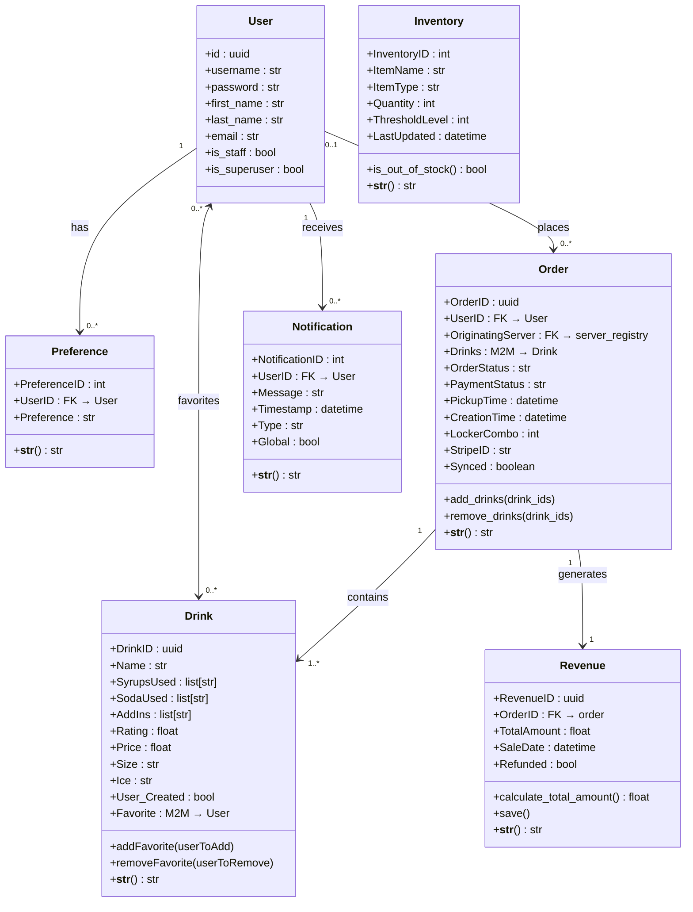
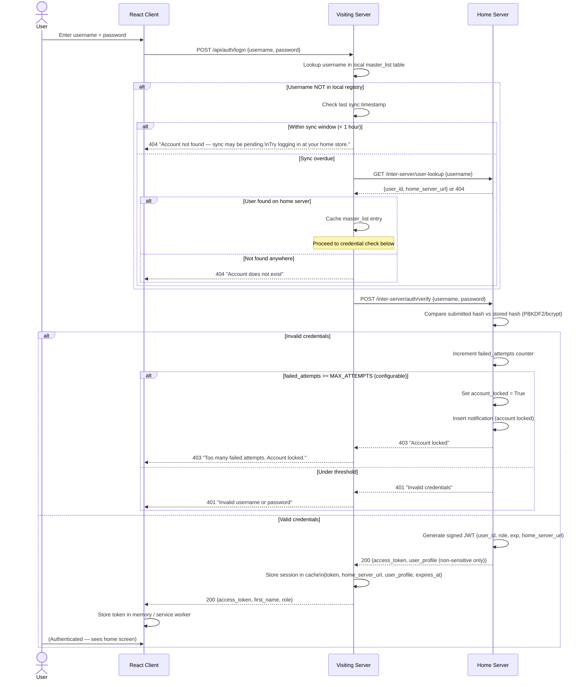
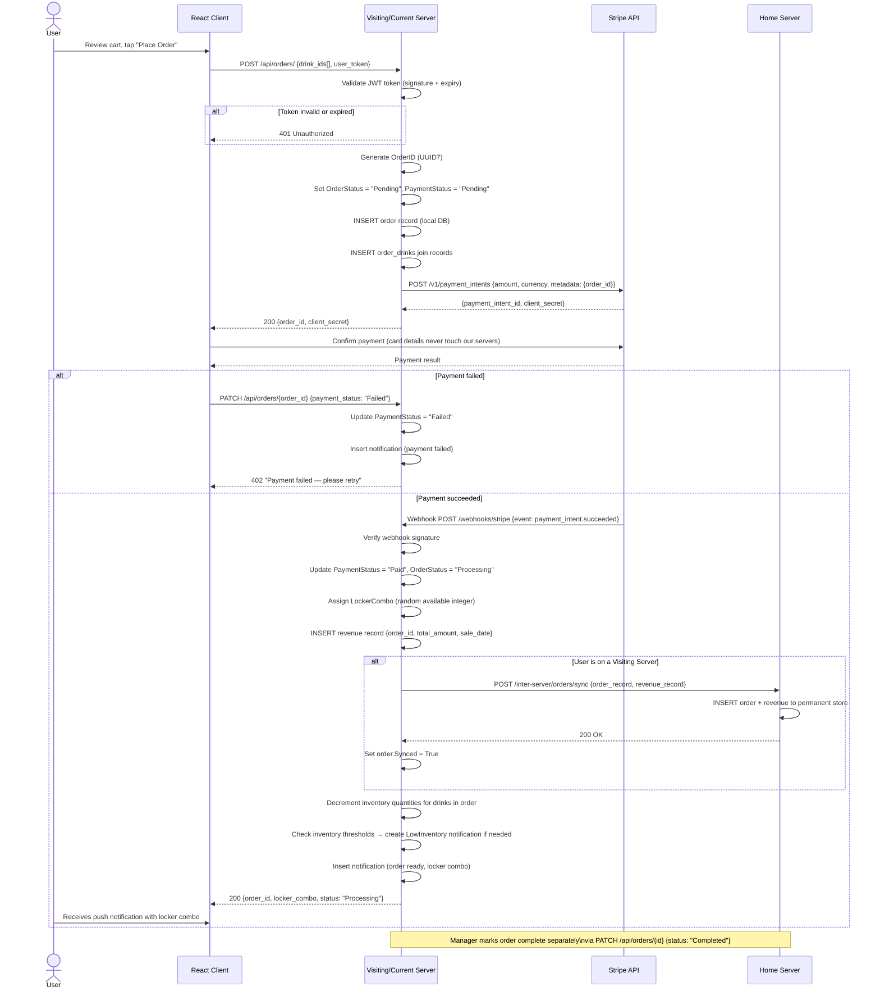

# Low-Level Design Document

**Version:** 2

**Team:** SocialDrinkers (3)

---

Table of contents:

- [Low-Level Design Document](#low-level-design-document)
  - [1. Introduction and Architectural Overview](#1-introduction-and-architectural-overview)
    - [1.1 Purpose](#11-purpose)
    - [1.2 Consistency with High-Level Design](#12-consistency-with-high-level-design)
    - [1.3 System Architecture](#13-system-architecture)
  - [2. Technology Stack \& Frameworks](#2-technology-stack--frameworks)
    - [2.1 Languages, Libraries, and Frameworks](#21-languages-libraries-and-frameworks)
    - [2.2 Justification](#22-justification)
  - [3. Subsystem and Class Design](#3-subsystem-and-class-design)
    - [3.1 Subsystem Breakdown](#31-subsystem-breakdown)
    - [3.2 Detailed Class Definitions](#32-detailed-class-definitions)
    - [3.3 UML Class Diagrams](#33-uml-class-diagrams)
    - [3.4 Order State Machine](#34-order-state-machine)
  - [4. Database Design](#4-database-design)
    - [4.1 Database Tables and Schema](#41-database-tables-and-schema)
      - [**Table: `user` (`auth_user`)**](#table-user-auth_user)
      - [**Table: `master_list`**](#table-master_list)
      - [**Table: `server_registry`**](#table-server_registry)
      - [**Table: `user_movement`**](#table-user_movement)
      - [**Table: `preference`**](#table-preference)
      - [**Table: `drink`**](#table-drink)
      - [**Table: `Flavors`**](#table-flavors)
      - [**Table: `inventory`**](#table-inventory)
      - [**Table: `notification`**](#table-notification)
      - [**Table: `order`**](#table-order)
      - [**Table: `revenue`**](#table-revenue)
      - [**Table: `order_drinks`** (Many-to-Many Join Table)](#table-order_drinks-many-to-many-join-table)
      - [**Table: `drink_favorite`** (Many-to-Many Join Table)](#table-drink_favorite-many-to-many-join-table)
      - [Implementation Notes](#implementation-notes)
    - [4.2 Normalization Justification](#42-normalization-justification)
      - [**First Normal Form (1NF):** Eliminating Repeating Groups](#first-normal-form-1nf-eliminating-repeating-groups)
      - [**Second Normal Form (2NF):** Eliminating Partial Dependencies](#second-normal-form-2nf-eliminating-partial-dependencies)
      - [**Third Normal Form (3NF):** Eliminating Transitive Dependencies](#third-normal-form-3nf-eliminating-transitive-dependencies)
  - [5. User Interface (UI) and Experience (UX)](#5-user-interface-ui-and-experience-ux)
    - [5.1 UI Prototypes](#51-ui-prototypes)
      - [User](#user)
        - [Manager](#manager)
        - [Admin](#admin)
        - [Super Admin](#super-admin)
    - [5.2 User Flow](#52-user-flow)
      - [Account Creation and Profile Setup](#account-creation-and-profile-setup)
      - [Login Process](#login-process)
      - [Logout Process](#logout-process)
      - [AI-Generated Drink Selection](#ai-generated-drink-selection)
      - [Super Admin Capabilities](#super-admin-capabilities)
      - [Regular Admin Capabilities](#regular-admin-capabilities)
      - [Store Manager Responsibilities](#store-manager-responsibilities)
    - [5.3 Usability and Accessibility](#53-usability-and-accessibility)
  - [6. Peer to Peer Networking](#6-peer-to-peer-networking)
    - [6.0 Terms](#60-terms)
      - [Home Server](#home-server)
      - [Visiting Server](#visiting-server)
      - [Sensitive Information](#sensitive-information)
      - [Permanent Data](#permanent-data)
      - [Ephemeral Data](#ephemeral-data)
      - [Authoritative Source](#authoritative-source)
      - [Inter-Server API](#inter-server-api)
    - [6.1 Home and Visiting Server Assignment](#61-home-and-visiting-server-assignment)
      - [Store-Local Users](#store-local-users)
      - [Cross-Store Users](#cross-store-users)
    - [6.2 Cross-Server User Session Handling](#62-cross-server-user-session-handling)
      - [Account Creation](#account-creation)
      - [Login Process](#login-process-1)
      - [Data Transfer Rules](#data-transfer-rules)
      - [Payment and Order Processing](#payment-and-order-processing)
    - [6.3 Data Synchronization and API Optimization](#63-data-synchronization-and-api-optimization)
      - [Login Discovery Process](#login-discovery-process)
      - [User Table Updates](#user-table-updates)
      - [Caching Strategy](#caching-strategy)
    - [6.4 Security Requirements for Peer-to-Peer Servers](#64-security-requirements-for-peer-to-peer-servers)
    - [6.5 Server Failure and Fault Tolerance](#65-server-failure-and-fault-tolerance)
      - [Visiting Server Failure](#visiting-server-failure)
      - [Home Server Failure](#home-server-failure)
      - [Home Server Recovery](#home-server-recovery)
    - [6.6 Scalability and Load Balancing](#66-scalability-and-load-balancing)
    - [6.7 Data Privacy Model](#67-data-privacy-model)
    - [6.8 Server Registration and Discovery](#68-server-registration-and-discovery)
      - [Server Registry](#server-registry)
      - [New Server Onboarding](#new-server-onboarding)
      - [Health Checks](#health-checks)
  - [7. Security and Data Protection](#7-security-and-data-protection)
    - [7.1 Security Risks \& Mitigations](#71-security-risks--mitigations)
    - [7.2 Data Protection (In Transit and At Rest)](#72-data-protection-in-transit-and-at-rest)
  - [8. Third-Party Integrations](#8-third-party-integrations)
    - [8.1 Integration Details](#81-integration-details)
      - [**Payments: Stripe**](#payments-stripe)
      - [**AI \& Machine Learning: Scikit-Learn and DialoGPT**](#ai--machine-learning-scikit-learn-and-dialogpt)
      - [**Location Services: Haversine \& Geohash**](#location-services-haversine--geohash)
  - [9. Deployment Plan and DevOps](#9-deployment-plan-and-devops)
    - [9.1 Deployment Strategy](#91-deployment-strategy)
  - [Deployment Architecture](#deployment-architecture)
    - [9.2 Automated Testing and Monitoring](#92-automated-testing-and-monitoring)
      - [Testing Strategy](#testing-strategy)
      - [Monitoring and Observability](#monitoring-and-observability)
  - [10. Task Breakdown and Team Assignments](#10-task-breakdown-and-team-assignments)
    - [10.1 Key Tasks and Feature Teams](#101-key-tasks-and-feature-teams)

---

## 1. Introduction and Architectural Overview

### 1.1 Purpose

The purpose of this document is to provide a detailed, technical blueprint for the CodePop system. It outlines the specific classes, database schemas, security protocols, and deployment strategies necessary for the development sprints. It serves as the authoritative reference for developers implementing the system. It covers the full deployment stack — from the ReactJS frontend to the Django backend, from the PostgreSQL database schema to the local Docker-based infrastructure on which all server instances run. Each server instance is packaged as a Docker container, ensuring environment consistency across all deployments. The same application codebase is deployed to every instance; instances are differentiated by their associated database and port, which is scoped to the individual store it serves.

### 1.2 Consistency with High-Level Design

The Low-Level Design remains fully consistent with the High-Level Design by preserving the defined three-tier architecture, maintaining clear separation between the client, server, and database layers.

This document adheres strictly to the technology stack selected in the HLD, utilizing ReactJS for the frontend, Django for the backend, PostgreSQL for the database, and Stripe for payment processing. The LLD does not introduce new architectural technologies or structural deviations; rather, it implements and refines the design decisions established in the HLD.

Security considerations outlined in the HLD are expanded upon in this document through detailed implementation strategies. This includes enforced data encryption in transit, hashed password storage using Django’s secure defaults, centralized storage of sensitive data on authoritative servers, and adherence to OWASP Top 10 security principles.

The decentralized peer-to-peer architecture described in the HLD is further operationalized in the LLD through the formal definition of Home and Visiting servers. This includes clearly defined server roles, authentication workflows, data ownership rules, synchronization policies, and fault tolerance mechanisms. These refinements ensure secure and efficient inter-server communication while preserving the original decentralized vision.

Additionally, the LLD supports the HLD’s goals regarding inventory tracking and predictive maintenance by defining the Inventory table, Notification system, order logging structures, and scalable REST-based endpoints.

The infrastructure choices made in this document are consistent with the HLD's operational goals. All server instances are orchestrated via Docker Compose, which provides the distribution and reliability required by the P2P architecture. Each server instance runs inside a Docker container, ensuring reproducible, environment-agnostic deployments. Because every instance runs identical application code and differs only in its connected database and configuration, new store locations can be onboarded by provisioning a new container and database — directly realizing the HLD's vision of an extensible, decentralized network.

### 1.3 System Architecture

Each client is implemented as a ReactJS Progressive Web App. It is responsible for rendering the user interface, handling user input, and securely communicating with backend services over HTTPS. The client manages session tokens for authenticated users and supports offline capabilities through service workers. It is designed to function on both mobile and desktop platforms.

Every server is responsible for authentication, authorization, and processing orders, including payment handling through Stripe (with mock support for development). Business logic and request validation are handled at this level.

Each server operates within a decentralized peer-to-peer network, where any store server can act as either a Home Server or a Visiting Server. Every individual store runs its own dedicated server instance. Sensitive user data remains stored on the user’s Home Server. Communication between servers is secured using TLS to ensure encrypted data exchange.

Users interact with the client, which sends HTTPS requests to the appropriate server. The server validates and processes the request, interacts with the database and/or external services as needed, and then returns a response to the client.

Because the system uses a decentralized architecture, each store operates its own independent server while participating in the broader network. This design supports horizontal scaling, as new store locations can be deployed with the same software stack and integrate into the network without requiring architectural changes.

The database uses PostgreSQL to store system data, including user accounts, order history, preferences, and related records. It enforces foreign key constraints and follows normalization principles to prevent redundancy and maintain consistent data integrity.

**Infrastructure and Deployment**

All server instances are hosted locally or on private servers via Docker. Each instance runs inside a Docker container, which packages the full application runtime — the Django backend, its dependencies, and its configuration — into a portable, self-contained unit. This guarantees that every instance runs in an identical environment, eliminating environment-specific bugs and simplifying deployment.

Every instance runs the same application code. Instances are differentiated by the PostgreSQL database they connect to and the port they expose. Each database is scoped to a specific individual store and holds only the data belonging to that store's user base. This design means:

- Adding a new store location requires only adding a new service to the `docker-compose.yml` file with a new database — no code changes are needed.
- A rolling update to the application (e.g., a new feature or security patch) can be applied uniformly across all instances by updating the shared Docker image.
- Database isolation ensures that a failure or data issue on one store's instance does not directly affect other stores.

This architecture maps directly onto the P2P model: each Docker container is an independent peer dedicated to a single store, capable of acting as a Home or Visiting Server.

---

## 2. Technology Stack & Frameworks

### 2.1 Languages, Libraries, and Frameworks

- **Frontend:** ReactJS (Progressive Web App architecture utilizing functional components and hooks)
- **Backend:** Django (Python-based framework handling business logic, authentication and API endpoints)
- **Database:** PostgreSQL (relational database system for persistent data storage)
- **AI/ML:**
  - `scikit-learn`: Powers the deterministic drink recommendation engine using `CountVectorizer` and cosine similarity.
  - `transformers` & `torch`: Powers the customer service chatbot using the `DialoGPT-medium` model.
  - `pandas`: Used for data manipulation and reading ingredient CSV files.
- **Other Tools:** Stripe (secure third-party payment processor with local mock support)

### 2.2 Justification

- **Design Choice:** The system uses ReactJS for frontend and Django for the backend with PostgreSQL as the database and Stripe for payment.

- **Alternatives Considered:** Native iOS (Swift) / Android (Kotlin) for frontend were considered but would require separate codebases overall slowing deployment and updates., Node.js with express was considered as a backend alternative, but we stuck with Django for it's security defaults and PostgreSQL integration.

- **Rationale:** ReactJS enables cross-platform deployment through a single progressive app which supports both desktop and mobile. Django provides the framework with built-in authentication handling, ORM support, and administrative tools which help with the system's decentralized architecture. PostgreSQL helps with foreign key enforcement and scalability, along with Django having built-in support for it. Stripe was chosen to allow sensitive payment information to be stored elsewhere, this allows the decentralized network to not have to send saved payment info between servers.

---

## 3. Subsystem and Class Design

### 3.1 Subsystem Breakdown

The CodePop system was originally designed with nine major subsystems. While the core "Customer Flow" (Subsystems 1-4, 7-8) was fully realized, internal management and logistics features (Subsystems 5, 6, 9) were partially implemented or deferred to ensure MVP stability:

1. **User Authentication & Authorization** — Handles user registration, login, logout, and role-based access control (user, manager, admin, super admin).
2. **User Preferences** — Stores and manages per-user flavor and drink preferences, consumed by the similarity engine.
3. **Drink Management** — Manages the catalog of drinks, including ingredients, pricing, and favorite tracking.
4. **Order Management** — Orchestrates the full order lifecycle from cart creation through fulfillment.
5. **Inventory Management** — Tracks physical stock levels and generates alerts. _Note: Automated restocking and inter-store transfers were not fully implemented._
6. **Notification System** — Delivers user-targeted and global alerts.
7. **Payment & Revenue** — Integrates with Stripe (and Mock Stripe) to process payments and record financial data.
8. **AI Drink Recommendation Engine** — Generates personalized recipes using `scikit-learn` and local CSV ingredient datasets.
9. **Customer Service Chatbot** — Provides a conversational interface for support flows using `microsoft/DialoGPT-medium`. _Note: Frontend integration remains incomplete._

_Note on Roles: While the system architecture supports "Logistics Manager" and "Repair Staff" roles, these features were largely cut or left non-functional in the final implementation to focus on the core customer experience._

---

### 3.2 Detailed Class Definitions

Each subsystem is structured so that model classes own only data and domain-level behavior (SRP), serializer classes own only validation and transformation, and view classes own only HTTP request/response handling. Inheritance is used exclusively to extend Django REST Framework base classes, avoiding custom deep hierarchies. Composition is preferred when objects must collaborate — for example, views compose serializers for validation rather than embedding validation logic inline, and models expose ManyToMany relationships to compose related entities.

---

**Subsystem 1: User Authentication & Authorization**

- `CustomAuthToken` _(extends `ObtainAuthToken`)_: Handles user login and token issuance.
  - _Methods:_ `post(request)` — validates credentials, returns `token`, `user_id`, `first_name`, `is_staff`, `is_superuser`
- `CreateUserAPIView` _(extends `CreateAPIView`)_: Handles user registration.
  - _Methods:_ `post(request)` — creates a `User` record and its associated auth token
- `LogoutUserAPIView` _(extends `APIView`)_: Handles user logout.
  - _Methods:_ `post(request)` — deletes the requesting user's auth token; requires `IsAuthenticated`
- `UserOperations` _(extends `ModelViewSet`)_: Provides super-admin user management (list, edit, delete).
  - _Methods:_ `list()`, `post(request)` — edit user fields (username, name, password, role), `destroy(request)`; requires `IsSuperUser`
- `IsSuperUser` _(extends `BasePermission`)_: Custom DRF permission gate.
  - _Methods:_ `has_permission(request, view)` — returns `True` only if the user is authenticated and `is_superuser`
- `CreateUserSerializer` _(extends `ModelSerializer`)_: Validates and securely creates user accounts.
  - _Fields:_ `username`, `password` (write-only), `first_name`, `last_name`
  - _Methods:_ `create(validated_data)` — calls `set_password()` to hash before saving
- `GetUserSerializer` _(extends `ModelSerializer`)_: Read serializer for user data.
  - _Fields:_ `id`, `username`, `password` (write-only), `first_name`, `last_name`, `is_staff`, `is_superuser`

---

**Subsystem 2: User Preferences**

- `Preference` _(extends `Model`)_: Stores a single preference tag for a user.
  - _Fields:_ `PreferenceID (AutoField PK)`, `UserID (ForeignKey → auth_user)`, `Preference (CharField, max 100)`
  - _Methods:_ `__str__()` — returns preference description
- `PreferencesOperations` _(extends `ModelViewSet`)_: Full CRUD for preferences; requires `IsAuthenticated`.
  - _Methods:_ `list()`, `create()`, `retrieve()`, `update()`, `destroy()`
- `UserPreferenceLookup` _(extends `ListAPIView`)_: Lists all preferences for a specific user.
  - _Methods:_ `get_queryset()` — filters by `user_id` URL parameter
- `PreferenceSerializer` _(extends `ModelSerializer`)_: Validates preferences against a fixed allow-list (~60 accepted flavor/style tags).
  - _Fields:_ `PreferenceID`, `UserID`, `Preference`
  - _Methods:_ `validate_Preference(value)` — raises `ValidationError` if value is not in the allowed set

---

**Subsystem 3: Drink Management**

- `Drink` _(extends `Model`)_: Represents a drink recipe; the central entity of the catalog.
  - _Fields:_ `DrinkID (UUID7)`, `Name (CharField, max 255)`, `SyrupsUsed (ArrayField)`, `SodaUsed (ArrayField)`, `AddIns (ArrayField)`, `Rating (FloatField, nullable)`, `Price (FloatField)`, `Size (CharField, default "m")`, `Ice (CharField, default "normal")`, `User_Created (BooleanField)`, `Favorite (ManyToManyField → auth_user)`
  - _Methods:_ `addFavorite(userToAdd)`, `removeFavorite(userToRemove)`, `__str__()`
- `DrinkOperations` _(extends `ModelViewSet`)_: Full CRUD for drinks; filters non-user-created drinks on list.
  - _Methods:_ `list()`, `create()`, `retrieve()`, `update()`, `destroy()`; PATCH actions for adding/removing favorites
- `UserDrinksLookup` _(extends `ListAPIView`)_: Lists all drinks favorited by a specific user.
  - _Methods:_ `get_queryset()` — filters `Favorite` by `user_id` URL parameter
- `DrinkSerializer` _(extends `ModelSerializer`)_: Validates drink creation and updates.
  - _Fields:_ All `Drink` model fields
  - _Methods:_ `validate_Size(value)` — accepts `['16oz', '24oz', '32oz']`; `validate_Ice(value)` — accepts `['none', 'light', 'regular', 'extra']`

---

**Subsystem 4: Order Management**

- `Order` _(extends `Model`)_: Represents a customer order and its full lifecycle state.
  - _Fields:_ `OrderID (UUID7)`, `UserID (ForeignKey → auth_user, nullable)`, `Drinks (ManyToManyField → Drink)`, `OrderStatus (CharField: pending/processing/completed/cancelled)`, `PaymentStatus (CharField: pending/paid/failed/remade)`, `PickupTime (DateTimeField, nullable)`, `CreationTime (DateTimeField, auto)`, `LockerCombo (BigIntegerField, nullable)`, `StripeID (CharField)`, `Synced (Boolean)`
  - _Methods:_ `add_drinks(drink_ids)`, `remove_drinks(drink_ids)`, `__str__()`
- `OrderOperations` _(extends `ModelViewSet`)_: Full CRUD for orders, including PATCH support for drink modifications.
  - _Methods:_ `list()`, `create()`, `retrieve()`, `update()`, `partial_update()`, `destroy()`
- `UserOrdersLookup` _(extends `ListCreateAPIView`)_: Lists and creates orders scoped to a specific user.
  - _Methods:_ `get_queryset()` — filters by `user_id`; `perform_create()` — assigns `UserID` automatically
- `OrderSerializer` _(extends `ModelSerializer`)_: Validates and creates orders, handling the ManyToMany drink assignment.
  - _Fields:_ All `Order` model fields
  - _Methods:_ `validate_Drinks(value)` — ensures drink list is non-empty; `create(validated_data)` — pops drinks, saves order, then calls `set()` on the M2M relation

---

**Subsystem 5: Inventory Management**

- `Inventory` _(extends `Model`)_: Tracks a physical stock item at the store.
  - _Fields:_ `InventoryID (AutoField PK)`, `ItemName (CharField, max 100)`, `ItemType (CharField: Soda/Syrup/Add In/Physical)`, `Quantity (PositiveIntegerField)`, `ThresholdLevel (PositiveIntegerField)`, `LastUpdated (DateTimeField, auto_now)`
  - _Methods:_ `is_out_of_stock()` — returns `True` if `Quantity <= 0`; `__str__()`
- `InventoryListAPIView` _(extends `ListAPIView`)_: Lists all inventory items that are not out of stock.
  - _Methods:_ `get_queryset()` — filters by `Quantity > 0`
- `InventoryReportAPIView` _(extends `APIView`)_: Generates an aggregate inventory report.
  - _Methods:_ `get(request)` — returns total item count, out-of-stock count, and below-threshold count
- `InventoryUpdateAPIView` _(extends `RetrieveUpdateAPIView`)_: Retrieves or updates a single inventory item; handles `reset_quantity` and `used_quantity` update modes; returns a warning when stock drops below `ThresholdLevel`.
  - _Methods:_ `partial_update(request, pk)` — validates quantity change and returns threshold warning if applicable
- `InventorySerializer` _(extends `ModelSerializer`)_: Serializes all inventory fields.
  - _Fields:_ `InventoryID`, `ItemName`, `ItemType`, `Quantity`, `ThresholdLevel`, `LastUpdated`

**Inventory Decrement and Threshold Alert Pseudocode**

These functions are called automatically after a successful Stripe webhook (see §6.2 Order Placement Pseudocode).

```
FUNCTION decrement_inventory(drink):
    ingredients ← []
    ingredients.extend(drink.sodas_used)
    ingredients.extend(drink.syrups_used)
    ingredients.extend(drink.add_ins)

    FOR ingredient_name IN ingredients:
        item ← Inventory.objects.filter(item_name=ingredient_name).first()
        IF item IS NULL:
            log_warning("Inventory item not found", ingredient_name)
            CONTINUE

        item.quantity    -= 1
        item.last_updated = now()
        item.save()

        check_inventory_threshold(item)


FUNCTION check_inventory_threshold(item):
    IF item.quantity <= item.threshold_level:
        # Avoid duplicate alerts — only create if no unresolved alert exists
        existing_alert ← Notification.objects.filter(
            type              = "LowInventory",
            message__contains = item.item_name,
            global            = True
        ).exists()

        IF NOT existing_alert:
            Notification.objects.create(
                user_id = NULL,    # NULL targets manager-role users
                message = f"Low stock: {item.item_name} — {item.quantity} remaining (threshold: {item.threshold_level})",
                type    = "LowInventory",
                global  = True
            )
            log_info("Low inventory alert created for", item.item_name)
```

- `Notification` _(extends `Model`)_: Stores a single alert or message for a user or for all users.
  - _Fields:_ `NotificationID (AutoField PK)`, `UserID (ForeignKey → auth_user)`, `Message (CharField, max 500)`, `Timestamp (DateTimeField, default now)`, `Type (CharField, max 50)`, `Global (BooleanField, default False)`
  - _Methods:_ `__str__()`
- `NotificationOperations` _(extends `ModelViewSet`)_: Full CRUD for notifications; filters to return both global notifications and those targeted at the requesting user. Includes a `filter_by_time` custom action accepting ISO 8601 `start`/`end` query parameters.
  - _Methods:_ `list()`, `create()`, `retrieve()`, `update()`, `destroy()`, `filter_by_time(request)`
- `UserNotificationLookup` _(extends `ListAPIView`)_: Lists all notifications belonging to a specific user.
  - _Methods:_ `get_queryset()` — filters by `user_id` URL parameter
- `NotificationSerializer` _(extends `ModelSerializer`)_: Serializes all notification fields.
  - _Fields:_ `NotificationID`, `UserID`, `Message`, `Timestamp`, `Type`, `Global`

---

**Subsystem 7: Payment & Revenue**

- `Revenue` _(extends `Model`)_: Records the financial outcome of a completed order.
  - _Fields:_ `RevenueID (UUID7)`, `OrderID (UUID7)`, `TotalAmount (FloatField, default 0.0)`, `SaleDate (DateTimeField, default now)`, `Refunded (BooleanField, default False)`
  - _Methods:_ `calculate_total_amount()` — sums `Price` for all drinks in the linked order; `save()` — overridden to auto-populate `TotalAmount` before insert; `__str__()`
- `StripePaymentIntentView` _(extends `View`, CSRF exempt)_: Creates a Stripe PaymentIntent for the client-side payment flow.
  - _Methods:_ `post(request)` — creates Stripe customer, ephemeral key, and payment intent; returns `paymentIntent`, `ephemeralKey`, `customer`, `publishableKey`
- `refund_order(client_secret_or_id)`: Module-level helper function that calls the Stripe Refunds API to reverse a charge.
- `RevenueViewSet` _(extends `ModelViewSet`)_: Full CRUD for revenue records.
  - _Methods:_ `list()`, `create()`, `retrieve()`, `update()`, `destroy()`
- `RevenueSerializer` _(extends `ModelSerializer`)_: Serializes revenue data and triggers auto-calculation on create.
  - _Fields:_ `RevenueID`, `OrderID`, `TotalAmount`, `SaleDate`, `Refunded`
  - _Methods:_ `create(validated_data)` — calls `calculate_total_amount()` after saving

---

**Subsystem 8: AI Drink Recommendation Engine**

- `GenerateAIDrink` _(extends `APIView`)_: HTTP interface to the recommendation engine; works for both anonymous and authenticated users.
  - _Methods:_ `get(request, user_id=None)` — loads user preferences (or defaults), delegates to `drinkAI.generate_soda()`, and returns a structured drink recipe
- `generate_soda(user_preferences)` _(module function in `drinkAI.py`)_: Orchestrates the full recommendation pipeline using local CSV data and similarity scoring.
  - _Returns:_ dict with `SyrupsUsed`, `SodaUsed`, `AddIns`
- `generate_similar_syrup_preferences(user_preference)` _(module function)_: Uses `CountVectorizer` + cosine similarity from `scikit-learn` to find the top 5 syrups that best match a user's flavor preference string from `Syrups.csv`.
- `generate_best_soda(syrups, prefs)` _(module function)_: Selects a soda whose `best-match-flavors` column in `Sodas.csv` overlaps most with the chosen syrups' flavor profiles.
- `generate_best_addins(syrups, soda, prefs, num)` _(module function)_: Selects add-ins from `AddIns.csv` whose `best-match-syrup` and `best-match-soda` columns align with the chosen syrups and soda.
- `create_list(csv_file_name)` _(module function)_: Reads a CSV ingredient file and returns an array of ingredient names for lookup operations.

**AI Recommendation — Preference Similarity Algorithm**

The recommendation pipeline runs using a deterministic scoring step powered by `scikit-learn`. Unlike LLM-based approaches, this is highly efficient, runs entirely locally, and produces consistent, auditable results based on the provided CSV ingredient dataset.

```
# Input: user's saved Preference tags, candidate ingredients from CSV datasets
FUNCTION generate_soda(user_preferences):
    # Step 1: Filter and categorize user preferences into syrups, sodas, and add-ins
    syrup_prefs, soda_prefs, addin_prefs ← categorize(user_preferences)

    # Step 2: Generate best syrups using CountVectorizer and Cosine Similarity
    chosen_syrups ← []
    FOR pref IN random_sample(syrup_prefs, 2):
        top_matches ← scikit_learn_similarity(pref, "Syrups.csv")
        chosen_syrups.extend(random_sample(top_matches, 2))

    # Step 3: Select best soda matching the chosen syrups
    best_soda ← scikit_learn_similarity(chosen_syrups, "Sodas.csv", filter=soda_prefs)

    # Step 4: Select best add-ins matching syrups and soda
    best_addins ← scikit_learn_similarity(chosen_syrups, best_soda, "AddIns.csv", filter=addin_prefs)

    RETURN {syrups: chosen_syrups, soda: best_soda, addins: best_addins}
```

**Complexity:** O(n · log n) for sorting matches where n is the number of ingredients in the CSV. At the current scale (~hundreds of ingredients), this runs in a few milliseconds locally.

- `Chatbot` _(extends `APIView`)_: Manages a multi-turn conversational support session powered by Microsoft DialoGPT-medium (hosted locally via `transformers`).
  - _Fields (session state):_ `phase` — current conversation stage (`init`, `1`, `2`, `3`, `4`); `order_num` — captured order reference; `drink_nums` — drinks flagged for refund/remake
  - _Methods:_ `post(request)` — receives user message and session state, runs intent matching for "refund" or "remade" using keyword analysis, advances the state machine (wrong-drink flow or refund flow), calls `refund_order()` when appropriate, and returns a structured JSON response with the next bot message and updated state. If no intent is matched, it delegates message generation to the `DialoGPT-medium` model.

---

### 3.3 UML Class Diagrams

The diagram below shows the six Django model classes, their fields, key methods, and relationships (foreign keys and many-to-many associations). The built-in Django `auth_user` table is represented as `User`.



---

### 3.4 Order State Machine

The `Order` model's `OrderStatus` and `PaymentStatus` fields transition through a strictly defined set of states. Illegal transitions are rejected at the view layer before any database write is attempted.

**OrderStatus transitions:**

```
                  ┌─────────┐
        create    │         │
   ─────────────► │ Pending │
                  │         │
                  └────┬────┘
                       │ Stripe webhook (payment_intent.succeeded)
                       ▼
                  ┌────────────┐
                  │ Processing │ ◄── Manager preparing drink
                  └─────┬──────┘
                        │ Manager marks complete
                        ▼
                  ┌───────────┐
                  │ Completed │
                  └───────────┘

    From Pending or Processing:
                  ┌───────────┐
                  │ Cancelled │ ◄── Payment failed / admin action
                  └───────────┘
```

**PaymentStatus transitions:**

```
    Pending ──► Paid      (Stripe webhook: payment_intent.succeeded)
    Pending ──► Failed    (Stripe webhook: payment_intent.payment_failed)
    Paid    ──► Remade    (Manager reprocesses a failed drink)
```

**Transition enforcement pseudocode** (applied inside `OrderOperations.partial_update`):

```
VALID_ORDER_TRANSITIONS = {
    "Pending"    : ["Processing", "Cancelled"],
    "Processing" : ["Completed", "Cancelled"],
    "Completed"  : [],          # Terminal state — no further transitions allowed
    "Cancelled"  : []           # Terminal state — no further transitions allowed
}

FUNCTION transition_order_status(order, new_status):
    IF new_status NOT IN VALID_ORDER_TRANSITIONS[order.order_status]:
        RAISE ValueError(
            f"Invalid transition: {order.order_status} → {new_status}"
        )
    order.order_status = new_status
    order.save()
```

---

## 4. Database Design

### 4.1 Database Tables and Schema

#### **Table: `user` (`auth_user`)**

Stores the user credentials and basic information. This table is **local** to each server and contains sensitive data (password hashes) only for users whose Home Server is this specific instance.

| id                    | username        | password        | email           | first_name | last_name | is_staff | is_superuser |
| :-------------------- | :-------------- | :-------------- | :-------------- | :--------- | :-------- | :------- | :----------- |
| `primary_key` (UUID7) | String (unique) | String (hashed) | String (unique) | String     | String    | Boolean  | Boolean      |

- **Security Note:** Password hashes are never synchronized. A server only contains `auth_user` records for users who registered at that specific store.
- **UUID7 Usage:** This is used to make it easier to sort users and query the database for synchronization, as the first part is a timestamp.

---

#### **Table: `master_list`**

A global mapping table synchronized across all servers in the network. It allows a visiting server to identify which Home Server possesses a user's authoritative credentials.

| UserID                | Username | HomeServerID            |
| :-------------------- | :------- | ----------------------- |
| `primary_key` (UUID7) | String   | FK to `server_registry` |

---

#### **Table: `server_registry`**

A global registry of all active store servers in the P2P network. It contains the network addresses and public keys required for secure inter-server communication and JWT verification.

| ServerID      | ServerURL      | PublicKey                     | Status          | LastSeen |
| :------------ | :------------- | :---------------------------- | :-------------- | :------- |
| `primary_key` | String (HTTPS) | Text (RSA/ED25519 Public Key) | Active/Inactive | DateTime |

---

#### **Table: `user_movement`**

Acts as an immutable audit log for when a user's authoritative Home Server is reassigned. This ensures that if a server is offline during a migration, it can process this log upon reconnection to accurately update its `master_list` and maintain synchronization across the P2P network.

| MovementID            | UserID                        | PreviousServerID        | NewServerID             | Timestamp              | Status                                |
| :-------------------- | :---------------------------- | :---------------------- | :---------------------- | :--------------------- | :------------------------------------ |
| `primary_key` (UUID7) | `id` (UUID7) from `auth_user` | FK to `server_registry` | FK to `server_registry` | DateTime (default now) | String (Initiated, Completed, Failed) |

---

#### **Table: `preference`**

Stores user-specific app or drink preferences.

| PreferenceID  | UserID                | Preference                               |
| :------------ | :-------------------- | :--------------------------------------- |
| `primary_key` | `id` from `auth_user` | String with user preferences (max `100`) |

---

#### **Table: `drink`**

Stores the recipes and metadata for custom sodas, whether they are standard menu items or created by a user.

| DrinkID               | Name               | SyrupsUsed       | SodaUsed         | AddIns           | Rating           | Price | Size                 | Ice                       | User_Created |
| :-------------------- | :----------------- | :--------------- | :--------------- | :--------------- | :--------------- | :---- | :------------------- | :------------------------ | :----------- |
| `primary_key` (UUID7) | String (max `255`) | Array of Strings | Array of Strings | Array of Strings | Float (nullable) | Float | String (default `m`) | String (default `normal`) | Boolean      |

---

#### **Table: `Flavors`**

Stores the types of flavors inside of the syrup or soda so the AI can better match flavors together.
| Syrup ID | Name | Primary Flavor | Secondary Flavor | Tertiary Flavor |
| :------------ | :----------------- | :--------------- | :--------------- | :--------------- |
| `primary_key` | String (max `255`) | String | String | String |

---

#### **Table: `inventory`**

Tracks the physical stock of the soda shop, including bases, syrups, add-ins, and cups/lids.

| InventoryID   | ItemName           | ItemType                               | Quantity         | ThresholdLevel   | LastUpdated             |
| :------------ | :----------------- | :------------------------------------- | :--------------- | :--------------- | :---------------------- |
| `primary_key` | String (max `100`) | String (Soda, Syrup, Add In, Physical) | Positive Integer | Positive Integer | DateTime (Auto-updated) |

---

#### **Table: `notification`**

Stores alerts and messages to be sent to users (e.g., when their soda is ready in the locker).

| NotificationID | UserID                | Message            | Timestamp              | Type              | Global                  |
| :------------- | :-------------------- | :----------------- | :--------------------- | :---------------- | :---------------------- |
| `primary_key`  | `id` from `auth_user` | String (max `500`) | DateTime (default now) | String (max `50`) | Boolean (default False) |

---

#### **Table: `order`**

Manages customer orders, their payment statuses, fulfillment details (like locker combinations), and acts as the authoritative historical ledger for a user's transactions across the entire peer-to-peer network.

| OrderID               | UserID                           | OrderStatus                                        | PaymentStatus                          | PickupTime          | CreationTime        | LockerCombo           | StripeID                  | Synced                    |
| :-------------------- | :------------------------------- | :------------------------------------------------- | :------------------------------------- | :------------------ | :------------------ | :-------------------- | :------------------------ | :------------------------ |
| `primary_key` (UUID7) | `id` from `auth_user` (nullable) | String (Pending, Processing, Completed, Cancelled) | String (Pending, Paid, Failed, Remade) | DateTime (nullable) | DateTime (Auto-add) | BigInteger (nullable) | String (Unique, nullable) | Boolean (default `False`) |

---

#### **Table: `revenue`**

Tracks accounting and financial metrics associated with orders.

| RevenueID             | OrderID                        | TotalAmount           | SaleDate                 | Refunded                  |
| :-------------------- | :----------------------------- | :-------------------- | :----------------------- | :------------------------ |
| `primary_key` (UUID7) | `OrderID` (UUID7) from `order` | Float (default `0.0`) | DateTime (default `now`) | Boolean (default `False`) |

---

#### **Table: `order_drinks`** (Many-to-Many Join Table)

Automatically generated by Django to handle the `ManyToManyField` linking multiple drinks to a single order.

| id            | order_id                       | drink_id                       |
| :------------ | :----------------------------- | :----------------------------- |
| `primary_key` | `OrderID` (UUID7) from `order` | `DrinkID` (UUID7) from `drink` |

---

#### **Table: `drink_favorite`** (Many-to-Many Join Table)

Automatically generated by Django to handle the `ManyToManyField` for users favoriting specific drinks.

| id            | drink_id               | user_id               |
| :------------ | :--------------------- | :-------------------- |
| `primary_key` | `DrinkID` from `drink` | `id` from `auth_user` |

---

#### Implementation Notes

- **Foreign Keys**: In the actual PostgreSQL database, Django will append `_id` to the Foreign Key fields. For example, the `UserID` field in the `Preference` model will be created as `UserID_id` in the database to link to the `auth_user` table.
- **Arrays**: Because we're using `ArrayField` for `SyrupsUsed`, `SodaUsed`, and `AddIns`, these will be native PostgreSQL array types (ideal for scalable recipe ingredients).

### 4.2 Normalization Justification

To ensure data integrity, minimize redundancy, and prevent anomalies (from `insert`, `update`, `delete`, etc.), the CodePop database is designed to adhere to at least the Third Normal Form (3NF).

Below is a breakdown of how these tables satisfy these rules:

#### **First Normal Form (1NF):** Eliminating Repeating Groups

1NF requires that the tables contain no repeating groups or multi-valued attributes, ensuring each column contains solely atomic values.

- **How we achieve it:** In our models, we use Django's `ManyToMany` field for relationships where multiple items can belong to multiple entities. Specifically, `Favorite` (users favoring drinks) and `Drinks` (drinks in an order). Instead of storing a comma-separated string of DrinkIDs in the `order` table, the ORM manages the mapping tables. This separates the data into distinct, atomic rows.
- **Notes on ArrayFields:** We utilize PostgreSQL `ArrayField` for `SyrupsUsed`, `SodaUsed`, and `AddIns` in the `Drink` model. While traditional theory considers this a violation of 1NF, this is a deliberate, modern optimization choice. Because these ingredients are strictly descriptive to the recipe, and don't require foreign-key tracking to an ingredients table, this prevents excessive and expensive SQL joins while maintaining application logic.

#### **Second Normal Form (2NF):** Eliminating Partial Dependencies

2NF further requires that all non-key attributes are fully functionally dependent on the entire primary key.

- **How we achieve it:** Partial dependencies can only occur in tables with composite primary keys (a primary key made of two or more columns). Because every standard model in our schema (`Preference`, `Drink`, `Inventory`, `Notification`, `Order`, `Revenue`) relies on a _single-column_ identifier (whether an auto-incrementing integer or a UUID) as its Primary Key (e.g., `PreferenceID`, `DrinkID`), partial dependency is structurally impossible. Every attribute in these tables depends entirely on that single ID.

#### **Third Normal Form (3NF):** Eliminating Transitive Dependencies

3NF further requires that no non-key attribute depends on another non-key attribute. All attributes must depend solely on the primary key.

- **How we achieve it:** We heavily utilize Foreign Keys to reference related data rather than duplicating it. For example, in the `Order` table, we store a `UserID` (Foreign Key) rather than storing the user's username, email, or phone number directly on the order record.
- **Preventing Anomalies:** If a user's account details were stored directly in the `Order` table, changing a user's email address would require updating every single order that user has ever made (Update Anomaly). If we deleted a user's only order, we might accidentally delete the user's account information (Deletion Anomaly). By strictly storing only the `UserID` in the `Order` table, the user's data depends strictly on the `id` in the `auth_user` table, completely satisfying 3NF. Similarly, the `Revenue` table calculates and stores financial data linked to an `OrderID`, isolating financial tracking from the logistical status of the Order itself.

---

## 5. User Interface (UI) and Experience (UX)

### 5.1 UI Prototypes

A working prototype for the application can be found [here](https://www.figma.com/make/BtypY8RxTDdqVOn2As0ygv/CodePop).

#### User

- 
- 
- 

##### Manager

- 
- 
  - _Note: Logistics Manager dashboard UI was partially developed but backend logic for stock transfers remains non-functional._

##### Admin

- 

##### Super Admin

- 
- 

### 5.2 User Flow

#### Account Creation and Profile Setup

1. User navigates to the registration page.
2. User enters username, password, and personal information.
3. User selects their primary/home store location.
4. User account is created in the selected store's `auth_user` table.
5. User profile summary is replicated across all servers via periodic sync to allow network-wide discovery.
6. User is redirected to the login page.

#### Login Process

1. User enters username and password.
2. System queries the local `master_list` to identify the user's home server.
3. If the user is at their home server, credentials are validated locally.
4. If the user is at a visiting server, the login request is proxied to the home server for authoritative validation.
5. Home server returns a signed JWT access token.
6. User session is established with the token stored in the browser.
7. User is redirected to the home screen.

**Cross-Server Login Workflow Diagram**

The diagram below details the full sequence for a user logging in at a visiting server (a store other than where they registered). For home-server logins, steps involving the visiting server's cache are skipped.



**Cross-Server Login Pseudocode**

```
# Executed on the VISITING SERVER
FUNCTION handle_login(request):
    username ← request.data["username"]
    password ← request.data["password"]

    # Step 1: Local registry lookup
    registry_entry ← MasterList.find(username=username)

    IF registry_entry IS NULL:
        sync_age ← now() - last_sync_timestamp()
        IF sync_age < SYNC_INTERVAL (1 hour):
            RETURN 404 "Account not found. Sync may be pending."
        ELSE:
            registry_entry ← inter_server_GET(
                url    = any_known_server + "/inter-server/user-lookup",
                params = {username: username}
            )
            IF registry_entry IS NULL:
                RETURN 404 "Account does not exist."
            ELSE:
                MasterList.cache(registry_entry)

    home_server_url ← registry_entry.home_server_url

    # Step 2: Forward credential verification to home server
    response ← inter_server_POST(
        url  = home_server_url + "/inter-server/auth/verify",
        body = {username: username, password: password}
    )

    IF response.status == 401: RETURN 401 "Invalid username or password."
    IF response.status == 403: RETURN 403 "Account locked."

    # Step 3: Cache session on visiting server (non-sensitive data only)
    token        ← response.data["access_token"]
    user_profile ← response.data["user_profile"]   # Never includes password hash

    SessionCache.set(
        key   = token,
        value = {
            home_server_url : home_server_url,
            user_profile    : user_profile,
            expires_at      : now() + SESSION_TTL
        }
    )

    RETURN 200 {access_token: token, first_name: user_profile.first_name, role: user_profile.role}


# Executed on the HOME SERVER only
FUNCTION verify_credentials(username, password):
    user ← User.objects.get(username=username)

    IF NOT check_password(password, user.password_hash):
        user.failed_attempts += 1
        user.save()
        IF user.failed_attempts >= MAX_LOGIN_ATTEMPTS:
            user.account_locked = True
            user.save()
            Notification.create(user=user, message="Account locked — too many failures.")
            RETURN 403
        RETURN 401

    user.failed_attempts ← 0   # Reset on success
    user.save()

    token ← JWT.sign({
        user_id         : user.id,
        role            : user.role,
        home_server_url : THIS_SERVER_URL,
        exp             : now() + TOKEN_TTL
    })

    RETURN 200 {
        access_token : token,
        user_profile : {first_name: user.first_name, role: user.role}
        # password_hash and MFA secrets are NEVER included
    }
```

#### Logout Process

1. User clicks logout button
2. System invalidates current session token
3. Cached data is cleared from client
4. User is redirected to login page
5. Session record is removed from visiting server (if applicable)

#### AI-Generated Drink Selection

1. User navigates to "Get Recommendation" feature
2. System sends request to AI recommendation engine with user preferences
3. AI analyzes user flavor profile and past orders
4. AI generates drink recipe with syrup combinations from `drink` table
5. Recommended drink is displayed with name, ingredients, and price
6. User can save recommendation to favorites or add directly to cart
7. Drink is added to `drink_favorite` table if saved, or to `order_drinks` if ordered

#### Super Admin Capabilities

Super admins can:

- Promote or demote regular admins to/from admin status
- Access all stores and user data across regions
- Manage system-wide security policies
- Override any store-level decision
- Generate system-wide reports
- Manage inter-server communication and P2P network configuration
- Access audit logs across all servers

**Process to Change Admin Access:**

1. Super admin navigates to "User Management" section
2. Super admin searches for target admin user
3. Super admin selects user and clicks "Modify Permissions"
4. Super admin toggles admin status on/off
5. System updates user permissions in `auth_user` table
6. Change is logged to audit trail with timestamp and super admin ID
7. Target user receives notification of permission change
8. If demoting, all admin sessions are invalidated immediately

#### Regular Admin Capabilities

Regular admins can:

- View all orders and user data within their assigned region
- Manage store managers and staff
- Monitor inventory levels
- Review financial reports and revenue data
- Handle customer support and refund requests
- Manage notifications and marketing messages
- Access server health and performance metrics for their region
- Cannot promote other users or modify system-wide settings

#### Store Manager Responsibilities

Store managers must:

1. **Daily Operations**

- Monitor real-time order queue and fulfillment status
- Manage locker assignments and pickup coordination
- Track inventory levels via `inventory` table
- Respond to customer notifications and issues

2. **Inventory Management**

- Check `ThresholdLevel` alerts in `inventory` table
- Reorder syrups, sodas, add-ins, and physical supplies when stock drops below threshold
- Log all inventory updates with timestamps
- Monitor expiration dates for perishable items

3. **Order Management**

- Review pending orders from `order` table
- Coordinate drink preparation
- Assign locker combinations from `LockerCombo` field
- Update `OrderStatus` (Pending → Processing → Completed)
- Send pickup notifications when drinks are ready

4. **Financial Oversight**

- Review daily revenue reports from `revenue` table
- Monitor payment statuses in `order` table (Pending, Paid, Failed)
- Process refunds for failed payments or customer complaints
- Generate end-of-day financial summaries

5. **Quality Control**

- Ensure drinks match saved recipes from `drink` table
- Monitor customer ratings and feedback
- Address low-rated drinks or recurring complaints
- Update drink recipes if quality issues arise

6. **Customer Service**

- Handle customer inquiries and complaints
- Process special orders or custom modifications
- Manage loyalty and preference programs
- Send promotional notifications via `notification` table

7. **System Maintenance**

- Perform equipment checks and preventive maintenance
- Report technical issues to IT/Support team
- Ensure P2P server connectivity and data synchronization
- Monitor cache synchronization status with home server

### 5.3 Usability and Accessibility

The CodePop interface is designed to prioritize usability and accessibility across all user types and devices:

**Visual Accessibility**

- All text meets WCAG AA contrast ratios (minimum 4.5:1 for body text, 3:1 for large text)
- Font sizes scale responsively with a minimum of 16px on mobile devices
- Interactive elements have minimum touch targets of 44x44 pixels
- Color is never the sole indicator of information; icons and text labels accompany all UI states

**Navigation and Wayfinding**

- Consistent header and navigation placement across all screens
- Breadcrumb trails on multi-step workflows (account creation, checkout, order tracking)
- Clear focus indicators for keyboard navigation
- Descriptive page titles and section headings
- Logical tab order following reading direction

**Error Handling and Feedback**

- Clear, plain-language error messages that explain what went wrong and how to fix it
- Real-time validation feedback as users complete forms
- Success confirmations after critical actions
- Toast notifications for non-critical updates

**Responsive Design**

- Single-column, mobile-first layout that scales to desktop
- Touch-friendly spacing for mobile interactions
- Optimized layouts for screen readers
- Support for system-level font scaling preferences

**Assistive Technology Support**

- Semantic HTML and ARIA labels for all interactive components
- Form labels properly associated with inputs
- Alternative text descriptions for all images
- Keyboard navigation fully functional (no mouse required)
- Compatible with screen readers (NVDA, JAWS, VoiceOver)

**Progressive Enhancement**

- Base functionality works without JavaScript
- Service workers enable offline capabilities
- Graceful degradation for older browsers

---

## 6. Peer to Peer Networking

This system uses a distributed peer-to-peer (P2P) server model where each server can operate independently while also communicating securely with other servers. Every server is capable of acting as both a home server (authoritative data owner) and a visiting server (temporary access node). This architecture supports geographic distribution, scalability, redundancy, and reduced latency for global users.

The design ensures:

- Data locality for performance

- Authoritative ownership of sensitive information

- Controlled replication of non-sensitive data

- Secure inter-server communication

- Reduced cross-server API overhead

### 6.0 Terms

#### Home Server

The home server is the authoritative server where a user's primary account record is stored.

Characteristics:

- Stores all permanent user data.

- Acts as the source of truth for authentication and sensitive data.

- Processes all security-sensitive operations.

- Maintains full user profile, and permissions

- Only one home server exists per user.

---

#### Visiting Server

A visiting server is any server that temporarily services a user whose account resides on another server.

Characteristics:

- Does not permanently store user data.

- Requests and caches non-sensitive data from the home server.

- Routes sensitive operations back to the home server.

- Improves user experience by reducing geographic latency.

---

#### Sensitive Information

Data classified as requiring heightened security controls.

Examples:

- Password hashes

- Multi-factor authentication secrets

- Government identifiers

- Encryption keys

Sensitive information:

- Is never replicated.

- Is never cached on visiting servers.

- Must only be accessed through secure inter-server requests.

---

#### Permanent Data

Data that must persist long-term and remain authoritative on the home server.

Examples:

- Orders

- Saved drinks

- Drink preferences

- Account settings

- Store access permissions

---

#### Ephemeral Data

Temporary data used only during a session.

Examples:

- Session tokens

- Temporary access tokens

- Cache entries

- Geo-location routing data

---

#### Authoritative Source

The server that owns and validates a specific dataset. In this system, the home server is the authoritative source for all user account data.

---

#### Inter-Server API

A secure internal API used exclusively for server-to-server communication.

Requirements:

- Encrypted (TLS)

- Authenticated via mutual authentication or signed service tokens

- Rate-limited

- Logged for auditing

---

### 6.1 Home and Visiting Server Assignment

When a user creates an account:

- The system assigns a home server based on the store where the account is created.

- All permanent and sensitive data is stored on that home server.

- The home server becomes the authoritative data owner.

---

#### Store-Local Users

Users such as:

- Logistics managers

- Store managers

- Regional administrators

These users:

- Are always routed directly to their home server.

- Do not require cross-server communication.

---

#### Cross-Store Users

Users such as:

- Customers

- Super administrators

These users:

- May visit any store location, each of which runs its own dedicated server.

- When visiting a store other than the one where they registered, they are serviced by a visiting server.

- Experience reduced latency when ordering at their home store.

- If a user connects to a non-home server, that server operates as a visiting server.

---

### 6.2 Cross-Server User Session Handling

Since user data resides on a single home server, the visiting server must coordinate access.

#### Account Creation

1. User enters information to create an account.

2. Server checks the local user registry for a matching username or email.

3. If a match is found, the server returns an error and prompts the user to use a different username or email.

4. If there is no match, account creation proceeds.

5. User table is updated and propagated to all other servers on the next hourly sync.

#### Login Process

1. User submits credentials.

2. Server checks the local user registry to identify the user's home server.

3. If the username is not found in the local registry, the login attempt is rejected. The client is informed that the account does not exist or that a sync delay may be in effect (see User Table Updates).
   1. A one-time discovery ping may be applied to see if nearby stores contain the user info before synchronization has occurred.

4. Home server validates the submitted credentials against the stored password hash.

5. If credentials are invalid:
   - The home server returns an authentication failure response.
   - The failed attempt is counted. After a configurable number of consecutive failures, the account is temporarily locked and the user is notified.

6. If credentials are valid:
   - Home server generates a temporary signed access token.
   - Visiting server establishes a session using the token.

7. Visiting server stores:
   - Home server location
   - Non-sensitive cached data
   - Session expiration time

Passwords are never transmitted in plain text and are never stored outside the home server.

---

#### Data Transfer Rules

Data Sent to Visiting Server (Temporary Cache)

- Order history

- Saved drinks

- Drink preferences

- Non-sensitive profile data

Data Never Sent

- Password hashes

- MFA secrets

- Encryption keys

---

#### Payment and Order Processing

When a user initiates payment on any server:

1. All payment will be handled by stripe.

2. Order is created
   - Order ID generated

   - Order added to account history

   - Order added to orders list

3. Stripe processes payment

4. Home server updates permanent order data.

5. If order is on visiting server, order is saved to visiting server and home server.

**Order Placement Workflow Diagram**

The diagram below shows the full sequence from cart submission through locker notification, covering both home-server and visiting-server scenarios.



**Order Placement Pseudocode**

```
FUNCTION create_order(request):
    token     ← request.headers["Authorization"]
    drink_ids ← request.data["drink_ids"]

    # Step 1: Validate session token
    session ← SessionCache.get(token)
    IF session IS NULL OR session.expires_at < now():
        RETURN 401 "Session expired. Please log in again."

    user_id         ← JWT.decode(token).user_id
    home_server_url ← session.home_server_url

    # Step 2: Validate drinks exist
    drinks ← Drink.objects.filter(id__in=drink_ids)
    IF drinks.count() != len(drink_ids):
        RETURN 400 "One or more drinks not found."

    # Step 3: Calculate total
    total ← SUM(drink.price FOR drink IN drinks)

    # Step 4: Create pending order record
    order ← Order.objects.create(
        id             = generate_uuid7(),
        user_id        = user_id,
        order_status   = "Pending",
        payment_status = "Pending",
        synced         = False
    )
    order.drinks.set(drinks)

    # Step 5: Initiate Stripe payment intent
    payment_intent ← Stripe.PaymentIntent.create(
        amount   = total * 100,    # Stripe uses cents
        currency = "usd",
        metadata = {order_id: order.id}
    )

    RETURN 200 {order_id: order.id, client_secret: payment_intent.client_secret}
    # Client confirms payment directly with Stripe — card data never passes through our servers


FUNCTION handle_stripe_webhook(event):
    IF event.type != "payment_intent.succeeded":
        RETURN 200   # Acknowledge and ignore other event types

    order_id ← event.data.metadata["order_id"]
    order    ← Order.objects.get(id=order_id)

    # Step 1: Update order status
    order.payment_status = "Paid"
    order.order_status   = "Processing"
    order.locker_combo   = assign_locker_combo()
    order.save()

    # Step 2: Record revenue
    Revenue.objects.create(
        id           = generate_uuid7(),
        order_id     = order.id,
        total_amount = compute_total(order),
        sale_date    = now(),
        refunded     = False
    )

    # Step 3: Sync to home server if currently on a visiting server
    IF THIS_SERVER_URL != home_server_url_for(order.user_id):
        response ← inter_server_POST(
            url  = home_server_url + "/inter-server/orders/sync",
            body = {order: order.serialize(), revenue: revenue.serialize()}
        )
        IF response.status == 200:
            order.synced = True
            order.save()
        ELSE:
            log_error("Home server sync failed for order", order.id)
            # Retry queue handles re-sync; order record is not lost

    # Step 4: Decrement inventory for all ingredients used
    FOR drink IN order.drinks.all():
        decrement_inventory(drink)

    # Step 5: Notify user
    Notification.objects.create(
        user_id = order.user_id,
        message = f"Your order is ready! Locker combo: {order.locker_combo}",
        type    = "OrderReady"
    )

    RETURN 200


FUNCTION assign_locker_combo():
    # Collect all combos currently in use by active orders
    active_combos ← Order.objects.filter(
        order_status__in=["Pending", "Processing"]
    ).values_list("locker_combo", flat=True)

    candidate ← random.randint(LOCKER_MIN, LOCKER_MAX)
    WHILE candidate IN active_combos:
        candidate ← random.randint(LOCKER_MIN, LOCKER_MAX)

    RETURN candidate
```

---

### 6.3 Data Synchronization and API Optimization

#### Login Discovery Process

To reduce system-wide API load:

1. All users and their home server is stored on every server.

2. Once a username match is found:
   - Home server is contacted for logging in.
   - If a match is not found, a one-time ping to other servers can be done to see if the user hasn't been synced yet.

3. This reduces:
   - Broadcast authentication overhead

   - Latency

   - Cross-server traffic

---

#### User Table Updates

The user table must be up to date across all servers.

This table will be automatically updated every hour to ensure data parity.

**Sync Window Consideration:** A newly created account may not be propagated to all servers until the next scheduled sync. If a user creates an account and then immediately attempts to log in at a different server within the same sync window, that server may not yet have a record for the user. In this case, the receiving server must return a clear error indicating that the account may not yet be available at this location, and direct the user to log in at the server where they registered or to retry after the sync interval.

**Hourly Sync Pseudocode** (runs as a scheduled Celery task on every server):

```
FUNCTION sync_user_registry():
    all_servers ← ServerRegistry.objects.filter(status="Active")

    FOR server IN all_servers:
        IF server.url == THIS_SERVER_URL:
            CONTINUE    # Skip self

        TRY:
            response ← inter_server_GET(
                url     = server.url + "/inter-server/users/updated-since",
                params  = {since: last_sync_timestamp()}
            )

            FOR user_entry IN response.data["users"]:
                existing ← MasterList.find(username=user_entry.username)

                IF existing IS NULL:
                    # New user — insert into local master_list
                    MasterList.create(
                        username        = user_entry.username,
                        home_server_url = user_entry.home_server_url,
                        updated_at      = user_entry.updated_at
                    )
                ELSE IF user_entry.updated_at > existing.updated_at:
                    # Newer record available — update
                    existing.home_server_url = user_entry.home_server_url
                    existing.updated_at      = user_entry.updated_at
                    existing.save()
                # ELSE: local record is current — skip

        CATCH NetworkError:
            log_warning("Sync failed for server", server.url)
            # Non-fatal; will retry on next scheduled cycle

    set_last_sync_timestamp(now())
```

---

#### Caching Strategy

Visiting servers maintain:

- Temporary cache of non-sensitive user data

- Session tokens

- Cache expiration timestamps

Cache invalidation policies:

- Time-based expiration

- Manual invalidation after account updates

- Forced refresh on critical actions

No sensitive data is cached.

**In-Memory Session Cache — Data Structure**

The session cache is implemented as a hash map (Python `dict`) keyed by the JWT access token string. This provides O(1) average-case lookup on every authenticated request, avoiding a round-trip to the home server for each API call.

```
SessionCache = {
    "<jwt_token_string>": {
        "home_server_url" : "https://store-b.codepop.internal",
        "user_profile"    : {
            "user_id"    : 42,
            "first_name" : "Alex",
            "role"       : "user"
            # password_hash, MFA secrets — NEVER stored here
        },
        "expires_at"      : <Unix timestamp>
    },
    ...
}
```

| Operation          | Complexity   | Notes                                                       |
| :----------------- | :----------- | :---------------------------------------------------------- |
| `get(token)`       | O(1) average | Direct hash lookup on every request                         |
| `set(token, data)` | O(1) average | Overwrites if token already exists                          |
| `delete(token)`    | O(1) average | Called on logout                                            |
| `sweep_expired()`  | O(n)         | Background tick; removes entries where `expires_at < now()` |

---

### 6.4 Security Requirements for Peer-to-Peer Servers

For secure P2P operation, servers must:

1. Use Mutual Authentication
   - Each server must verify the identity of other servers before accepting requests.

2. Encrypt All Inter-Server Traffic
   - All communication must use TLS.

3. Enforce Principle of Least Privilege

   Visiting servers:
   - May request only required data.

   - Cannot directly modify sensitive data.

4. Maintain Audit Logs

   All inter-server requests must log:
   - Requesting server

   - Timestamp

   - User ID

   - Operation performed

5. Rate Limiting

   To prevent abuse:
   - Limit login discovery calls

   - Limit cross-server payment attempts

---

### 6.5 Server Failure and Fault Tolerance

#### Visiting Server Failure

If a visiting server fails:

- Users with active sessions on the visiting server lose their local cache.

- Users must log in again at the nearest available server.

- Because no permanent data is stored on a visiting server, no data is lost.

- The home server remains authoritative and unaffected.

#### Home Server Failure

If a home server fails:

- New login attempts for users assigned to that home server are rejected.

- Users who are already authenticated via a visiting server may continue their current session until the cached session token expires, after which re-authentication will fail until the home server is restored.

- No other server may assume authority over the home server's data.

- Writes to permanent or sensitive data (orders, account changes, preferences) are rejected for affected users while the home server is unavailable.

#### Home Server Recovery

When a home server comes back online:

- It re-registers itself with the network (see Section 6.8).

- All other servers resume routing authentication requests to it automatically, based on restored health check status.

- No manual intervention is required for users to resume normal login once the server is marked active again.

### 6.6 Scalability and Load Balancing

To ensure system scalability:

- Each store's server manages users who registered at that store; new store locations are onboarded by provisioning a new server instance.

- Visiting servers should monitor CPU and memory usage.

- Routing should direct users to their home store's server when possible, and to the nearest available store server otherwise.

- Health checks must determine server availability.

### 6.7 Data Privacy Model

This system follows a strict data separation model:

- Sensitive data remains centralized per user.

- Non-sensitive data may be cached temporarily.

- Permanent writes always return to home server.

- Visiting servers act only as operational proxies.

This ensures:

- Reduced attack surface

- Compliance readiness

- Controlled data ownership

- Predictable data consistency

### 6.8 Server Registration and Discovery

For servers to communicate with each other, each server must be known to the rest of the network. This is managed through a server registry that is replicated alongside the user table.

#### Server Registry

Each server maintains a local copy of the server registry, which contains metadata and security keys for all known store instances:

| Field       | Description                                                         |
| :---------- | :------------------------------------------------------------------ |
| `ServerID`  | Unique identifier for the server instance                           |
| `ServerURL` | HTTPS endpoint used for inter-server API calls                      |
| `PublicKey` | The asymmetric public key used to verify JWTs signed by this server |
| `RegionID`  | Unique identifier for the region this server is dedicated to        |
| `Status`    | Current availability status (`Active`, `Inactive`)                  |
| `LastSeen`  | Timestamp of the last successful health check response              |

The registry is replicated across all servers using the same hourly sync mechanism as the user table.

#### New Server Onboarding

When a new store server instance is provisioned:

1. An administrator manually adds the new server's entry to the registry on one existing server.

2. The next hourly sync propagates the new server record to all other peers.

3. On first startup, the new server pulls the full user table and server registry from any known peer.

4. The new server begins accepting traffic once initial synchronization is complete.

#### Health Checks

Each server periodically contacts all known peers to confirm availability:

- If a server does not respond within a timeout window, its `Status` is set to `Inactive` in the local registry.

- When a previously inactive server responds again, its `Status` is restored to `Active` and normal routing resumes.

- Health check state is maintained locally by each server and is not propagated via the hourly sync — each server independently determines peer availability.

## 7. Security and Data Protection

### 7.1 Security Risks & Mitigations

There are various common security risks potentially involved in the development of this application if proper standards are not followed:

- **Risk: Mitigation**
  - **Notes**
- **SQL Injection:** Prevented by Django's Object-based (ORM) implementation of SQL commands, treating all user inputs purely as text.
  - `eval()` is a very dangerous function (**DO NOT USE**)
- **Cross-site Scripting (XSS):** React by default treats all rendered variables as pure text, instead of just putting it into the webpage. This prevents instances where if a malicious username is rendered, even if there is code by way of `<script>` tags, these are not executed on the user's machine.
  - Note the dangers of using `dangerouslySetInnerHTML` in React. (**DO NOT USE**)
- **CSRF:** Prevented by using Django's `CSRF Token` checks during state-changing requests (e.g. `POST`, `PUT`, `DELETE`). Only valid, active sessions have a usable `CSRF token`, preventing random websites from sending requests to the database.

### 7.2 Data Protection (In Transit and At Rest)

- **In Transit:** All communications between the ReactJS app and Django backend will be encrypted using HTTPS/TLS.
- **At Rest:** Sensitive user data (like passwords) will not be stored in plaintext. Django’s default PBKDF2 password hasher will be used, with the possibility of easily updating later to a newer algorithm (e.g. Argon2id) based on OWASP and NIST recommendations. Payment information is solely handled by Stripe. `django-encrypted-model-fields` will be used where possible (fields that aren't queried or filtered within the database). This was chosen because it's transparent to the Django Views, so there's no extra learning involved; it's simply an improvement on security.

---

## 8. Third-Party Integrations

### 8.1 Integration Details

The CodePop system minimizes external dependencies by implementing key features locally, ensuring reliability and reducing operational costs.

**Stripe** handles all payment processing through tokenization. Payment intents are created server-side and processed client-side via Stripe Elements with webhook listeners for status updates. For development and testing environments where API keys are not provided, a **Mock Stripe** implementation is used to simulate successful transactions and webhook events.

**AI Drink Recommendations** are powered by a local recommendation engine using `scikit-learn` and `pandas`. By applying `CountVectorizer` and `cosine_similarity` to a curated dataset of syrups, sodas, and add-ins stored in CSV files, the system generates personalized recipes without the need for external LLM APIs like OpenAI. This ensures fast, deterministic, and cost-effective recommendations.

**Location Services** are implemented using local mathematical models. The system uses the **Haversine formula** to calculate the great-circle distance between coordinates and applies custom heuristics to estimate drive times. This removes the dependency on Google Maps API for distance and routing calculations while providing sufficient accuracy for store selection and regional logic.

#### **Payments: Stripe**

Stripe is integrated as the primary payment processor. The implementation follows PCI DSS compliance standards to ensure secure card handling.

**Integration Details:**

- Stripe's tokenization system ensures that raw card data never touches CodePop servers.
- Payment intent is created on the backend and processed client-side using Stripe Elements.
- Webhook endpoints listen for payment status updates (e.g., `payment_intent.succeeded`).
- **Mock Fallback:** If `STRIPE_SECRET_KEY` is not configured, the system automatically switches to a `MockStripe` class that simulates the Stripe API behavior, allowing full testing of the order and revenue flow without live keys.

**Security Measures:**

- No card data is cached or stored locally.
- All Stripe API calls use server-side authentication with secret keys.
- HTTPS/TLS encryption protects all client-server payment communication.

---

#### **AI & Machine Learning: Scikit-Learn and DialoGPT**

Instead of relying on third-party LLM APIs, CodePop utilizes local machine learning models and libraries to provide AI features.

**Drink Recommendation Engine:**
- Uses `scikit-learn`'s `CountVectorizer` to transform ingredient flavor profiles into vectors.
- Calculates `cosine_similarity` between user preferences and the ingredient vectors to find the best matches.
- Operates on local `Syrups.csv`, `Sodas.csv`, and `AddIns.csv` files.

**Customer Service Chatbot:**
- Powered by the `microsoft/DialoGPT-medium` model, a pre-trained conversational AI.
- Hosted locally using the `transformers` and `torch` libraries.
- Includes a hardcoded logic layer for processing specific customer service intents like refunds and drink remakes based on keyword analysis.

**Implementation Benefits:**
- **Zero Cost:** No per-request fees associated with external APIs.
- **Privacy:** User conversation data and preferences never leave the local network.
- **Reliability:** The system remains fully functional even without an internet connection to external AI services.

---

#### **Location Services: Haversine & Geohash**

CodePop implements geographic logic internally, avoiding the need for the Google Maps API.

**Use Cases:**

1. **Distance Calculation**
   - The system implements the Haversine formula to calculate the distance between a user's coordinates and store locations.
   - Coordinates are derived from store metadata and user-provided geohashes.

2. **Drive Time Estimation**
   - Uses a heuristic model (e.g., 2 minutes per mile) to estimate arrival times for orders.
   - Sufficient for providing users with a general expectation of when to pick up their drinks.

3. **Store Selection**
   - Users select their preferred store from a list of active servers discovered via the P2P network.
   - Server selection is managed in the frontend `StoreSelector` component, which maps users to the appropriate backend instance.

**Implementation:**

- `decodeGeohash`: Decodes standard geohash strings into latitude/longitude.
- `haversineKm`: Calculates straight-line distance in kilometers.
- `estimateDriveTimeMinutes`: Provides a simple distance-to-time conversion.

---

## 9. Deployment Plan and DevOps

### 9.1 Deployment Strategy

## Deployment Architecture

**Frontend Deployment (React PWA)**

- Built as a Progressive Web App using React.
- Static assets (HTML, CSS, JS) served by the Next.js production server.
- Service workers enable offline functionality and caching.
- Users access via a central landing page that allows selecting from the 9 available store instances.

**Backend Deployment (Django)**

- Django application packaged in a single Docker image used by all store instances.
- Orchestrated via **Docker Compose**, launching 9 simultaneous store instances on a single host or distributed network.
- Each instance is assigned a unique port (e.g., 8000-8008) and connects to its own dedicated PostgreSQL database.
- Environment configuration (database connection, API keys, secrets) injected via `.env` files and Docker Compose environment variables.
- API endpoints exposed over HTTP/HTTPS; all requests validated and authenticated.

**Inter-Service Communication**

- Frontend communicates with backend via REST API.
- Backend instances communicate securely via TLS for P2P operations (synching user registries and proxied requests).
- **P2P Discovery:** Each instance is aware of other peers via a shared `ServerRegistry` table, allowing for seamless cross-store logins and data synchronization.

**Monitoring & Scaling**

- Basic monitoring via Docker stats and container logs.
- Scaling achieved by adding new service definitions to the `docker-compose.yml` file.
- Health checks ensure that inactive peers are flagged in the `ServerRegistry`.

### 9.2 Automated Testing and Monitoring

#### Testing Strategy

The CodePop system employs a multi-layered testing approach to ensure code quality and system reliability across the 9 store instances.

**Unit Testing**

Django unit tests validate individual model methods and API endpoint behavior.

**Integration Testing**

Integration tests validate workflows spanning multiple subsystems and multiple store instances. This includes simulating cross-store login and order synchronization.

**Continuous Integration (CI)**

- Git commits trigger automated testing and linting.
- Linting checks (using `pylint` and `flake8`) enforce code style.
- Type checking (using `mypy` for Python) catches type-related bugs early.

---

#### Monitoring and Observability

Container logs from all 9 instances are aggregated to provide a unified view of the network's health.

The system implements comprehensive monitoring across application, infrastructure, and P2P communication layers.

**Application Logging**

Django's built-in logging framework captures all relevant system events:

- **INFO Level**: User actions (login, order creation, preference updates), API requests, and authentication events.
- **WARNING Level**: Inventory threshold breaches, payment failures, failed authentication attempts, and Stripe API errors.
- **ERROR Level**: Unhandled exceptions, database constraint violations, third-party service failures, and inter-server communication errors.
- **DEBUG Level**: Detailed request payloads, serializer validation steps, and ORM query logs (disabled in production).

Logs are structured in JSON format to enable machine parsing and correlation:

```json
{
  "timestamp": "2024-01-15T14:23:45Z",
  "level": "ERROR",
  "user_id": 123,
  "request_id": "abc-xyz-789",
  "subsystem": "Payment",
  "message": "Stripe refund failed",
  "stripe_error_code": "rate_limit",
  "order_id": 456
}
```

**Error Tracking and Alerting**

Critical errors are captured and alerted on immediately:

- Unhandled exceptions are logged with full stack traces and context (user ID, request data, server ID).
- Payment processing failures trigger alerts to operations staff and are logged to the `notification` table for user notification.
- Inter-server communication failures (home server unreachable, authentication token rejection) are logged and trigger failover logic.
- Database connection pool exhaustion or slow queries exceeding configurable thresholds trigger alerts.

**Infrastructure Monitoring**

Docker stats and container engine monitoring track infrastructure health across all deployed instances:

- **CPU and Memory Usage**: Each Docker container's resource utilization is monitored.
- **Disk Space**: Storage usage on each instance is monitored; alerts fire if free disk space drops below 10%.
- **Network I/O**: Incoming and outgoing network traffic is tracked to detect unusual spikes or DDoS-like patterns.
- **Container Health**: Docker containers are monitored for restart frequency; unexpected restarts trigger alerts.

**P2P Network Health**

Inter-server communication is monitored to ensure network resilience:

- **Health Check Status**: The result of each peer-to-peer health check (success, timeout, connection refused) is logged with timestamp.
- **Home Server Availability**: If a home server fails health checks, it is marked as `Inactive` and users are routed to alternative servers; this transition is logged.
- **Sync Lag**: The time difference between the last successful sync and current time is monitored. If lag exceeds 2 sync intervals, an alert is triggered.

**Performance Monitoring**

API response times are tracked to detect performance regressions:

- Endpoint response times are aggregated and p95, p99 latencies are calculated.
- Queries taking longer than configurable thresholds (e.g., >1 second) are logged as slow queries.
- **AI Recommendation Performance**: Recommendation times are tracked to ensure local similarity scoring remains efficient.
- Payment processing latency (time from order creation to Stripe success) is tracked.

**User-Facing Metrics**

High-level system health metrics are available via a `/health` endpoint:

```json
{
  "status": "healthy",
  "database_connection": "ok",
  "home_servers_active": 5,
  "visiting_servers_active": 4,
  "orders_pending": 23,
  "average_api_latency_ms": 145
}
```

**Log Aggregation and Retention**

All logs from all server instances are aggregated centrally using standard Docker log drivers:

- Logs are queryable by timestamp, severity, subsystem, user ID, server ID, and custom fields.
- Dashboards display a real-time overview of system health, recent errors, and key metrics.

**Testing of Monitoring Systems**

Monitoring systems themselves are tested:

- Synthetic transactions are periodically executed to ensure the full request/response flow works end-to-end.
- Alert routing is tested to confirm that critical alerts reach on-call staff.
- Log parsing and aggregation is validated to ensure logs are correctly indexed and searchable.

---

## 10. Task Breakdown and Team Assignments

### 10.1 Key Tasks and Feature Teams

| Priority | Task Description                           | Subsystem | Assigned Team   |
| :------- | :----------------------------------------- | :-------- | :-------------- |
| High     | Set up Django Models and migrate database  | Database  | Back-end Team   |
| High     | Implement JWT / Session Authentication API | Auth      | Back-end Team   |
| High     | Build Home and Order UI components         | UI        | Front-end Team  |
| Medium   | Integrate AI Recommendation script         | AI        | Back-end Team   |
| Medium   | Connect Cart UI to backend API             | Order Mgt | Front-end Team  |
| Low      | Configure deployment server                | DevOps    | Network/Backend |
