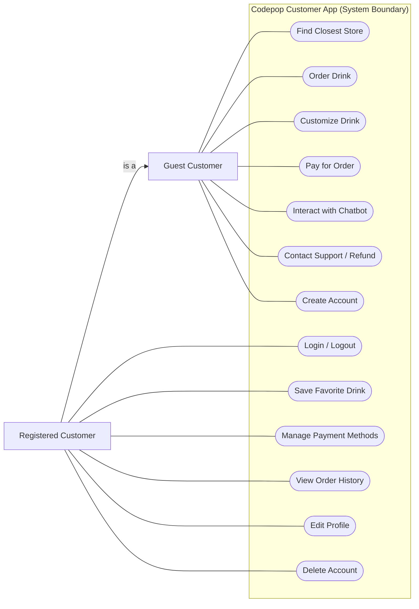
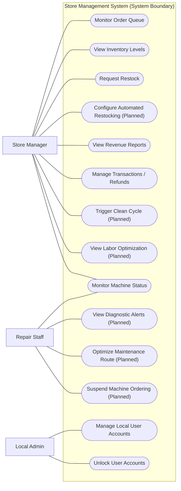
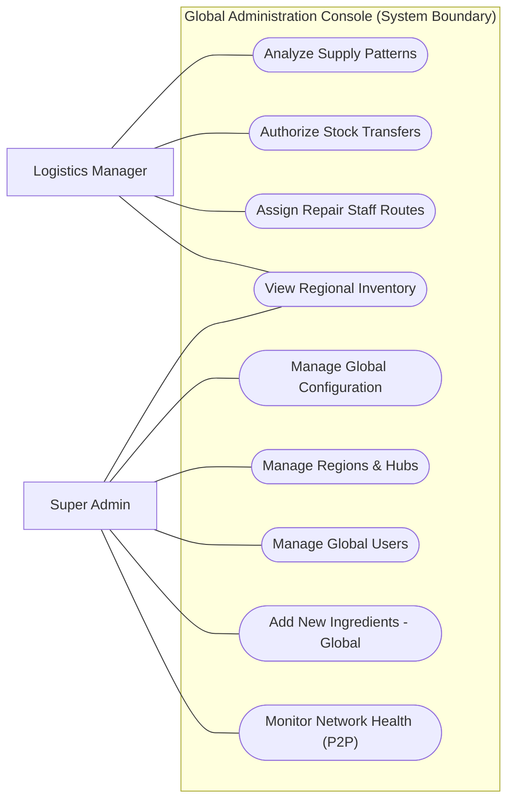

# Codepop Requirements Document

**Version:** 2

**Team:** SocialDrinkers (3)

---

- [Codepop Requirements Document](#codepop-requirements-document)
  - [1. Purpose](#1-purpose)
  - [2. Scope](#2-scope)
  - [3. System Context: Regions, Hubs, and Flow](#3-system-context-regions-hubs-and-flow)
  - [4. Understanding the Users (User Classes and Characteristics)](#4-understanding-the-users-user-classes-and-characteristics)
    - [4.1 Guest Customer: "Jake the Impatient Traveler"](#41-guest-customer-jake-the-impatient-traveler)
    - [4.2 Registered Customer: "Sarah the Busy Professional"](#42-registered-customer-sarah-the-busy-professional)
    - [4.3 Store Manager](#43-store-manager)
    - [4.4 Logistics Manager (Partial Implementation)](#44-logistics-manager-partial-implementation)
    - [4.5 Repair Staff (Cut from MVP)](#45-repair-staff-cut-from-mvp)
    - [4.6 Administrative Roles](#46-administrative-roles)
  - [5. Business Requirements (Strategic Vision)](#5-business-requirements-strategic-vision)
    - [5.1 Scalability Through Decentralization](#51-scalability-through-decentralization)
    - [5.2 Market Positioning and "Premium Automated" Niche](#52-market-positioning-and-premium-automated-niche)
    - [5.3 Labor Efficiency and Human-in-the-Loop Minimization](#53-labor-efficiency-and-human-in-the-loop-minimization)
    - [5.4 Brand Consistency and Global Quality Control](#54-brand-consistency-and-global-quality-control)
    - [5.5 Supply Chain Optimization and Waste Reduction](#55-supply-chain-optimization-and-waste-reduction)
    - [5.6 Financial Integrity and Compliance](#56-financial-integrity-and-compliance)
  - [6. Functional Requirements (System Behavior)](#6-functional-requirements-system-behavior)
    - [6.1 The Customer Experience and Ordering Lifecycle](#61-the-customer-experience-and-ordering-lifecycle)
    - [6.2 Local AI and Intelligent Support Capabilities](#62-local-ai-and-intelligent-support-capabilities)
    - [6.3 Inventory Management and Supply Resilience](#63-inventory-management-and-supply-resilience)
    - [6.4 Operational Dashboards and Role-Based Access](#64-operational-dashboards-and-role-based-access)
  - [7. Nonfunctional Requirements (System Quality)](#7-nonfunctional-requirements-system-quality)
    - [7.1 Performance and Latency](#71-performance-and-latency)
    - [7.2 Reliability and Fault Tolerance](#72-reliability-and-fault-tolerance)
    - [7.3 Scalability and Distribution](#73-scalability-and-distribution)
    - [7.4 Security and Privacy](#74-security-and-privacy)
    - [7.5 Portability and Compatibility](#75-portability-and-compatibility)
  - [8. User Stories](#8-user-stories)
  - [Customer](#customer)
  - [Guest Customer](#guest-customer)
  - [Registered Customer](#registered-customer)
  - [Store Manager](#store-manager)
  - [Logistics Manager](#logistics-manager)
  - [Repair Staff](#repair-staff)
  - [Admin (Local)](#admin-local)
  - [Super Admin](#super-admin)
  - [9. MoSCoW Prioritization](#9-moscow-prioritization)
  - [Must Have](#must-have)
    - [Region Management](#region-management)
    - [Store Info](#store-info)
    - [Machine Management](#machine-management)
    - [Dashboards](#dashboards)
    - [Universal Drink ordering system](#universal-drink-ordering-system)
    - [AI (Local Implementation)](#ai-local-implementation)
    - [Device Access](#device-access)
  - [Should Have](#should-have)
    - [Regions](#regions)
    - [Stores](#stores)
    - [Logistic Manager](#logistic-manager)
    - [Manager](#manager)
  - [Could Have](#could-have)
    - [Stock](#stock)
    - [Push Notifications](#push-notifications)
  - [Will Not Have](#will-not-have)
  - [10. System Narrative: Bringing It Together](#10-system-narrative-bringing-it-together)
  - [11. Use Case Diagrams](#11-use-case-diagrams)
    - [11.1 Customer Experience](#111-customer-experience)
    - [11.2 Store Management](#112-store-management)
    - [11.3 Global Administration](#113-global-administration)
  - [13. Data Entities and Business Rules](#13-data-entities-and-business-rules)
    - [13.1 User and Authentication Entities](#131-user-and-authentication-entities)
    - [13.2 Beverage and Inventory Entities](#132-beverage-and-inventory-entities)
    - [13.3 Order and Transaction Entities](#133-order-and-transaction-entities)
  - [14. Glossary of Terms](#14-glossary-of-terms)
  - [15. Conclusion](#15-conclusion)

---

## 1. Purpose

Codepop is designed to redefine how customers interact with beverage services by combining automation, personalization, and operational efficiency into a single cohesive system. At its core, Codepop exists to solve two parallel problems:

1. Customers want fast, customizable drinks without waiting.
2. Businesses want to reduce labor while maintaining high-quality service.

This document defines the **functional, nonfunctional, business, and user requirements** that guide the development of the Codepop ecosystem. Rather than describing how the system will be built, it focuses on what the system must accomplish and why those outcomes matter.

The intention is to ensure that every requirement contributes to a system that is:
- Clear in purpose  
- Efficient in operation  
- Scalable in design  
- Valuable to all users  

---

## 2. Scope

Codepop is not a single application—it is an interconnected ecosystem that coordinates multiple actors and systems in real time.

Imagine a typical scenario:

A customer is driving home after work. They want a drink, but they don’t want to wait in line or risk it being watered down. Using the Codepop app, they place an order. The system detects their location and calculates when they will arrive. Based on this, it delays drink preparation until the optimal moment.

Behind that simplicity is a complex system consisting of:

- A **customer-facing mobile and web application**
- A **decentralized store-level operational system**
- A **simulated logistics and inventory network**
- A **machine interface for robotic drink dispensers**

These components work together to enable **Just-In-Time drink fulfillment**, where drinks are prepared based on estimated arrival times calculated via local coordinate heuristics.

The system manages interactions between:
- Customers placing orders  
- Store managers overseeing operations  
- Logistics managers (Partial implementation)
- Repair staff (Conceptual role; UI/UX cut from final MVP)

The success of Codepop depends on how well these interactions are synchronized.

---

## 3. System Context: Regions, Hubs, and Flow

To support scalability, Codepop organizes its operations geographically.

A **Region** represents a large operational area containing multiple stores.

Within each region exists a **Supply Hub**, a centralized warehouse responsible for distributing inventory to stores. These hubs can also support nearby regions within a 1000-mile radius when necessary.

To further optimize efficiency, regions may be divided into **Micro-Regions** (A subdivision of a geographic region), which allow:
- Faster stock transfers  
- More efficient repair staff routing  
- Better localized decision-making  

This structure ensures that the system can scale without relying on a single centralized authority.

> Codepop is not just an ordering app—it is a coordinated ecosystem where multiple systems and users interact to deliver a single, seamless outcome.

---

## 4. Understanding the Users (User Classes and Characteristics)

The effectiveness of Codepop depends on its ability to serve a diverse set of users, each with distinct goals, responsibilities, and constraints.

---

### 4.1 Guest Customer: "Jake the Impatient Traveler"

The Guest Customer interacts with Codepop for immediate needs. They prioritize convenience above all else. Jake is a representative of this class—he is a 24-year-old traveler who just arrived in the city. He is thirsty and wants a quick, refreshing drink before his next tour. He doesn't like downloading new apps or filling out long registration forms for a single purchase.

Jake wants:
- A fast ordering process that requires zero personal data entry.
- No requirement to create an account to view the full menu and pricing.
- Minimal friction between decision and checkout (e.g., Apple Pay support).
- A clear, simple "Most Popular" menu to avoid decision fatigue from thousands of combinations.

However, he accepts limitations:
- No saved preferences; every visit starts from a blank slate.
- No personalized recommendations based on his flavor profile.
- No persistent data or order history to revisit a previous creation.

For this user, success is measured in **seconds and simplicity**.

---

### 4.2 Registered Customer: "Sarah the Busy Professional"

The Registered Customer builds a relationship with the system. Sarah represents this class; she is a 32-year-old marketing executive who visits CodePop three times a week. She is highly particular about her caffeine intake and flavor profiles. She uses the app to "roam" between the store near her office and the store near her gym.

Sarah expects:
- Saved drink preferences so her "standard" order is one tap away.
- Stored payment methods to avoid fumbling for a card at the kiosk.
- Access to her full order history across the entire P2P network.
- Personalized drink recommendations that learn her preference for "citrus" and "low sugar."

She also benefits from advanced features such as:
- AI-generated drink suggestions that help her discover new flavor combinations within her taste profile.
- Optimized order timing based on her location, ensuring her drink is fresh even if she's 5 minutes late.
- Loyalty rewards and specific seasonal offers tailored to her ordering habits.

For Sarah, Codepop becomes part of a routine, where each interaction improves the next through data-driven personalization.

---

### 4.3 Store Manager

The Store Manager ensures that the physical store operates smoothly.

Their responsibilities include:
- Monitoring inventory (syrups, cups, CO2, etc.)  
- Tracking revenue and transactions  
- Observing machine status and alerts  

They rely on:
- Accurate, real-time data  
- Clear system notifications  
- Limited but focused access to their own store  

Their goal is to prevent disruptions before they affect customers.

**In a complete design:**
- The Store Manager would be able to configure **Automated Restocking**, where the system automatically places an order to the Regional Hub when inventory hits a critical threshold.
- They would have access to a **Labor Optimization dashboard** that suggests staffing levels based on historical JIT order peaks.
- They would be able to remotely trigger a "Clean Cycle" for dispensers during off-peak hours.

---

### 4.4 Logistics Manager (Partial Implementation)

The Logistics Manager operates at a higher level, focusing on **efficiency across the network**.

In the current MVP:
- View stock usage trends.
- Backend logic for inter-store stock transfers was deferred and remains non-functional.

**In a complete design:**
- The Logistics Manager would use a **Global Inventory Optimizer** to authorize and route stock transfers between stores to prevent expiration waste.
- They would manage the **Supply Hub fulfillment queue**, ensuring that regional warehouses are optimally stocked based on seasonal demand trends across multiple cities.
- They would have a **Predictive Logistics map** showing real-time delivery truck locations and estimated arrival times for store restocks.

---

### 4.5 Repair Staff (Cut from MVP)

Repair Staff tasked with maintaining robotic drink dispensers to minimize store downtime. 

- This role was conceptualized in the design phase but the dedicated "Repair Staff View" and routing logic were cut from the final implementation.

**In a complete design:**
- Repair Staff would receive **Push Notifications** with diagnostic codes the moment a dispenser enters an "Error" or "Service Upcoming" state.
- They would use a **Maintenance Routing app** that optimizes their daily travel path based on the geographic location of all stores needing service in their micro-region.
- They would be able to **Temporarily Suspend Ordering** for specific machines or ingredients directly from their mobile device while a repair is in progress.

---

### 4.6 Administrative Roles

Administrative users ensure system integrity.

**Local Admins**: A store-level administrator with elevated permissions compared to the standard Store Manager.
- Manage store-level users  
- Maintain account access  

**Super Admins**: The highest level of system access, responsible for the global configuration of the decentralized network.
- View global revenue aggregation (Functional)
- Manage regional configurations  
- Oversee all system data across the 9-store network

These roles ensure the system remains secure, organized, and scalable.

---

## 5. Business Requirements (Strategic Vision)

Codepop is not just a beverage service; it is a "Store-in-a-Box" business model designed to maximize profitability through extreme operational efficiency and a decentralized architecture.

---

### 5.1 Scalability Through Decentralization

The system must support growth from a single pilot store to a massive distributed network without the need for a massive, centralized data center.

- **Independent Store Operation:** Every store server is its own source of truth for its own transactions, ensuring that if the "headquarters" loses internet access, the store can still process orders and take payments, independent of other stores.
- **Easy Store Onboarding:** Adding a new store location should require only the deployment of a new Docker instance and database, without requiring any manual reconfiguration of existing nodes.
- **Data Locality:** Sensitive user data stays on the user’s designated "Home Server," reducing the potential impact of a data breach and ensuring local data laws are respected automatically.

---

### 5.2 Market Positioning and "Premium Automated" Niche

The beverage industry is currently split between high-labor specialty cafes and low-quality vending machines. Codepop occupies the "Premium Automated" niche, which provides high customization while maintaining low overhead.

- **Value Proposition:** Provide a premium, AI-driven experience that feels personalized to the user, similar to a boutique beverage shop, while utilizing a 100% automated fulfillment pipeline.
- **Target ROI:** The system should aim for a significant reduction in per-drink labor costs, targeting a 30-40% lower labor-to-revenue ratio than traditional competitors.

---

### 5.3 Labor Efficiency and Human-in-the-Loop Minimization

Codepop’s primary business objective is to decouple revenue growth from headcount growth.

- **Dispenser Automation:** Drink fulfillment must be handled entirely by robotic dispensers with zero manual intervention required for standard orders.
- **Staff Shift:** Staff involvement is minimized to inventory refilling and deep cleaning, allowing a single employee to manage multiple stores or larger footprints without being tied to a counter.
- **Customer Self-Service:** The AI Customer Service Chatbot must handle common support requests (refunds/remakes) autonomously to minimize the need for on-site management.

---

### 5.4 Brand Consistency and Global Quality Control

In a distributed network, maintaining the "CodePop Taste" is critical for brand equity. A "Cherry Cola" in Store A must be identical to a "Cherry Cola" in Store B.

- **Standardization Requirement:** All ingredient definitions (syrups, bases, add-ins) are managed globally to ensure chemistry and taste consistency across the entire network.
- **Auditability:** Every transaction is logged with its exact ingredient formula to allow for quality audits and precise inventory tracking across multiple regions.

---

### 5.5 Supply Chain Optimization and Waste Reduction

Codepop utilizes data and proximity-based logic to minimize the environmental and financial costs of waste.

- **Just-In-Time Fulfillment:** By predicting arrival times via local coordinate heuristics, the system reduces the discard rate of prepared drinks that go watery or flat before pickup.
- **Proactive Restocking:** Machine status and inventory usage patterns are monitored to trigger restocking before a stockout occurs, avoiding the lost revenue and poor customer experience of "Unavailable" items.
- **Transfer Logic:** The system supports transfers between regional hubs and local stores, prioritizing stock movements that minimize shipping distance and expiration waste.

---

### 5.6 Financial Integrity and Compliance

Each store must maintain accurate, verifiable financial records while allowing the network as a whole to remain compliant with tax and regulatory bodies.

- **Local Revenue Ownership:** Revenue data is recorded at each store instance to ensure local compliance.
- **Aggregation Support:** The system must allow Super Admins to aggregate revenue reports across regions for global financial oversight and tax reporting.
- **Stripe Integration:** Payments and refunds must be processed through a trusted third-party provider to ensure PCI compliance and secure handling of sensitive financial credentials.

---

## 6. Functional Requirements (System Behavior)

---

### 6.1 The Customer Experience and Ordering Lifecycle

The system must support the full lifecycle of a beverage order, from discovery to fulfillment, ensuring a low-friction interaction.

- **Store Selection and Discovery:**
  - The system must provide a mechanism for users to discover active store servers within the P2P network.
  - The system must automatically detect the user's location and route them to the closest available store server to ensure optimal latency and convenience.
  - For all users, the system must allow manual selection of a store instance to view its local menu.
  - For registered users, the system must utilize the P2P proxying protocol to retrieve user data (preferences, history) from their "Home Server" while they are connected to a "Visiting Server" at their current location, ensuring they always interact with the geographically nearest node.
- **Drink Customization and Configuration:**
  - The system must allow users to choose from a list of base sodas, syrups, and add-ins (creams, fruits, etc.).
  - The system must enforce drink rules: discrete quantization (pumps/squirts) and standard volumes (Small/Medium/Large).
  - Users must be able to name their custom creations and save them for future re-ordering.
- **Cart and Checkout Operations:**
  - The system must support multi-drink orders in a single cart session.
  - Checkout must be handled securely through a third-party tokenization provider (Stripe).
  - The system must generate a unique pickup code (Locker Combo) for every order upon successful payment.
- **Order Modification and Cancellation:**
  - Users must be able to cancel an order at any point before the robotic dispenser begins preparation.
  - Upon cancellation, the system must trigger an automatic refund via the payment provider.

---

### 6.2 Local AI and Intelligent Support Capabilities

Codepop utilizes local machine learning models to provide intelligence without the latency or cost of external cloud APIs.

- **Deterministic Recommendation Engine:**
  - The system must generate personalized drink recipes by calculating the **cosine similarity** between a user's saved preferences and the flavor profiles of available ingredients.
  - Recommendations must be generated entirely locally using the `scikit-learn` library and internal CSV datasets.
- **Conversational Support (Chatbot):**
  - The system must provide a text-based interface for support requests.
  - The chatbot must utilize a locally hosted LLM (`DialoGPT-medium`) to understand user intent.
  - The system must implement a "Keyword Assisted Intent Matcher" to bridge the gap between the LLM’s conversational output and the system's operational logic (e.g., triggering a refund).
- **Just-In-Time (JIT) Preparation Logic:**
  - The system must estimate a user's arrival time using the **Haversine formula** to calculate distance between the user’s device and the store.
  - Drink preparation should be delayed until the user enters a calculated "Catchment Area," ensuring the beverage is fresh upon arrival. (Dynamically calculated to ensure large orders are prepared on time)

---

### 6.3 Inventory Management and Supply Resilience

The system must ensure that the digital menu accurately reflects physical stock levels across the decentralized network.

- **Real-Time Stock Tracking:**
  - Every order must automatically decrement the appropriate inventory quantities for each ingredient used.
  - The system must prevent users from ordering a drink that contains an out-of-stock ingredient.
- **Threshold Alerts and Proactive Restocking:**
  - Store Managers must be able to set "Low Stock Thresholds" for every ingredient.
  - The system must generate notifications when a stock level falls below its defined threshold.
- **Master List Synchronization:**
  - The system must synchronize ingredient availability and pricing across all stores in a region periodically.
  - Any change to global ingredient metadata (e.g., a price increase) made by a Super Admin must propagate to all store instances via the P2P synchronization protocol.

---

### 6.4 Operational Dashboards and Role-Based Access

The system must provide tailored interfaces for each operational role to ensure security, task focus, and a seamless user experience across the decentralized network.

- **Customer Interface (Guest & Registered):**
  - **Menu Browsing:** Real-time visibility of available drinks and ingredients at the currently selected store.
  - **AI Recommendation Tool:** Access to personalized drink suggestions based on local similarity matching.
  - **Order Tracking:** A live view of the order status (Pending, Preparing, Ready) and the unique Pickup Code/Locker Combo.
  - **Account Management (Registered Only):** Access to order history, flavor preferences, and saved "Favorite" recipes.
- **Store Manager Dashboard:**
  - **Order Queue Management:** Real-time monitoring and fulfillment status of all active orders at the local store.
  - **Local Inventory Controls:** Tools to view stock levels, set thresholds, and manually trigger restock requests.
  - **Financial Oversight:** Access to non-sensitive transaction history and local revenue reporting for the specific store instance.
  - **Machine Status Monitor:** A high-level view of dispenser health, including error codes and upcoming maintenance windows.
- **Logistics Manager Dashboard:**
  - **Regional Inventory Aggregation:** A unified view of stock levels across all stores within their assigned region.
  - **Supply Chain Coordination:** Tools to authorize and monitor stock transfers between regional hubs and local stores.
  - **Logistics Analytics:** Visualizations of ingredient usage trends to inform long-term supply hub procurement.
- **Repair Staff View (Mobile Optimized):**
  - **Diagnostic Alerts:** Real-time push notifications or alerts containing machine error codes and sensor data.
  - **Service Ticket Management:** Tools to view, claim, and update the status of maintenance tickets across the micro-region.
  - **Store Locator:** Integrated maps or location data for efficient routing between store servers needing service.
- **Local Admin Console:**
  - **User Management:** Elevated permissions to manage local user accounts, reset passwords, and assign roles for the specific store.
  - **System Audit Logs:** Access to local server logs for security auditing and troubleshooting.
- **Super Admin (Global) Console:**
  - **Global Revenue Reporting:** Aggregated financial data from all active store instances in the 9-store network for tax and performance analysis.
  - **Catalog Management:** The authoritative interface to add, remove, or update ingredients and prices across the entire P2P network.
  - **Network Topology & Health:** Real-time status monitoring of the P2P server registry, sync lag, and node availability.

---

## 7. Nonfunctional Requirements (System Quality)

While functional requirements define *what* the system does, nonfunctional requirements define *how* it performs. Codepop’s quality targets are driven by the need for a "near-instant" feel in a decentralized environment.

---

### 7.1 Performance and Latency

Users expect a fluid, responsive experience across both mobile and web platforms.

- **Response Time:** 95% of API requests should be completed in less than **250ms** under normal load conditions.
- **Menu Loading:** The menu and inventory synchronization for a store must complete in less than **500ms** from a cold start.
- **AI Recommendation Latency:** Generating a personalized drink recommendation using local similarity models should take no more than **100ms** to ensure a seamless UI transition.

---

### 7.2 Reliability and Fault Tolerance

As a decentralized network, the failure of a single node must not impact the overall ecosystem.

- **Network Resilience:** The system must continue to operate even if a peer server becomes unavailable. Visiting users should be able to seamlessly switch to another nearby store if their current one fails.
- **Data Persistence:** In the event of a server crash, no more than **1 minute** of transaction data should be at risk of loss.
- **Recovery:** Any Docker-based store instance must be capable of restarting and re-synchronizing with its peers in less than **2 minutes**.

---

### 7.3 Scalability and Distribution

The system architecture is specifically designed for horizontal expansion.

- **Horizontal Scaling:** The system must support the addition of at least **100 concurrent store instances** within a single region without a measurable impact on inter-server synchronization latency.
- **User Capacity:** Each store instance should be able to handle at least **500 active orders per hour** and 1,000 concurrent web sessions.

---

### 7.4 Security and Privacy

Security is paramount in a decentralized P2P environment where sensitive user data is roaming.

- **Asymmetric Authentication:** Every inter-server communication must be validated using asymmetric RSA keys, ensuring that one store cannot spoof another's identity.
- **Payment Security:** Raw payment data (credit card numbers) must never be stored or processed directly by the CodePop backend. Tokenization via Stripe is mandatory.
- **Data Minimization:** Visiting servers must only store the minimum amount of user data required to process the current transaction and should purge this data within 24 hours of the order completion.

---

### 7.5 Portability and Compatibility

The "Web-First" approach ensures that the system is accessible across all modern user environments.

- **Platform Support:** The system must maintain 100% functional parity across iOS (Safari), Android (Chrome), and desktop browsers (Edge, Firefox).
- **Responsive Design:** The UI must adhere to a mobile-first philosophy, ensuring that all primary ordering actions can be completed with a single thumb on a 5-inch screen.
- **Offline Readiness:** The frontend should be architected to support future Progressive Web App (PWA) features, allowing basic menu browsing even during intermittent network connectivity.

---

## 8. User Stories

The User Stories below describe the functional requirements from the perspective of each role

## Customer

1. As any Customer I want to contact someone to get a refund, make a complaint, or get a drink remade so that I can get my issues resolved and feel satisfied with the service.

## Guest Customer

2. As a Guest Customer I want to order a drink without having to make an account so that I can get my drink quickly.

3. As a Guest Customer, I want to filter or view popular drink options so that I am not overwhelmed by the endless customization possibilities.

4. As a Guest Customer, I might want to create or sign into an account so that I can save my order history for future convenience.

## Registered Customer

5. As a Registered Customer I want to see drinks that I have ordered before so that I can re-order my favorites without customizing them from scratch.

6. As a Registered Customer I want to be recommended new drinks based on personal preferences so that I can discover new drink combinations that I might like.

7. As a Registered Customer I want to save my payment info so that I don't need to input it each time

8. As a Registered Customer, I want to be able to sign out so that I can protect my account information.

9. As a Registered Customer, I want to delete my account so that I can remove my personal data from the system permanently.

10. As a Registered Customer I want to be able to edit my profile so that I can keep my contact and payment information up to date.

11. As a Registered Customer I want to be able to save my favorite drinks and view/modify/delete them so that I can keep a personal menu of my favorite drinks.

12. As a Registered Customer, I want to be able to have my drink fresh and ready for me right as I arrive to pick it up so that I don't have to wait or have a watered-down drink.

13. As a Registered Customer, I want to be able to add payment options to my account so I can pay through the app when I order my drinks.

14. As a Registered Customer, I want to be refunded if I cancel my drink order so that I do not lose money if I made a mistake or change my mind.

## Store Manager

15. As a Store Manager I want to view stock inventory so that I can request restocks as needed

16. As a Store Manager I want access to non-sensitive payment transaction information to help administer refunds, verify transactions, and other payment-related issues

17. As a Store Manager I want to be able to see store revenue reports from the database so that I can track the financial performance of my store.

18. As a store manager I want to be able to view the status of my machines so that I can immediately identify if my machines are working properly or if they need maintenance.

## Logistics Manager

19. As a Logistics Manager I want to view the supply usage of each store so that I can use recognize patterns in the supply usage of each store

20. As a Logistics Manager I want to manage the routing of supplies to stores so that I can ensure supplies can reach each store before they run out

21. As a Logistics Manager I want to update and create supply schedules based on patterns I've found so that I can ensure each store is sufficiently stocked on time for their individual needs

## Repair Staff

22. As a Repair Staff I want to stay updated on robot conditions so that I can repair them when needed

23. As a Repair Staff I want to be assigned to stores that require less of a distance to travel so I can go from one store to another quickly

24. As a Repair Staff I want to notify the system that repairs are in progress so that customers can't order from the location while repairs are underway

## Admin (Local)

25. As an Admin I want to access store data so I can add and manage Store Manager accounts

26. As an Admin I want to update/remove/unlock user accounts so that I can help users and protect the system from misuse

## Super Admin

27. As a Super Admin I want to access data for any store location so that I can manage new Admins and other roles across the region

28. As a Super Admin I want to manage supply hubs and regions so that when new stores are added we can adjust boundaries as needed for efficiency

29. As a Super Admin I need to make nation-wide updates so that I can keep all the stores up to date

30. As a Super Admin I want to add new ingredients to every store and supply hub so that when a new flavor is added we can deploy it quickly and efficiently

---

## 9. MoSCoW Prioritization

## Must Have
### Region Management

- Stores will belong and act within an assigned region
- Each Region will have a supply hub
- Supplies can come from supply hub, local suppliers, stores within region, and regions within 1000 miles

### Store Info

- Communicate directly with other stores inside of their region
- Own stock quantity

- Sales data

- The user will pay for their soda(s) as soon as they submit their order either on the app or the website. If the cart is empty no transactions will take place. If the user decides to cancel the order, they will get immediately reimbursed. The user should not be able to cancel their order once the drinks have been picked up.

- All transactions will be handled by third party software to reduce need for encryption

### Machine Management

- Keep track of maintenance schedule

- Keep track of machine type

- Keep track of machine status
  - running

  - repair-start

  - repair-end

  - error

  - critical error

  - out of order

  - service upcoming

- Keep track of when the status is applied/changed

- Keep track of how long until machine is inoperable

### Dashboards

- each role requires a specific dashboard to update/change/view everything that their responsibilities require of them

- User has the option to create their own drink without the use of AI

### Universal Drink ordering system

- Drinks are universal in their makeup
  - a small is x oz, medium is y oz, and a large is z oz

  - syrup is quantized to a squirt (cant order a half squirt)

  - Ingredients share the same name everywhere

- an order can contain many drinks

- each drink does not have to fill the entire volume

- ingredients added in different order are the same (mtn dew, lime, lemon is the same as lemon, mtn dew, lime)

- ingredients combine if added out of order (1 lemon, 1 lime, 1 lemon -> 2 lemon, 1 lime)

### AI (Local Implementation)

- Can generate drinks using a deterministic similarity algorithm (based on `scikit-learn` and `pandas`) rather than a third-party LLM, ensuring privacy and offline functionality.
- Uses the **Haversine formula** to estimate arrival based on coordinates; just-in-time preparation is triggered when a user enters the store's calculated catchment area.
- Includes a local chatbot (`DialoGPT-medium`) to handle customer service refund/remake flows via keyword-assisted intent matching.

### Device Access

- Prioritize access through Application, should be available on both Apple and Android as well as web applications. Web applications should include Google Chrome, Safari, Firefox, and Edge compatibility 

---

## Should Have
### Regions

- Contain Micro Regions
  - Micro regions will allow for repair staff to move around more efficiently

  - Micro regions will NOT have impenetrable borders

### Stores

- Store specific drinks

- Drinks in the order queue (ordered but not yet made)

- Organize other stores between micro and main region

- upcoming maintenance schedule

- total storage availability (can store 100 lbs of syrup, 30 different flavors, etc)

- minimum stock before re-order

- minimum stock required to allow transfer to other store

- maximum stock of items

- contains their own server

- sign in any user from any store server

### Logistic Manager

- Adjust minimum stock quantities to have on hand inside the supply hub

- access all store stock info
  - minimum/maximum

  - minimum stock to allow transfers

### Manager

- set store minimum/maximum stock

- set store minimum allow to transfer value

- request stock from other stores

- deny stock transfer requests

---

## Could Have
### Stock

- stock organized within micro regions so stock transfers are faster

- predictive ordering based off of sales data

- new suggested minimums based off of sales data

### Push Notifications

- users can receive notifications about order status and special offers

- managers can receive notifications of supplies running low which need restocking

---

## Will Not Have

- **Shared Accounts**: Multiple users cannot control a single account.

- **Alternative payment systems**: Gift cards or cash payments are not supported.

- **Repair Staff View**: Dedicated maintenance dashboard and staff routing were cut.

- **Repair staff location/status tracking**: This was not implemented.

- **Stock Transfers**: Automated/authorized stock movement between stores (Logistics Manager feature) was not implemented.

---

## 10. System Narrative: Bringing It Together

The true success of Codepop lies in making a complex system feel effortless.

A customer places an order.  
The system calculates timing.  
The store prepares the drink.  
Inventory adjusts automatically.  
Maintenance is predicted before failure.  

What the customer experiences is simple—but what enables it is a tightly coordinated system of requirements working together.

Every requirement in this document exists to support that illusion of simplicity.

---

## 11. Use Case Diagrams 

### 11.1 Customer Experience

### 11.2 Store Management

### 11.3 Global Administration

---

## 13. Data Entities and Business Rules

To ensure clarity in the system's behavior, the following entities and their governing business rules are defined.

---

### 13.1 User and Authentication Entities

- **Registered User:** A profile that contains a username, hashed password, flavor preferences, and a designated "Home Server."
- **Home Server (Rule):** Every registered user must be associated with exactly one Home Server. This server is the "Source of Truth" for the user's sensitive data.
- **Visiting Server (Rule):** A user may log in to any Visiting Server in the network. The Visiting Server must proxy authentication to the Home Server.

---

### 13.2 Beverage and Inventory Entities

- **Drink Recipe:** A configuration consisting of a base soda, one or more syrups, and zero or more add-ins.
- **Ingredient Quantization (Rule):** All ingredients must be added in discrete, non-partial units (e.g., "2 pumps," not "2.5 pumps").
- **Stock Threshold (Rule):** If an ingredient’s quantity falls below its defined threshold, the item must be automatically marked as "Unavailable" in the customer-facing menu to prevent unfulfillable orders.

---

### 13.3 Order and Transaction Entities

- **Order Record:** A capture of a successful transaction, including the unique Pickup Code, timestamp, and payment reference.
- **Refund Integrity (Rule):** A refund may only be issued if the order has not yet been "Marked as Fulfilled" by the system.
- **Price Calculation (Rule):** The total price of an order is the sum of each drink's base price plus tax, rounded to two decimal places.

---

## 14. Glossary of Terms

To ensure an unambiguous understanding of the system, the following terms are defined:

- **Asymmetric Encryption:** A security method using a pair of keys (public and private) for authentication. In Codepop, this ensures that only authorized servers can join the P2P network.
- **Catchment Area:** The geographic radius around a store within which the system triggers the preparation of a "Just-In-Time" order.
- **Cosine Similarity:** A mathematical measure used by the local recommendation engine to find the "distance" between a user's preferences and an ingredient's flavor profile.
- **Decentralization:** An architectural philosophy where power and data are distributed across many nodes (stores) rather than held by a single central server.
- **Geohash:** A hierarchical spatial data structure which subdivides space into buckets of grid shape. Used in Codepop to store user and store coordinates efficiently.
- **Haversine Formula:** A mathematical equation used to calculate the great-circle distance between two points on a sphere (the Earth) given their longitudes and latitudes.
- **Just-In-Time (JIT):** A fulfillment strategy where the preparation of a product is delayed until the latest possible moment to ensure maximum freshness.
- **Micro-Region:** A small, geographic subset of a larger Region used to optimize inventory transfers and management focus.
- **P2P (Peer-to-Peer):** A network model where all nodes (servers) have equal status and communicate directly with each other without a central hub.
- **Proxying:** The act of one server performing a request on behalf of another. In Codepop, this allows a Visiting Server to authenticate a user by talking to their Home Server.
- **Tokenization:** The process of replacing sensitive data (like a credit card number) with a non-sensitive equivalent (a token) to ensure security.

---

## 15. Conclusion

This document transforms a collection of features into a unified system vision. By focusing on user intent, business value, and decentralized reliability, it ensures that Codepop is not just functional, but meaningful, scalable, and efficient. The result is a system that delivers value at every level—from the individual customer to the global network.