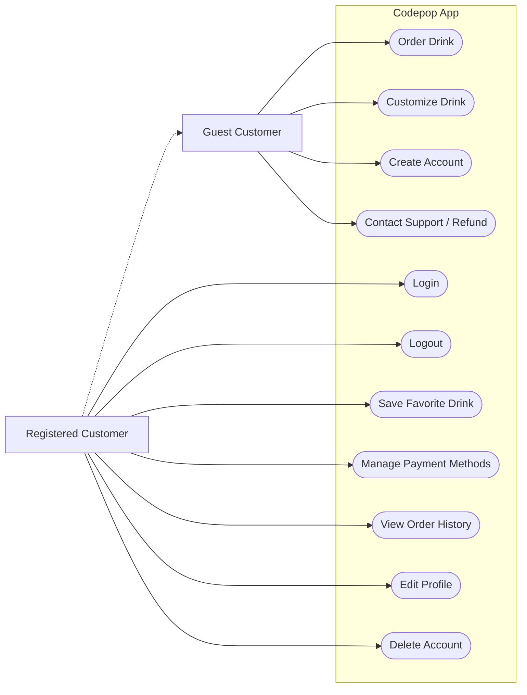
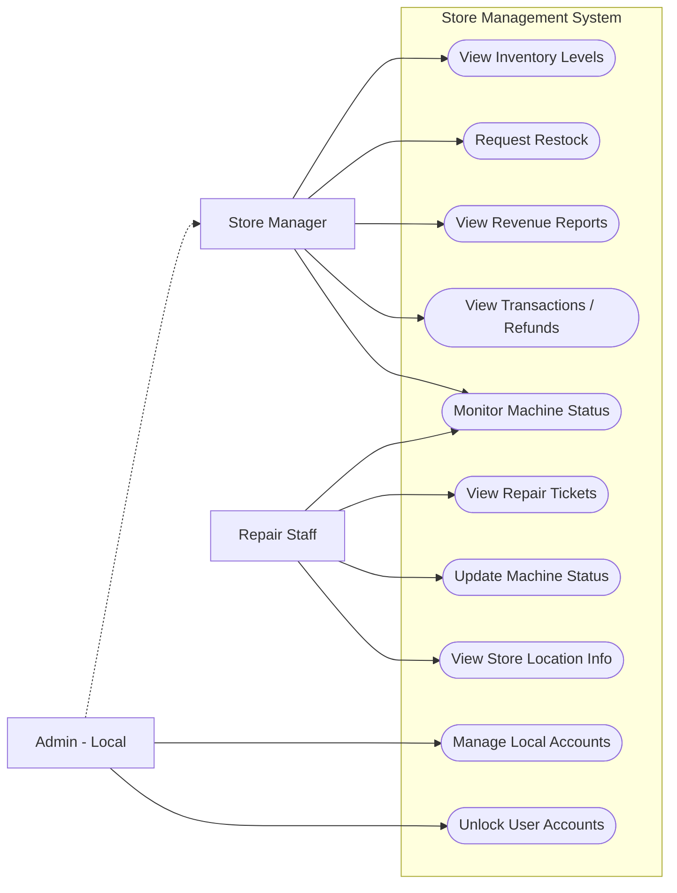
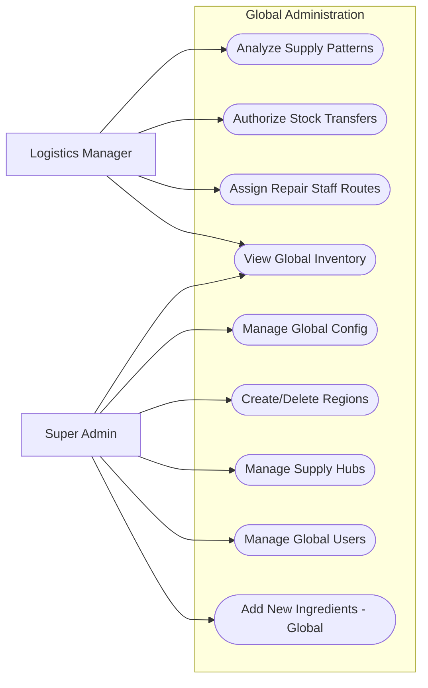

# Codepop Requirements Document

---

## 1. Purpose

Codepop is designed to redefine how customers interact with beverage services by combining automation, personalization, and operational efficiency into a single cohesive system. At its core, Codepop exists to solve two parallel problems:

1. Customers want fast, customizable drinks without waiting.
2. Businesses want to reduce labor while maintaining high-quality service.

This document defines the **functional, nonfunctional, business, and user requirements** that guide the development of the Codepop ecosystem. Rather than describing how the system will be built, it focuses on what the system must accomplish and why those outcomes matter.

The intention is to ensure that every requirement contributes to a system that is:
- Clear in purpose  
- Efficient in operation  
- Scalable in design  
- Valuable to all users  

---

## 2. Scope

Codepop is not a single application—it is an interconnected ecosystem that coordinates multiple actors and systems in real time.

Imagine a typical scenario:

A customer is driving home after work. They want a drink, but they don’t want to wait in line or risk it being watered down. Using the Codepop app, they place an order. The system detects their location and calculates when they will arrive. Based on this, it delays drink preparation until the optimal moment.

Behind that simplicity is a complex system consisting of:

- A **customer-facing mobile and web application**
- A **decentralized store-level operational system**
- A **simulated logistics and inventory network**
- A **machine interface for robotic drink dispensers** (simulated via backend state management)

These components work together to enable **Just-In-Time drink fulfillment**, where drinks are prepared based on estimated arrival times calculated via local coordinate heuristics.

The system manages interactions between:
- Customers placing orders  
- Store managers overseeing operations  
- Logistics managers (Partial implementation)
- Repair staff (Conceptual role; UI/UX cut from final MVP)

The success of Codepop depends on how well these interactions are synchronized.

---

## 3. System Context: Regions, Hubs, and Flow

To support scalability, Codepop organizes its operations geographically.

A **Region** represents a large operational area containing multiple stores.

Within each region exists a **Supply Hub**, a centralized warehouse responsible for distributing inventory to stores. These hubs can also support nearby regions within a 1000-mile radius when necessary.

To further optimize efficiency, regions may be divided into **Micro-Regions** (A subdivision of a geographic region), which allow:
- Faster stock transfers  
- More efficient repair staff routing  
- Better localized decision-making  

This structure ensures that the system can scale without relying on a single centralized authority.

> Codepop is not just an ordering app—it is a coordinated ecosystem where multiple systems and users interact to deliver a single, seamless outcome.

---

## 4. Understanding the Users (User Classes and Characteristics)

The effectiveness of Codepop depends on its ability to serve a diverse set of users, each with distinct goals, responsibilities, and constraints.

---

### 4.1 Guest Customer

The Guest Customer interacts with Codepop for immediate needs. They prioritize convenience above all else.

They want:
- A fast ordering process  
- No requirement to create an account  
- Minimal friction between decision and checkout  

However, they accept limitations:
- No saved preferences  
- No personalized recommendations  
- No persistent data  

For this user, success is measured in **speed and simplicity**.

---

### 4.2 Registered Customer

The Registered Customer builds a relationship with the system.

They expect:
- Saved drink preferences  
- Stored payment methods  
- Access to order history  
- Personalized drink recommendations  

They also benefit from advanced features such as:
- AI-generated drink suggestions  
- Optimized order timing based on location  

For them, Codepop becomes part of a routine, where each interaction improves the next.

---

### 4.3 Store Manager

The Store Manager ensures that the physical store operates smoothly.

Their responsibilities include:
- Monitoring inventory (syrups, cups, CO2, etc.)  
- Tracking revenue and transactions  
- Observing machine status and alerts  

They rely on:
- Accurate, real-time data  
- Clear system notifications  
- Limited but focused access to their own store  

Their goal is to prevent disruptions before they affect customers.

---

### 4.4 Logistics Manager (Partial Implementation)

The Logistics Manager operates at a higher level, focusing on **efficiency across the network**.

In the current MVP:
- View stock usage trends.
- Backend logic for inter-store stock transfers was deferred and remains non-functional.

---

### 4.5 Repair Staff (Cut from MVP)

Repair Staff tasked with maintaining robotic drink dispensers to minimize store downtime. 

- This role was conceptualized in the design phase but the dedicated "Repair Staff View" and routing logic were cut from the final implementation.

---

### 4.6 Administrative Roles

Administrative users ensure system integrity.

**Local Admins**: A store-level administrator with elevated permissions compared to the standard Store Manager.
- Manage store-level users  
- Maintain account access  

**Super Admins**: The highest level of system access, responsible for the global configuration of the decentralized network.
- View global revenue aggregation (Functional)
- Manage regional configurations  
- Oversee all system data across the 9-store network

These roles ensure the system remains secure, organized, and scalable.

---

## 5. Business Requirements

The following requirements define the strategic goals of Codepop.

---

### 5.1 Scalability Through Decentralization

The system must support growth from a single store to a distributed network.

- Stores operate independently
- easy expansion from a single store to multiple locations
- Data synchronization occurs only when necessary  
- No single centralized server controls the entire system 

---

### 5.2 Automation and Minimal Human Interaction

Codepop aims to minimize reliance on human labor while maintaining service quality.

- Drink fulfillment is handled by robotic dispensers  
- AI assists in decision-making  
- Staff involvement is minimized  

---

### 5.3 Supply Chain Optimization

The system must minimize waste and prevent shortages.

- Inventory is sourced based on proximity:
  - Local Store → Regional Hub → Nearby Hub (<1000 miles)
- Supply hubs must efficiently distribute stock
- Predict demand based on usage patterns  

---

### 5.4 Maintenance Efficiency

To maximize system uptime and profits, the system must transition from a reactive to a proactive maintenance schedule.

- Machine issues are predicted before failure  
- Repair routes are optimized  
- Downtime is minimized  

---

### 5.5 Financial and Regulatory Compliance

Each store must maintain accurate financial records while allowing aggregation at higher levels.

The system must:
- Track revenue at each store  
- Allow aggregation at higher levels  
- Maintain accurate financial records  

---

### 5.6 Payment Handling

- Payments are processed at order submission  
- Refunds are issued before pickup  
- Third-party systems handle transactions for security (stripe)

---

## 6. Functional Requirements (System Behavior)

---

### 6.1 Customer Ordering Experience

The system must allow users to:
- Order drinks via mobile or web  
- Customize drink ingredients  
- Place multiple drinks in one order  
- Cancel orders before fulfillment  

Drink rules must remain consistent:
- Standard sizes (small, medium, large)  
- Ingredients are normalized regardless of order  
- Quantities are discrete (no partial units)  

---

### 6.2 AI Capabilities (Local Implementation)

The system must:
- Generate drink suggestions by calculating **cosine similarity** between user preferences and ingredient flavor profiles from local datasets (`scikit-learn` based).
- Provide conversational support via a local LLM (`microsoft/DialoGPT-medium`) to handle refund and remake inquiries.
- Estimate arrival times using the **Haversine formula** and speed heuristics to trigger just-in-time preparation.

---

### 6.3 Inventory Management

The system must:
- Track stock levels at all locations  
- Trigger restocking when thresholds are reached  
- Enable transfers between stores and hubs  

---

### 6.4 Machine Monitoring

The system must:
- Track machine states (running, error, repair, etc.)  
- Log status changes with timestamps  
- Predict failure timelines  

---

### 6.5 Role-Based Dashboards

Each user role must have access to a tailored dashboard that allows them to:
- View relevant data  
- Perform necessary actions  
- Monitor system status  

---

## 7. Nonfunctional Requirements (System Quality)

---

### 7.1 Performance

The system must respond quickly to all user interactions.

---

### 7.2 Reliability

The system must operate continuously with minimal downtime.

---

### 7.3 Scalability

The system must handle growth in users, stores, and data.

---

### 7.4 Security

Sensitive operations must be handled securely through trusted services.

---

### 7.5 Compatibility

The system must support:
- iOS and Android  
- Web browsers (Chrome, Safari, Firefox, Edge)  

---

### 7.6 Availability

The system must remain accessible during peak usage periods.

---

## 8. User Stories

The User Stories below describe the functional requirements from the perspective of each role

## Customer

1. As any Customer I want to contact someone to get a refund, make a complaint, or get a drink remade so that I can get my issues resolved and feel satisfied with the service.

## Guest Customer

2. As a Guest Customer I want to order a drink without having to make an account so that I can get my drink quickly.

3. As a Guest Customer, I want to filter or view popular drink options so that I am not overwhelmed by the endless customization possibilities.

4. As a Guest Customer, I might want to create or sign into an account so that I can save my order history for future convenience.

## Registered Customer

5. As a Registered Customer I want to see drinks that I have ordered before so that I can re-order my favorites without customizing them from scratch.

6. As a Registered Customer I want to be recommended new drinks based on personal preferences so that I can discover new drink combinations that I might like.

7. As a Registered Customer I want to save my payment info so that I don't need to input it each time

8. As a Registered Customer, I want to be able to sign out so that I can protect my account information.

9. As a Registered Customer, I want to delete my account so that I can remove my personal data from the system permanently.

10. As a Registered Customer I want to be able to edit my profile so that I can keep my contact and payment information up to date.

11. As a Registered Customer I want to be able to save my favorite drinks and view/modify/delete them so that I can keep a personal menu of my favorite drinks.

12. As a Registered Customer, I want to be able to have my drink fresh and ready for me right as I arrive to pick it up so that I don't have to wait or have a watered-down drink.

13. As a Registered Customer, I want to be able to add payment options to my account so I can pay through the app when I order my drinks.

14. As a Registered Customer, I want to be refunded if I cancel my drink order so that I do not lose money if I made a mistake or change my mind.

## Store Manager

15. As a Store Manager I want to view stock inventory so that I can request restocks as needed

16. As a Store Manager I want access to non-sensitive payment transaction information to help administer refunds, verify transactions, and other payment-related issues

17. As a Store Manager I want to be able to see store revenue reports from the database so that I can track the financial performance of my store.

18. As a store manager I want to be able to view the status of my machines so that I can immediately identify if my machines are working properly or if they need maintenance.

## Logistics Manager

19. As a Logistics Manager I want to view the supply usage of each store so that I can use recognize patterns in the supply usage of each store

20. As a Logistics Manager I want to manage the routing of supplies to stores so that I can ensure supplies can reach each store before they run out

21. As a Logistics Manager I want to update and create supply schedules based on patterns I've found so that I can ensure each store is sufficiently stocked on time for their individual needs

## Repair Staff

22. As a Repair Staff I want to stay updated on robot conditions so that I can repair them when needed

23. As a Repair Staff I want to be assigned to stores that require less of a distance to travel so I can go from one store to another quickly

24. As a Repair Staff I want to notify the system that repairs are in progress so that customers can't order from the location while repairs are underway

## Admin (Local)

25. As an Admin I want to access store data so I can add and manage Store Manager accounts

26. As an Admin I want to update/remove/unlock user accounts so that I can help users and protect the system from misuse

## Super Admin

27. As a Super Admin I want to access data for any store location so that I can manage new Admins and other roles across the region

28. As a Super Admin I want to manage supply hubs and regions so that when new stores are added we can adjust boundaries as needed for efficiency

29. As a Super Admin I need to make nation-wide updates so that I can keep all the stores up to date

30. As a Super Admin I want to add new ingredients to every store and supply hub so that when a new flavor is added we can deploy it quickly and efficiently

---

## 9. MoSCoW Prioritization

## Must Have
### Region Management

- Stores will belong and act within an assigned region
- Each Region will have a supply hub
- Supplies can come from supply hub, local suppliers, stores within region, and regions within 1000 miles

### Store Info

- Communicate directly with other stores inside of their region
- Own stock quantity

- Sales data

- The user will pay for their soda(s) as soon as they submit their order either on the app or the website. If the cart is empty no transactions will take place. If the user decides to cancel the order, they will get immediately reimbursed. The user should not be able to cancel their order once the drinks have been picked up.

- All transactions will be handled by third party software to reduce need for encryption

### Machine Management

- Keep track of maintenance schedule

- Keep track of machine type

- Keep track of machine status
  - running

  - repair-start

  - repair-end

  - error

  - critical error

  - out of order

  - service upcoming

- Keep track of when the status is applied/changed

- Keep track of how long until machine is inoperable

### Dashboards

- each role requires a specific dashboard to update/change/view everything that their responsibilities require of them

- User has the option to create their own drink without the use of AI

### Universal Drink ordering system

- Drinks are universal in their makeup
  - a small is x oz, medium is y oz, and a large is z oz

  - syrup is quantized to a squirt (cant order a half squirt)

  - Ingredients share the same name everywhere

- an order can contain many drinks

- each drink does not have to fill the entire volume

- ingredients added in different order are the same (mtn dew, lime, lemon is the same as lemon, mtn dew, lime)

- ingredients combine if added out of order (1 lemon, 1 lime, 1 lemon -> 2 lemon, 1 lime)

### AI (Local Implementation)

- Can generate drinks using a deterministic similarity algorithm (based on `scikit-learn` and `pandas`) rather than a third-party LLM, ensuring privacy and offline functionality.
- Uses the **Haversine formula** to estimate arrival based on coordinates; just-in-time preparation is triggered when a user enters the store's calculated catchment area.
- Includes a local chatbot (`DialoGPT-medium`) to handle customer service refund/remake flows via keyword-assisted intent matching.

### Device Access

- Prioritize access through Application, should be available on both Apple and Android as well as web applications. Web applications should include Google Chrome, Safari, Firefox, and Edge compatibility 

---

## Should Have
### Regions

- Contain Micro Regions
  - Micro regions will allow for repair staff to move around more efficiently

  - Micro regions will NOT have impenetrable borders

### Stores

- Store specific drinks

- Drinks in the order queue (ordered but not yet made)

- Organize other stores between micro and main region

- upcoming maintenance schedule

- total storage availability (can store 100 lbs of syrup, 30 different flavors, etc)

- minimum stock before re-order

- minimum stock required to allow transfer to other store

- maximum stock of items

- contains their own server

- sign in any user from any store server

### Logistic Manager

- Adjust minimum stock quantities to have on hand inside the supply hub

- access all store stock info
  - minimum/maximum

  - minimum stock to allow transfers

### Manager

- set store minimum/maximum stock

- set store minimum allow to transfer value

- request stock from other stores

- deny stock transfer requests

---

## Could Have
### Stock

- stock organized within micro regions so stock transfers are faster

- predictive ordering based off of sales data

- new suggested minimums based off of sales data

### Push Notifications

- users can receive notifications about order status and special offers

- managers can receive notifications of supplies running low which need restocking

---

## Will Not Have

- **Shared Accounts**: Multiple users cannot control a single account.

- **Alternative payment systems**: Gift cards or cash payments are not supported.

- **Repair Staff View**: Dedicated maintenance dashboard and staff routing were cut.

- **Repair staff location/status tracking**: This was not implemented.

- **Stock Transfers**: Automated/authorized stock movement between stores (Logistics Manager feature) was not implemented.

---

## 10. System Narrative: Bringing It Together

The true success of Codepop lies in making a complex system feel effortless.

A customer places an order.  
The system calculates timing.  
The store prepares the drink.  
Inventory adjusts automatically.  
Maintenance is predicted before failure.  

What the customer experiences is simple—but what enables it is a tightly coordinated system of requirements working together.

Every requirement in this document exists to support that illusion of simplicity.

---

## 11. Use Case Diagrams 

## Customer Experience

## Store Management

## Logistics Management

## 12. Conclusion

This document transforms a collection of features into a unified system vision.

By focusing on:
- User intent  
- Business value  
- System reliability  

it ensures that Codepop is not just functional, but meaningful, scalable, and efficient.

The result is a system that delivers value at every level—from the individual customer to the global network.